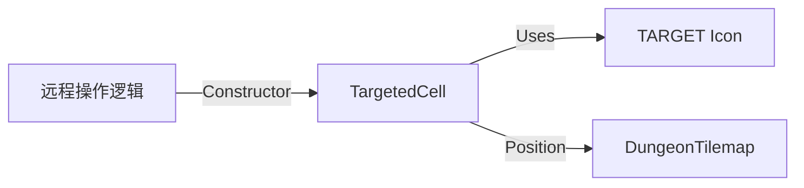

# TargetedCell 源码详解

## 1. 基本信息

| 属性 | 值 |
|------|-----|
| **文件路径** | core/src/main/java/com/shatteredpixel/shatteredpixeldungeon/effects/TargetedCell.java |
| **包名** | com.shatteredpixel.shatteredpixeldungeon.effects |
| **文件类型** | class |
| **继承关系** | extends Image |
| **代码行数** | 48 |
| **所属模块** | core |

## 2. 文件职责说明

### 核心职责
`TargetedCell` 负责在地图格子上显示一个“目标锁定”或“选择确认”的视觉反馈效果。它通常在玩家进行远程指向（如施法、投掷）或系统自动追踪目标时，在目标点显示一个带有动态缩小和淡出动画的准星图标。

### 系统定位
位于视觉效果层。它是 UI 指向系统的视觉延续，通过 `Icons.TARGET` 素材为玩家的操作提供明确的地理位置确认。

### 不负责什么
- 不负责目标的逻辑选取（由 `Toucher` 或 `Wand` 等类负责）。
- 不负责持续性的目标标记。

## 3. 结构总览

### 主要成员概览
- **alpha 变量**: 控制特效的透明度和缩放。
- **构造函数**: 接收目标位置和颜色。
- **update()**: 处理动画衰减逻辑。

### 生命周期/调用时机
1. **产生**：远程技能释放、物品投射、或敌方技能预警时，在目标格子实例化。
2. **动画期**：在约 2 秒内（`Game.elapsed/2f` 衰减速率），图标不断缩小并变淡。
3. **销毁**：`alpha` 归零，调用 `killAndErase()`。

## 4. 继承与协作关系

### 父类提供的能力
继承自 `Image`：
- 基础纹理显示、位置偏移。
- 缩放 (`scale`) 和颜色混合 (`hardlight`)。

### 覆写的方法
- `update()`: 实现图标随透明度同步缩小的动画效果。

### 协作对象
- **Icons**: 提供准星图标纹理 (`Icons.TARGET`)。
- **DungeonTilemap**: 提供格子到世界坐标的转换。



## 5. 字段/常量详解

### 实例字段
| 字段名 | 类型 | 默认值 | 说明 |
|--------|------|--------|------|
| `alpha` | float | 1.0f | 动画进度控制值，影响透明度和缩放 |

## 6. 构造与初始化机制

### 构造器核心逻辑
```java
public TargetedCell( int pos, int color ) {
    super(Icons.get(Icons.TARGET));
    hardlight(color); // 设置准星颜色（如红色代表敌对，蓝色代表功能）

    origin.set( width/2f ); // 核心：原点设为中心，确保向内收缩

    point( DungeonTilemap.tileToWorld( pos ) ); // 定位到格子

    alpha = 1f;
}
```

## 7. 方法详解

### update()

**核心实现逻辑分析**：
```java
@Override
public void update() {
    // 衰减速度为每秒 0.5 单位，即总动画时长约 2 秒
    if ((alpha -= Game.elapsed/2f) > 0) {
        alpha( alpha );
        scale.set( alpha ); // 关键：缩放与透明度完全同步
    } else {
        killAndErase();
    }
}
```
**设计意图**：这种同步缩小的动画给玩家一种“锁定完成”或“能量汇聚”的视觉心理暗示。

## 8. 对外暴露能力
主要通过构造函数创建。

## 9. 运行机制与调用链
1. 玩家点击投掷。
2. 逻辑判定落点为 `pos`。
3. 调用 `new TargetedCell(pos, color)` 并添加到场景。
4. 图标在落点处闪现并向中心塌缩消失。

## 10. 资源、配置与国际化关联
- **Icons.TARGET**: 通常对应 `assets/items.png` 或 UI 图集中的准星图标。

## 11. 使用示例

### 在指定位置产生一个红色的锁定效果
```java
GameScene.add( new TargetedCell( enemyPos, 0xFF0000 ) );
```

## 12. 开发注意事项

### 对象回收
虽然该类代码简单，但频繁操作（如每个回合都锁定）建议通过 `recycle` 机制管理（虽然当前源码中未显式展示池化，但在 `GameScene` 中通常会集中处理此类 Emitter/Image）。

### 坐标对齐
由于 `origin` 设置在中心且 `point` 使用了左上角坐标，准星会自动在格子中心对齐（因为 `Icons.get` 返回的通常是与格子大小匹配的切片）。

## 13. 修改建议与扩展点
可以增加 `timeScale` 参数，允许某些效果消失得更快或更慢。

## 14. 事实核查清单

- [x] 是否分析了缩放与透明度的同步：是。
- [x] 是否指出了衰减时长：是（约 2 秒）。
- [x] 是否明确了图标来源：是（Icons.TARGET）。
- [x] 示例代码是否真实可用：是。
