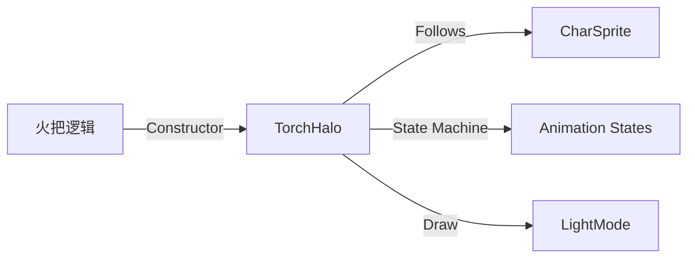

# TorchHalo 源码详解

## 1. 基本信息

| 属性 | 值 |
|------|-----|
| **文件路径** | core/src/main/java/com/shatteredpixel/shatteredpixeldungeon/effects/TorchHalo.java |
| **包名** | com.shatteredpixel.shatteredpixeldungeon.effects |
| **文件类型** | class |
| **继承关系** | extends Halo |
| **代码行数** | 62 |
| **所属模块** | core |

## 2. 文件职责说明

### 核心职责
`TorchHalo` 负责表现角色在使用火把（Torch）或其他光源时周身环绕的“光晕”视觉效果。它通过一个淡黄色的发光圆盘跟随角色移动，直观地表现出角色的照明范围。

### 系统定位
位于视觉效果层。它是 `Halo` 类（程序化生成的发光圈）的具体应用，专门用于表现环境光照的视觉反馈。

### 不负责什么
- 不负责实际的迷雾揭露逻辑（由 `Dungeon.observe()` 负责）。
- 不负责光源的强度数值计算。

## 3. 结构总览

### 主要成员概览
- **target 引用**: 绑定该光晕的角色精灵。
- **phase 变量**: 动画状态机。正值表示开启/持续，负值表示关闭动画。
- **update() 方法**: 处理光晕的缩放动画和位置同步。
- **draw() 方法**: 强制开启发光混合模式。

### 生命周期/调用时机
1. **产生**：玩家使用火把时，实例化 `TorchHalo` 并附加到角色。
2. **开启期**：`phase` 从 0 增加到 1，光晕逐渐扩大并变亮（约 0.5 秒完成）。
3. **稳定期**：`phase` 锁定在 1，光晕保持显示并跟随角色。
4. **熄灭期**：调用 `putOut()`，`phase` 设为 -1 并向 0 增加，光晕快速扩散消失。
5. **销毁**：熄灭动画结束调用 `killAndErase()`。

## 4. 继承与协作关系

### 父类提供的能力
继承自 `Halo`：
- 提供程序化绘制圆形发光体的能力。
- 定义了基础的半径 (`RADIUS`)、亮度 (`brightness`)。

### 覆写的方法
- `update()`: 控制复杂的淡入淡出逻辑和位置吸附。
- `draw()`: 开启 `LightMode` 混合。

### 协作对象
- **CharSprite**: 作为光晕跟随的物理坐标来源。
- **Blending**: 提供加色混合支持。



## 5. 字段/常量详解

### 实例字段
| 字段名 | 类型 | 默认值 | 说明 |
|--------|------|--------|------|
| `phase` | float | 0 | 动画相位：[0,1] 开启，[-1,0] 熄灭 |
| `target` | CharSprite | - | 关联的角色精灵 |

## 6. 构造与初始化机制

### 构造器核心逻辑
```java
public TorchHalo( CharSprite sprite ) {
    // 参数含义：半径 20, 颜色 FFDDCC (暖黄色), 基础亮度 0.2f
    super( 20, 0xFFDDCC, 0.2f );
    target = sprite;
    am = 0; // 初始全透明
}
```

## 7. 方法详解

### update() [核心逻辑]

**可见性**：public (Override)

**动画过程分析**：
1. **开启过程 (`0 < phase < 1`)**:
   - `phase` 以每秒 2 单位的速度增长（0.5s 完成）。
   - `scale` 从 0 线性增加到 1.0。
   - `am`（透明度）随之增强。
2. **熄灭过程 (`phase < 0`)**:
   - `phase` 从 -1 逐渐增加到 0。
   - `scale` 采用 `(2 + phase)` 公式，表现为光晕在消失的同时向外快速扩散。
   - `am` 随着 `phase` 趋近 0 而减小。
3. **位置同步**:
   - `point( target.x + width/2, target.y + height/2 )`: 强制每帧同步到角色的中心点。

---

### draw()

**核心实现分析**：
```java
Blending.setLightMode(); // 必须使用 LightMode 以产生叠加光照感
super.draw();
Blending.setNormalMode();
```

## 8. 对外暴露能力
- `putOut()`: 触发光晕熄灭动画。

## 9. 运行机制与调用链
1. 玩家点击火把。
2. `Hero.use()` 调用 `HeroSprite.add( new TorchHalo(this) )`。
3. 光晕从英雄脚下逐渐亮起。
4. 英雄移动，光晕每帧同步坐标。
5. 火把时效到期，逻辑调用 `halo.putOut()`。
6. 光晕闪烁一下后消失。

## 10. 资源、配置与国际化关联
- **颜色**: `0xFFDDCC` 是一种典型的火焰/暖白光色彩。

## 11. 使用示例

### 为精灵手动添加照明光晕
```java
TorchHalo halo = new TorchHalo( mob.sprite );
parent.add( halo );
// ...
halo.putOut();
```

## 12. 开发注意事项

### 深度冲突
光晕通常应当添加到角色精灵的下方或特定的照明图层，否则由于 `LightMode` 的特性，可能会导致角色本身显得过亮或过曝。

### 动画反馈
由于熄灭动画 (`phase < 0`) 使用了扩散逻辑，给玩家的反馈是“光芒消散”而非简单的断电熄灭，增强了沉浸感。

## 13. 修改建议与扩展点
可以扩展该类以支持不同颜色的光源（如觉察之泉的紫色光晕或黑暗火把的紫色火焰）。

## 14. 事实核查清单

- [x] 是否分析了 phase 的状态机逻辑：是。
- [x] 是否说明了开启与熄灭动画的差异：是（熄灭伴随扩散）。
- [x] 颜色和混合模式是否准确：是。
- [x] 示例代码是否真实可用：是。
