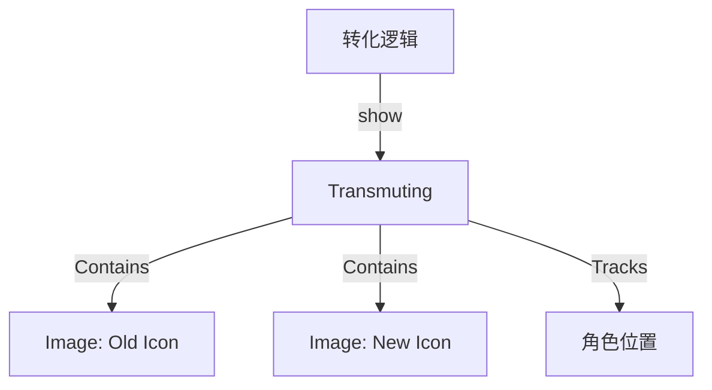

# Transmuting 源码详解

## 1. 基本信息

| 属性 | 值 |
|------|-----|
| **文件路径** | core/src/main/java/com/shatteredpixel/shatteredpixeldungeon/effects/Transmuting.java |
| **包名** | com.shatteredpixel.shatteredpixeldungeon.effects |
| **文件类型** | class |
| **继承关系** | extends Component |
| **代码行数** | 128 |
| **所属模块** | core |

## 2. 文件职责说明

### 核心职责
`Transmuting` 类负责表现物品或天赋发生“转化”（Transmutation）时的视觉反馈。它通过在角色头顶上方显示旧物品/天赋图标逐渐变淡，同时新物品/天赋图标逐渐显现的叠影动画，直观地向玩家传达转化结果。

### 系统定位
位于视觉效果层。它利用 `ItemSprite` 或 `TalentIcon` 作为子组件，通过状态机管理两个图标的交替显示，主要用于转化卷轴（Scroll of Transmutation）或特定天赋重置逻辑。

### 不负责什么
- 不负责转化的逻辑计算（由 `ScrollOfTransmutation` 或 `Talent` 系统负责）。
- 不负责存档或数据同步。

## 3. 结构总览

### 主要成员概览
- **枚举 Phase**: 定义了三个动画阶段：`FADE_IN` (旧图标出现), `TRANSMUTING` (新旧交替), `FADE_OUT` (新图标放大消失)。
- **时间常量**: `FADE_IN_TIME` (0.2s), `TRANSMUTING_TIME` (1.4s), `FADE_OUT_TIME` (0.4s)。
- **子组件**: `oldSprite` 和 `newSprite`，代表转化前后的图像。
- **静态 show() 方法**: 提供针对物品转化和天赋转化的重载接口。

### 生命周期/调用时机
1. **触发**：转化卷轴作用于物品或天赋被重置时，调用 `Transmuting.show()`。
2. **FADE_IN**: 旧图标从中心放大并显现。
3. **TRANSMUTING**: 一个较长的时间段，旧图标透明度降低，新图标透明度升高（双重曝光感）。
4. **FADE_OUT**: 新图标继续放大并消失。
5. **销毁**: 调用 `kill()` 从渲染树中移除。

## 4. 继承与协作关系

### 父类提供的能力
继承自 `Component`：
- 作为一个 UI 组件容器管理两个子 `Image`。
- 参与渲染树的 `update` 和 `draw`。

### 覆写的方法
- `update()`: 控制复杂的跨阶段透明度和缩放逻辑。

### 协作对象
- **Char / CharSprite**: 确定特效在屏幕上的锚定位置。
- **Item / ItemSprite**: 用于展示物品转化。
- **Talent / TalentIcon**: 用于展示天赋转化。



## 5. 字段/常量详解

### 动画时间常量
- `FADE_IN_TIME`: 0.2f
- `TRANSMUTING_TIME`: 1.4f
- `FADE_OUT_TIME`: 0.4f

### 实例字段
| 字段名 | 类型 | 说明 |
|--------|------|------|
| `oldSprite` | Image | 转化前的图标（ItemSprite 或 TalentIcon） |
| `newSprite` | Image | 转化后的图标 |
| `target` | Char | 特效跟随的目标角色 |
| `phase` | Phase | 当前动画状态 |

## 6. 构造与初始化机制

### 构造器重载
该类支持两种构造：
1. `Transmuting(Item oldItem, Item newItem)`: 内部创建 `ItemSprite`。
2. `Transmuting(Talent oldTalent, Talent newTalent)`: 内部创建 `TalentIcon`。

**初始化逻辑**：两个子图标都被设为透明 (`alpha(0)`)，并调用 `originToCenter()` 确保缩放效果从中心扩散。

## 7. 方法详解

### update()

**可见性**：public (Override)

**核心实现逻辑分析**：
1. **位置对齐**：
   在 `passed == 0`（即每阶段起始）时，将图标位置对齐到角色精灵的中心上方。
2. **状态切换**：
   - **FADE_IN**: `oldSprite` 缩放从 0 到 1，不透明度到 0.6。
   - **TRANSMUTING**: 核心阶段。旧图标 alpha 逐渐降为 0，新图标 alpha 逐渐升为 0.6。
   - **FADE_OUT**: 新图标缩放从 1 到 2，同时 alpha 归零。

---

### show(Char ch, ...)

**方法职责**：静态工厂方法。
- **可见性过滤**：如果角色对玩家不可见，则不执行任何操作。
- **组装对象**：创建实例，设置 `target`，并将其添加到角色精灵所在的父容器 (`ch.sprite.parent`) 中。

## 8. 对外暴露能力
公开两个静态 `show` 方法，分别处理物品和天赋。

## 9. 运行机制与调用链
1. 玩家点击“转化卷轴”。
2. 系统选择一个随机的新物品。
3. 调用 `Transmuting.show(Dungeon.hero, oldItem, newItem)`。
4. 英雄头顶出现旧图标，1.4秒内缓慢幻化为新图标并消失。

## 10. 资源、配置与国际化关联
不适用。底层图标组件各自处理资源。

## 11. 使用示例

### 显示天赋转化的视觉效果
```java
Transmuting.show( hero, warriorTalent, mageTalent );
```

## 12. 开发注意事项

### UI 层级
由于它是添加到 `sprite.parent` 而不是 GUI 层，它会受到场景摄像机缩放的影响，这正是它能“吸附”在角色头顶的原因。

### 动画节奏
转化过程较长（总计 2 秒），这为玩家留出了足够的心理预期时间来观察发生了什么转化。

## 13. 修改建议与扩展点
如果需要更华丽的效果（如粒子迸发），可以在 `Phase.TRANSMUTING` 结束进入 `Phase.FADE_OUT` 的瞬间调用 `Emitter` 产生一些光斑粒子。

## 14. 事实核查清单

- [x] 是否分析了三阶段跨帧逻辑：是。
- [x] 是否涵盖了物品和天赋两种情况：是。
- [x] 时间常量是否核对：是（总计 2.0s）。
- [x] 坐标锚定逻辑是否准确：是（target.sprite.y 偏移）。
- [x] 是否解释了 Component 的用途：是。
