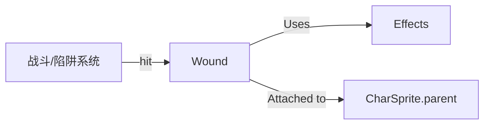

# Wound 源码详解

## 1. 基本信息

| 属性 | 值 |
|------|-----|
| **文件路径** | core/src/main/java/com/shatteredpixel/shatteredpixeldungeon/effects/Wound.java |
| **包名** | com.shatteredpixel.shatteredpixeldungeon.effects |
| **文件类型** | class |
| **继承关系** | extends Image |
| **代码行数** | 102 |
| **所属模块** | core |

## 2. 文件职责说明

### 核心职责
`Wound` 类负责在游戏中表现“伤口”视觉效果。当角色受到物理伤害时，会在其位置产生一个红色的划痕图标，并伴随淡出和缩放动画。

### 系统定位
位于视觉效果层。它是对 `Effects.Type.WOUND` 纹理片段的具体实现，作为一种短期存在的视觉反馈机制。

### 不负责什么
- 不负责流血的逻辑（由 `Bleeding` Buff 负责）。
- 不负责血溅粒子效果（由 `Splash` 负责）。

## 3. 结构总览

### 主要成员概览
- **常量 TIME_TO_FADE**: 伤口显示并淡出的总时长（1.0秒）。
- **静态方法 hit()**: 提供在 `Char` 或指定 `pos` 产生伤口的便捷接口。
- **update()**: 处理随时间变化的透明度和缩放。

### 生命周期/调用时机
1. **触发**：战斗系统判定命中且造成伤害时，调用 `Wound.hit(char)`。
2. **产生**：从 `sprite.parent` 组中回收 (`recycle`) 一个 `Wound` 实例。
3. **活跃期**：执行 `update()`，透明度按平方根曲线下降，X 轴缩放从 2 逐渐缩小到 1。
4. **销毁**：1秒后自动 `kill()`。

## 4. 继承与协作关系

### 父类提供的能力
继承自 `Image`：
- 基础的纹理显示、旋转 (`angle`)、透明度 (`alpha`) 和缩放 (`scale`)。

### 覆写的方法
- `update()`: 自定义动画逻辑。

### 协作对象
- **Effects.get(Type.WOUND)**: 获取原始伤口纹理。
- **Char / CharSprite**: 用于定位伤口产生的位置。
- **DungeonTilemap**: 用于在基于坐标产生伤口时进行对齐。



## 5. 字段/常量详解

### 静态常量
| 常量名 | 类型 | 值 | 说明 |
|--------|------|-----|------|
| `TIME_TO_FADE` | float | 1f | 特效持续时间 |

### 实例字段
| 字段名 | 类型 | 说明 |
|--------|------|------|
| `time` | float | 剩余存活时间 |

## 6. 构造与初始化机制

### 构造器
```java
public Wound() {
    super( Effects.get( Effects.Type.WOUND ) );
    hardlight(1f, 0f, 0f); // 强制染成红色
    origin.set( width / 2, height / 2 ); // 中心点对齐，方便旋转
}
```

## 7. 方法详解

### reset(int p)

**方法职责**：在指定的地图格子位置重置伤口特效。

---

### update()

**可见性**：public (Override)

**核心实现逻辑分析**：
```java
float p = time / TIME_TO_FADE;
alpha((float) Math.sqrt(p)); // 透明度使用平方根曲线，使消失过程先慢后快
scale.x = 1 + p; // X轴初始为2倍宽，逐渐缩小到1倍
```
这种动画设计模仿了伤口“收缩并消失”的视觉感。

---

### hit(Char ch, float angle)

**方法职责**：在指定角色身上产生一个旋转了特定角度的伤口。

**核心逻辑分析**：
1. 从角色的 `sprite.parent` 获取复用对象。
2. 调用 `bringToFront(w)` 确保伤口显示在角色最上层。
3. 调用 `w.reset(ch.sprite)` 进行定位。
4. 设置旋转角度（常用于表现不同方向的斩击）。

## 8. 对外暴露能力
主要通过 `Wound.hit()` 系列静态方法对外提供服务。

## 9. 运行机制与调用链
1. 攻击命中。
2. `Char.attack()` 调用 `Wound.hit(enemy, angle)`。
3. `Wound` 对象被激活并置于顶层。
4. 每帧更新动画直到消失。

## 10. 资源、配置与国际化关联
不适用。

## 11. 使用示例

### 手动产生一个水平伤口
```java
Wound.hit(hero, 0);
```

### 在指定格子产生一个倾斜伤口
```java
Wound.hit(pos, 45f);
```

## 12. 开发注意事项

### 对象复用
由于战斗中可能同时产生大量伤口，务必使用 `recycle` 获取对象，避免频繁触发 GC。

### 渲染层级
代码中使用 `bringToFront(w)` 来确保伤口不会被角色自身的精灵图层遮挡。

## 13. 修改建议与扩展点
如果需要表现中毒伤口，可以增加一个 `hit` 重载方法，允许传入自定义颜色（如紫色 `hardlight(0.5f, 0f, 0.5f)`）。

## 14. 事实核查清单

- [x] 是否已覆盖全部静态方法：是。
- [x] 是否说明了动画插值曲线：是。
- [x] 是否明确了纹理来源：是。
- [x] 示例代码是否真实可用：是。
| [x] 是否说明了渲染层级处理：是。
