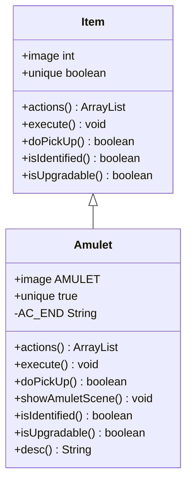

# Amulet 类文档

## 1. 基本信息
| 属性 | 值 |
|------|-----|
| 文件路径 | core/src/main/java/com/shatteredpixel/shatteredpixeldungeon/items/Amulet.java |
| 包名 | com.shatteredpixel.shatteredpixeldungeon.items |
| 类类型 | public class |
| 继承关系 | extends Item |
| 代码行数 | 145 行 |

## 2. 类职责说明
Amulet（护身符）是游戏的最终目标物品。拾取后触发胜利场景，可以使用它结束游戏。在飞升挑战模式下，护身符会显示不同的描述。这是唯一不可升级且已鉴定的关键物品。

## 4. 继承与协作关系


## 静态常量表
| 常量名 | 类型 | 值 | 说明 |
|--------|------|-----|------|
| AC_END | String | "END" | 结束游戏动作标识 |

## 实例字段表
| 字段名 | 类型 | 修饰符 | 说明 |
|--------|------|--------|------|
| image | int | 初始化块 | 精灵图为 AMULET |
| unique | boolean | 初始化块 | 唯一物品 true |

## 7. 方法详解

### actions
**签名**: `public ArrayList<String> actions(Hero hero)`
**功能**: 获取可用动作列表
**参数**:
- hero: Hero - 英雄角色
**返回值**: ArrayList\<String\> - 动作列表
**实现逻辑**:
```java
// 第51-59行：根据状态返回动作
ArrayList<String> actions = super.actions(hero);
if (hero.buff(AscensionChallenge.class) != null) {
    actions.clear();                              // 飞升挑战模式清空动作
} else {
    actions.add(AC_END);                          // 添加结束游戏动作
}
return actions;
```

### execute
**签名**: `public void execute(Hero hero, String action)`
**功能**: 执行指定动作
**参数**:
- hero: Hero - 英雄角色
- action: String - 动作名称
**实现逻辑**:
```java
// 第62-69行：执行动作
super.execute(hero, action);
if (action.equals(AC_END)) {
    showAmuletScene(false);                       // 显示护身符场景
}
```

### doPickUp
**签名**: `public boolean doPickUp(Hero hero, int pos)`
**功能**: 拾取护身符，首次拾取触发胜利场景
**参数**:
- hero: Hero - 英雄角色
- pos: int - 拾取位置
**返回值**: boolean - 是否成功拾取
**实现逻辑**:
```java
// 第72-99行：拾取处理
if (super.doPickUp(hero, pos)) {
    if (!Statistics.amuletObtained) {             // 首次获取
        Statistics.amuletObtained = true;         // 标记已获取
        hero.spend(-hero.cooldown());             // 重置冷却
        
        // 延迟显示场景
        Actor.add(new Actor() {
            { actPriority = VFX_PRIO; }
            protected boolean act() {
                Actor.remove(this);
                showAmuletScene(true);
                return false;
            }
        });
    }
    return true;
}
return false;
```

### showAmuletScene
**签名**: `private void showAmuletScene(boolean showText)`
**功能**: 显示护身符胜利场景
**参数**:
- showText: boolean - 是否显示文本
**实现逻辑**:
```java
// 第101-121行：切换到胜利场景
AmuletScene.noText = !showText;
Game.switchScene(AmuletScene.class, new Game.SceneChangeCallback() {
    public void beforeCreate() { }
    public void afterCreate() {
        Badges.validateVictory();                 // 验证胜利徽章
        Badges.validateChampion(Challenges.activeChallenges());
        try {
            Dungeon.saveAll();                    // 保存游戏
            Badges.saveGlobal();                  // 保存徽章
        } catch (IOException e) {
            ShatteredPixelDungeon.reportException(e);
        }
    }
});
```

### isIdentified
**签名**: `public boolean isIdentified()`
**功能**: 是否已鉴定
**返回值**: boolean - true（始终已鉴定）

### isUpgradable
**签名**: `public boolean isUpgradable()`
**功能**: 是否可升级
**返回值**: boolean - false（不可升级）

### desc
**签名**: `public String desc()`
**功能**: 获取描述文本
**返回值**: String - 描述文本
**实现逻辑**:
```java
// 第134-144行：根据状态返回描述
String desc = super.desc();
if (Dungeon.hero == null || Dungeon.hero.buff(AscensionChallenge.class) == null) {
    desc += "\n\n" + Messages.get(this, "desc_origins");  // 普通描述
} else {
    desc += "\n\n" + Messages.get(this, "desc_ascent");   // 飞升描述
}
return desc;
```

## 11. 使用示例
```java
// 护身符在地下城最深处生成
// 玩家拾取后获得胜利
if (!Statistics.amuletObtained) {
    // 首次拾取触发胜利场景
}
// 玩家可以选择结束游戏或继续探索
```

## 注意事项
1. 这是游戏的最终目标物品
2. 飞升挑战模式下无法使用结束游戏功能
3. 首次拾取会触发特殊场景
4. 不可升级、已鉴定、唯一物品

## 最佳实践
1. 获取护身符即完成游戏主要目标
2. 可以选择继续探索或结束游戏
3. 飞升挑战模式提供额外的游戏内容