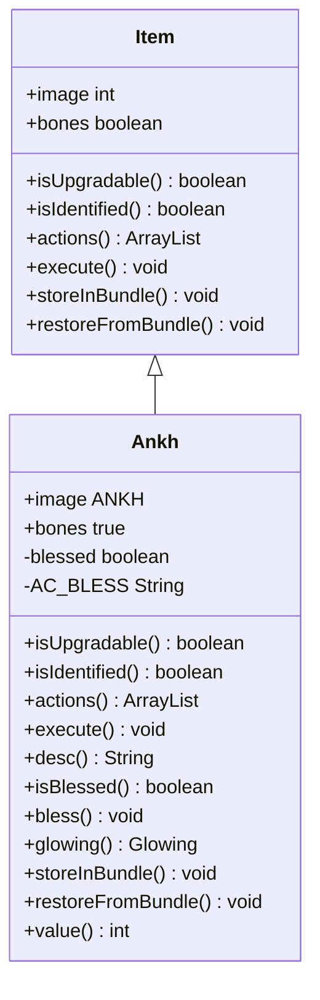

# Ankh 类文档

## 1. 基本信息
| 属性 | 值 |
|------|-----|
| 文件路径 | core/src/main/java/com/shatteredpixel/shatteredpixeldungeon/items/Ankh.java |
| 包名 | com.shatteredpixel.shatteredpixeldungeon.items |
| 类类型 | public class |
| 继承关系 | extends Item |
| 代码行数 | 134 行 |

## 2. 类职责说明
Ankh（安卡十字架）是复活道具，可以被祝福后提供更好的复活效果。使用装满水的水袋可以祝福安卡。祝福后的安卡会发光，并在死亡时提供额外保护。可以从骨头堆中继承到下一局游戏。

## 4. 继承与协作关系


## 静态常量表
| 常量名 | 类型 | 值 | 说明 |
|--------|------|-----|------|
| AC_BLESS | String | "BLESS" | 祝福动作标识 |
| BLESSED | String | "blessed" | Bundle 存储键 |
| WHITE | Glowing | 0xFFFFCC | 祝福后的发光效果 |

## 实例字段表
| 字段名 | 类型 | 修饰符 | 说明 |
|--------|------|--------|------|
| image | int | 初始化块 | 精灵图为 ANKH |
| bones | boolean | 初始化块 | 可从骨头继承 true |
| blessed | boolean | private | 是否已祝福 |

## 7. 方法详解

### isUpgradable
**签名**: `public boolean isUpgradable()`
**功能**: 是否可升级
**返回值**: boolean - false（不可升级）

### isIdentified
**签名**: `public boolean isIdentified()`
**功能**: 是否已鉴定
**返回值**: boolean - true（始终已鉴定）

### actions
**签名**: `public ArrayList<String> actions(Hero hero)`
**功能**: 获取可用动作列表
**参数**:
- hero: Hero - 英雄角色
**返回值**: ArrayList\<String\> - 动作列表
**实现逻辑**:
```java
// 第62-68行：添加祝福动作
ArrayList<String> actions = super.actions(hero);
Waterskin waterskin = hero.belongings.getItem(Waterskin.class);
if (waterskin != null && waterskin.isFull() && !blessed) {
    actions.add(AC_BLESS);                        // 有满水袋且未祝福时添加祝福动作
}
return actions;
```

### execute
**签名**: `public void execute(final Hero hero, String action)`
**功能**: 执行指定动作
**参数**:
- hero: Hero - 英雄角色
- action: String - 动作名称
**实现逻辑**:
```java
// 第71-91行：执行祝福动作
super.execute(hero, action);
if (action.equals(AC_BLESS)) {
    Waterskin waterskin = hero.belongings.getItem(Waterskin.class);
    if (waterskin != null) {
        blessed = true;                           // 标记已祝福
        waterskin.empty();                        // 清空水袋
        GLog.p(Messages.get(this, "bless"));     // 显示祝福消息
        hero.spend(1f);                           // 消耗1回合
        hero.busy();
        
        Sample.INSTANCE.play(Assets.Sounds.DRINK);
        CellEmitter.get(hero.pos).start(Speck.factory(Speck.LIGHT), 0.2f, 3);
        hero.sprite.operate(hero.pos);
    }
}
```

### desc
**签名**: `public String desc()`
**功能**: 获取描述文本
**返回值**: String - 根据祝福状态返回不同描述
**实现逻辑**:
```java
// 第94-99行：根据状态返回描述
if (blessed)
    return Messages.get(this, "desc_blessed");    // 祝福状态描述
else
    return super.desc();                           // 普通描述
```

### isBlessed
**签名**: `public boolean isBlessed()`
**功能**: 获取祝福状态
**返回值**: boolean - 是否已祝福

### bless
**签名**: `public void bless()`
**功能**: 设置为祝福状态

### glowing
**签名**: `public Glowing glowing()`
**功能**: 获取发光效果
**返回值**: Glowing - 祝福时返回白色发光，否则返回null

### storeInBundle / restoreFromBundle
**功能**: 保存/恢复祝福状态

### value
**签名**: `public int value()`
**功能**: 获取出售价格
**返回值**: int - 50 * 数量

## 11. 使用示例
```java
// 创建安卡
Ankh ankh = new Ankh();

// 使用满水袋祝福
if (waterskin.isFull() && !ankh.isBlessed()) {
    ankh.execute(hero, Ankh.AC_BLESS);
}

// 祝福后的安卡提供更好的复活效果
// 安卡可以从骨头堆继承到下一局游戏
```

## 注意事项
1. bones=true，可以从骨头继承到下一局
2. 需要满水袋才能祝福
3. 祝福后发光并改变描述
4. 祝福安卡提供更好的复活效果

## 最佳实践
1. 获得安卡后尽快找水袋祝福
2. 祝福安卡可以防止装备掉落
3. 安卡是重要的生存保障道具
4. 可以在商店购买或在关卡中找到