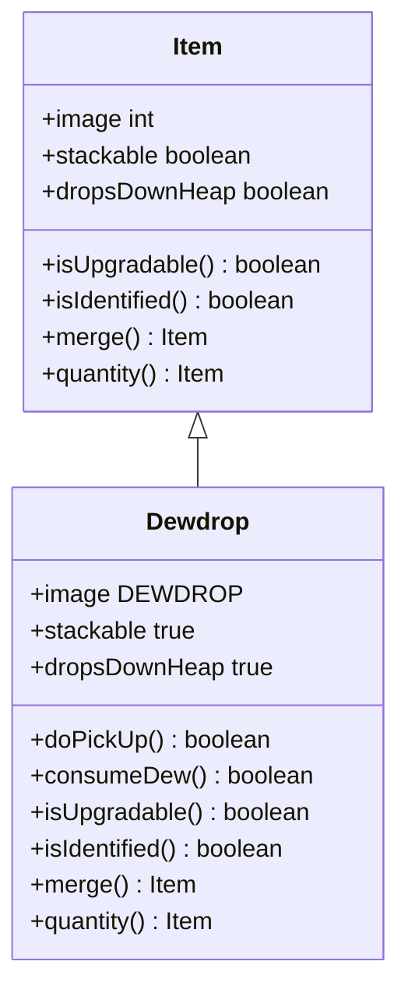

# Dewdrop 类文档

## 1. 基本信息
| 属性 | 值 |
|------|-----|
| 文件路径 | core/src/main/java/com/shatteredpixel/shatteredpixeldungeon/items/Dewdrop.java |
| 包名 | com.shatteredpixel.shatteredpixeldungeon.items |
| 类类型 | public class |
| 继承关系 | extends Item |
| 代码行数 | 158 行 |

## 2. 类职责说明
Dewdrop（露珠）是基础治疗物品，会自动收集到水袋中。如果水袋已满，直接使用可回复生命值。每个露珠回复5%最大生命值。护盾露珠天赋可以将部分效果转化为护盾。

## 4. 继承与协作关系


## 静态常量表
无静态常量。

## 实例字段表
| 字段名 | 类型 | 修饰符 | 说明 |
|--------|------|--------|------|
| image | int | 初始化块 | 精灵图为 DEWDROP |
| stackable | boolean | 初始化块 | 可堆叠 true |
| dropsDownHeap | boolean | 初始化块 | 掉落到堆底部 true |

## 7. 方法详解

### doPickUp
**签名**: `public boolean doPickUp(Hero hero, int pos)`
**功能**: 拾取露珠
**参数**:
- hero: Hero - 英雄角色
- pos: int - 拾取位置
**返回值**: boolean - 是否成功拾取
**实现逻辑**:
```java
// 第53-80行：拾取逻辑
Waterskin flask = hero.belongings.getItem(Waterskin.class);
Catalog.setSeen(getClass());
Statistics.itemTypesDiscovered.add(getClass());

if (flask != null && !flask.isFull()) {
    // 水袋未满，收集到水袋
    flask.collectDew(this);
    GameScene.pickUp(this, pos);
} else {
    // 水袋已满或没有水袋，直接使用
    int terr = Dungeon.level.map[pos];
    if (!consumeDew(1, hero, terr == Terrain.ENTRANCE || terr == Terrain.ENTRANCE_SP
            || terr == Terrain.EXIT || terr == Terrain.UNLOCKED_EXIT)) {
        return false;
    } else {
        Catalog.countUse(getClass());
    }
}

Sample.INSTANCE.play(Assets.Sounds.DEWDROP);
hero.spendAndNext(pickupDelay());
return true;
```

### consumeDew (静态方法)
**签名**: `public static boolean consumeDew(int quantity, Hero hero, boolean force)`
**功能**: 使用露珠回复生命或护盾
**参数**:
- quantity: int - 露珠数量
- hero: Hero - 英雄角色
- force: boolean - 是否强制使用
**返回值**: boolean - 是否成功使用
**实现逻辑**:
```java
// 第82-129行：使用露珠
// 20个露珠回复满血
int effect = Math.round(hero.HT * 0.05f * quantity);  // 每个露珠5%最大生命

int heal = Math.min(hero.HT - hero.HP, effect);

// 护盾露珠天赋
int shield = 0;
if (hero.hasTalent(Talent.SHIELDING_DEW)) {
    // 血瓶效果计算
    if (quantity > 1 && heal < effect && VialOfBlood.delayBurstHealing()) {
        heal = Math.round(heal / VialOfBlood.totalHealMultiplier());
    }
    shield = effect - heal;
    
    int maxShield = Math.round(hero.HT * 0.2f * hero.pointsInTalent(Talent.SHIELDING_DEW));
    int curShield = 0;
    if (hero.buff(Barrier.class) != null) curShield = hero.buff(Barrier.class).shielding();
    shield = Math.min(shield, maxShield - curShield);
}

if (heal > 0 || shield > 0) {
    // 治疗
    if (heal > 0 && quantity > 1 && VialOfBlood.delayBurstHealing()) {
        Healing healing = Buff.affect(hero, Healing.class);
        healing.setHeal(heal, 0, VialOfBlood.maxHealPerTurn());
        healing.applyVialEffect();
    } else {
        hero.HP += heal;
        if (heal > 0) {
            hero.sprite.showStatusWithIcon(CharSprite.POSITIVE, Integer.toString(heal), FloatingText.HEALING);
        }
    }
    
    // 护盾
    if (shield > 0) {
        Buff.affect(hero, Barrier.class).incShield(shield);
        hero.sprite.showStatusWithIcon(CharSprite.POSITIVE, Integer.toString(shield), FloatingText.SHIELDING);
    }
} else if (!force) {
    GLog.i(Messages.get(Dewdrop.class, "already_full"));
    return false;
}

return true;
```

### isUpgradable
**签名**: `public boolean isUpgradable()`
**功能**: 是否可升级
**返回值**: boolean - false

### isIdentified
**签名**: `public boolean isIdentified()`
**功能**: 是否已鉴定
**返回值**: boolean - true

### merge
**签名**: `public Item merge(Item other)`
**功能**: 合并露珠（最多1个）
**返回值**: Item - 合并后的物品

### quantity
**签名**: `public Item quantity(int value)`
**功能**: 设置数量（限制为1）
**返回值**: Item - 当前物品

## 11. 使用示例
```java
// 露珠在草地上生成
// 拾取时自动收集到水袋
// 水袋满时直接使用回复生命

// 多个露珠可以一次使用
Dewdrop.consumeDew(5, hero, false);  // 回复25%最大生命
```

## 注意事项
1. 自动收集到水袋，优先填充水袋
2. 每个露珠回复5%最大生命
3. 护盾露珠天赋可以将部分效果转化为护盾
4. 最多堆叠1个（不可真正堆叠）

## 最佳实践
1. 保持水袋有空间收集露珠
2. 满血时会提示已满
3. 护盾露珠天赋提供额外生存能力
4. 血瓶饰品会影响治疗效果