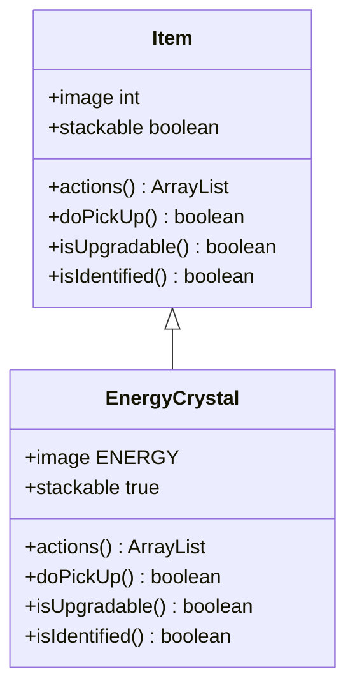

# EnergyCrystal 类文档

## 1. 基本信息
| 属性 | 值 |
|------|-----|
| 文件路径 | core/src/main/java/com/shatteredpixel/shatteredpixeldungeon/items/EnergyCrystal.java |
| 包名 | com.shatteredpixel.shatteredpixeldungeon.items |
| 类类型 | public class |
| 继承关系 | extends Item |
| 代码行数 | 86 行 |

## 2. 类职责说明
EnergyCrystal（能量水晶）是炼金系统的货币。拾取后直接增加到能量储备中，用于购买炼金配方和制作物品。没有使用动作，只能被拾取或出售。

## 4. 继承与协作关系


## 静态常量表
无静态常量。

## 实例字段表
| 字段名 | 类型 | 修饰符 | 说明 |
|--------|------|--------|------|
| image | int | 初始化块 | 精灵图为 ENERGY |
| stackable | boolean | 初始化块 | 可堆叠 true |

## 7. 方法详解

### 构造函数
**签名**: `public EnergyCrystal()` / `public EnergyCrystal(int value)`
**功能**: 创建能量水晶
**参数**:
- value: int - 数量（默认为1）

### actions
**签名**: `public ArrayList<String> actions(Hero hero)`
**功能**: 获取可用动作列表
**返回值**: ArrayList\<String\> - 空列表（无可用动作）

### doPickUp
**签名**: `public boolean doPickUp(Hero hero, int pos)`
**功能**: 拾取能量水晶，直接增加到能量储备
**参数**:
- hero: Hero - 英雄角色
- pos: int - 拾取位置
**返回值**: boolean - 是否成功拾取
**实现逻辑**:
```java
// 第57-74行：拾取处理
Catalog.setSeen(getClass());
Statistics.itemTypesDiscovered.add(getClass());

Dungeon.energy += quantity;                      // 增加能量储备
// TODO: 追踪能量收集？已经有了配方制作追踪

GameScene.pickUp(this, pos);
hero.sprite.showStatusWithIcon(0x44CCFF, Integer.toString(quantity), FloatingText.ENERGY);
hero.spendAndNext(pickupDelay());

Sample.INSTANCE.play(Assets.Sounds.ITEM);

updateQuickslot();

return true;
```

### isUpgradable
**签名**: `public boolean isUpgradable()`
**功能**: 是否可升级
**返回值**: boolean - false

### isIdentified
**签名**: `public boolean isIdentified()`
**功能**: 是否已鉴定
**返回值**: boolean - true

## 11. 使用示例
```java
// 创建能量水晶
EnergyCrystal crystal = new EnergyCrystal(10);

// 拾取后直接增加能量
// Dungeon.energy += 10

// 能量用于炼金
// 购买配方、制作物品等
```

## 注意事项
1. 拾取后直接增加能量，不占用背包
2. 能量是全局储备，不会丢失
3. 没有使用动作，只能拾取
4. 在炼金锅中使用能量

## 最佳实践
1. 收集能量水晶以购买炼金配方
2. 能量可以用于制作各种物品
3. 高级配方需要更多能量
4. 能量水晶常见于宝箱和掉落