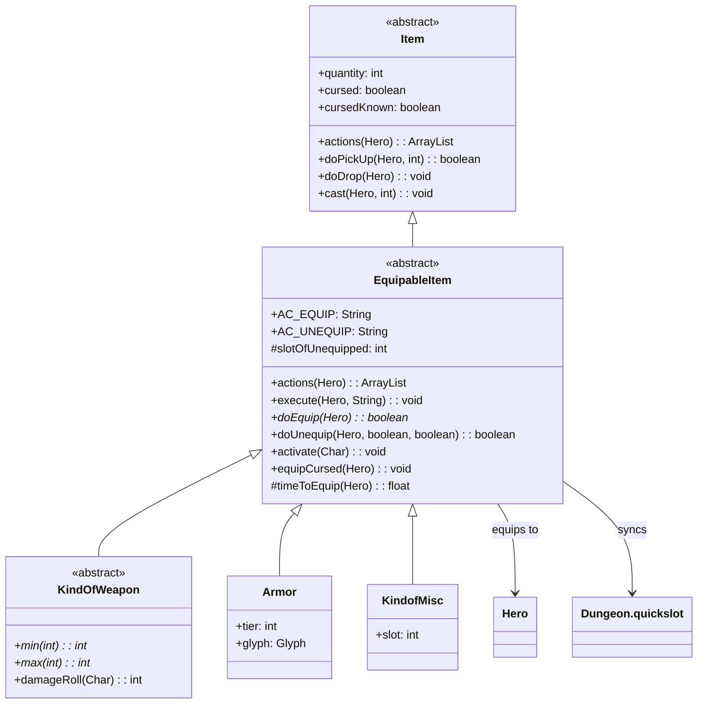

# EquipableItem 类文档

## 1. 基本信息

| 属性 | 值 |
|------|-----|
| 文件路径 | core/src/main/java/com/shatteredpixel/shatteredpixeldungeon/items/EquipableItem.java |
| 包名 | com.shatteredpixel.shatteredpixeldungeon.items |
| 类类型 | abstract class |
| 继承关系 | extends Item |
| 代码行数 | 161 行 |
| 许可证 | GNU GPL v3 |

## 2. 类职责说明

`EquipableItem` 是所有可装备物品的抽象基类，负责：

1. **装备/卸下操作** - 定义装备和卸下的标准流程和动作
2. **快捷栏同步** - 装备/卸下时自动更新快捷栏槽位
3. **诅咒处理** - 处理诅咒物品无法卸下的机制
4. **时间消耗** - 管理装备操作的时间消耗（默认1回合）
5. **视觉效果** - 提供诅咒装备的视觉反馈

## 4. 继承与协作关系



## 静态常量表

| 常量名 | 类型 | 值 | 说明 |
|--------|------|-----|------|
| AC_EQUIP | String | "EQUIP" | 装备动作标识符 |
| AC_UNEQUIP | String | "UNEQUIP" | 卸下动作标识符 |
| slotOfUnequipped | int | -1 | 被卸下物品的快捷栏槽位（静态） |

## 实例字段表

| 字段名 | 类型 | 修饰符 | 默认值 | 说明 |
|--------|------|--------|--------|------|
| bones | boolean | (init) | true | 装备物品可以被骨骼保存 |

## 7. 方法详解

### actions(Hero hero)

**签名**: `@Override public ArrayList<String> actions(Hero hero)`

**功能**: 返回物品可执行的动作列表，添加装备/卸下动作。

**参数**:
- `hero`: Hero - 执行动作的英雄

**返回值**: `ArrayList<String>` - 动作列表

**实现逻辑**:
```java
// 第48-53行：
ArrayList<String> actions = super.actions(hero);  // 获取父类动作
actions.add(isEquipped(hero) ? AC_UNEQUIP : AC_EQUIP);  // 根据状态添加动作
return actions;
// 如果已装备则显示"卸下"，否则显示"装备"
```

### doPickUp(Hero hero, int pos)

**签名**: `@Override public boolean doPickUp(Hero hero, int pos)`

**功能**: 拾取物品时检查是否需要显示鉴定指南提示。

**返回值**: `boolean` - 拾取成功返回true

**实现逻辑**:
```java
// 第56-65行：
if (super.doPickUp(hero, pos)) {
    // 如果物品未鉴定且玩家未读过鉴定指南页面
    if (!isIdentified() && !Document.ADVENTURERS_GUIDE.isPageRead(Document.GUIDE_IDING)) {
        // 闪烁提示玩家阅读指南
        GameScene.flashForDocument(Document.ADVENTURERS_GUIDE, Document.GUIDE_IDING);
    }
    return true;
}
return false;
```

### execute(Hero hero, String action)

**签名**: `@Override public void execute(Hero hero, String action)`

**功能**: 执行装备/卸下动作，处理快捷栏同步。

**参数**:
- `hero`: Hero - 执行动作的英雄
- `action`: String - 动作类型

**实现逻辑**:

```
第69-92行：装备/卸下动作处理
├─ 第72行：调用父类execute
├─ 第74-88行：AC_EQUIP 装备动作
│  ├─ 第77行：获取当前快捷栏槽位
│  ├─ 第78行：重置slotOfUnequipped
│  ├─ 第79行：执行装备
│  ├─ 第80-82行：如果物品在快捷栏，重新分配槽位
│  └─ 第85-87行：如果物品不在快捷栏但被替换的物品在，继承槽位
└─ 第89-91行：AC_UNEQUIP 卸下动作
   └─ 调用doUnequip(hero, true)
```

### doDrop(Hero hero)

**签名**: `@Override public void doDrop(Hero hero)`

**功能**: 丢弃装备物品，需要先卸下。

**实现逻辑**:
```java
// 第94-99行：
// 如果未装备或可以成功卸下，则执行丢弃
if (!isEquipped(hero) || doUnequip(hero, false, false)) {
    super.doDrop(hero);
}
// 诅咒物品无法卸下，因此无法丢弃
```

### cast(final Hero user, int dst)

**签名**: `@Override public void cast(final Hero user, int dst)`

**功能**: 投掷装备物品时处理卸下逻辑。

**参数**:
- `user`: Hero - 投掷者
- `dst`: int - 目标位置

**实现逻辑**:
```java
// 第101-111行：
if (isEquipped(user)) {
    // 如果只有1件且无法卸下（诅咒），则不执行投掷
    if (quantity == 1 && !this.doUnequip(user, false, false)) {
        return;
    }
}
super.cast(user, dst);  // 执行父类投掷逻辑
```

### equipCursed(Hero hero)

**签名**: `public static void equipCursed(Hero hero)`

**功能**: 播放诅咒装备的视觉效果和音效。

**参数**:
- `hero`: Hero - 被诅咒的英雄

**实现逻辑**:
```java
// 第113-116行：
// 播放诅咒粒子效果（6个暗影粒子）
hero.sprite.emitter().burst(ShadowParticle.CURSE, 6);
// 播放诅咒音效
Sample.INSTANCE.play(Assets.Sounds.CURSED);
```

### timeToEquip(Hero hero)

**签名**: `protected float timeToEquip(Hero hero)`

**功能**: 返回装备操作所需时间。

**返回值**: `float` - 时间（回合数），默认1.0

**实现逻辑**:
```java
// 第118-120行：
return 1f;  // 默认消耗1回合
// 子类可重写（如快速装备天赋可返回0）
```

### doEquip(Hero hero)

**签名**: `public abstract boolean doEquip(Hero hero)`

**功能**: 抽象方法，子类必须实现装备逻辑。

**返回值**: `boolean` - 装备成功返回true

**说明**: 此方法是核心装备方法，子类需要实现具体的装备流程。

### doUnequip(Hero hero, boolean collect, boolean single)

**签名**: `public boolean doUnequip(Hero hero, boolean collect, boolean single)`

**功能**: 卸下装备物品。

**参数**:
- `hero`: Hero - 英雄
- `collect`: boolean - 是否收回背包
- `single`: boolean - 是否为单次操作（影响时间消耗方式）

**返回值**: `boolean` - 卸下成功返回true

**实现逻辑**:

```
第124-153行：卸下流程
├─ 第126-131行：诅咒检查
│  ├─ 如果诅咒且无魔法免疫且未丢失物品栏
│  └─ 显示"无法卸下诅咒物品"消息，返回false
├─ 第133-137行：时间消耗
│  ├─ single=true: spendAndNext（消耗时间并结束回合）
│  └─ single=false: spend（仅消耗时间）
├─ 第139行：记录快捷栏槽位
├─ 第142-150行：收回物品
│  ├─ 临时设置keptThoughLostInvent=true
│  ├─ 如果需要收回且能收回背包，则收回
│  └─ 否则掉落在地上
└─ 第152行：返回true
```

### doUnequip(Hero hero, boolean collect)

**签名**: `final public boolean doUnequip(Hero hero, boolean collect)`

**功能**: 简化的卸下方法，默认单次操作。

**实现逻辑**:
```java
// 第155-157行：
return doUnequip(hero, collect, true);  // 调用完整版本
```

### activate(Char ch)

**签名**: `public void activate(Char ch)`

**功能**: 激活装备效果（如Buff），默认空实现。

**参数**:
- `ch`: Char - 装备者

**说明**: 子类可重写此方法添加装备后的激活效果（如戒指的Buff）。

## 11. 使用示例

### 创建自定义可装备物品

```java
public class CustomRing extends EquipableItem {
    
    @Override
    public boolean doEquip(Hero hero) {
        // 从背包移除
        detachAll(hero.belongings.backpack);
        
        // 检查当前槽位
        if (hero.belongings.ring != null) {
            // 卸下当前戒指
            if (!hero.belongings.ring.doUnequip(hero, true)) {
                // 卸下失败（诅咒），收回背包
                collect(hero.belongings.backpack);
                return false;
            }
        }
        
        // 装备新戒指
        hero.belongings.ring = this;
        activate(hero);
        
        // 消耗时间
        hero.spendAndNext(timeToEquip(hero));
        return true;
    }
    
    @Override
    public void activate(Char ch) {
        // 添加戒指Buff
        Buff.affect(ch, RingBuff.class);
    }
}
```

### 处理诅咒装备

```java
// 装备诅咒武器
if (weapon.cursed && !weapon.cursedKnown) {
    // 播放诅咒效果
    EquipableItem.equipCursed(hero);
    GLog.n("你被诅咒了！");
}

// 尝试卸下诅咒装备
if (weapon.cursed && hero.buff(MagicImmune.class) == null) {
    // 诅咒物品无法卸下
    GLog.w("诅咒的物品无法卸下！");
}
```

### 快捷栏同步示例

```java
// execute方法自动处理快捷栏同步
// 场景：物品A在快捷栏槽位1，物品B在背包
// 执行：装备物品B（替换物品A）
// 结果：
//   1. 物品B被装备
//   2. 物品A被卸下到背包
//   3. 物品B继承快捷栏槽位1（因为物品A原来在那）
```

## 注意事项

1. **诅咒机制** - 诅咒装备在无魔法免疫时无法卸下
2. **快捷栏同步** - 装备/卸下操作会自动同步快捷栏
3. **时间消耗** - 默认装备消耗1回合，子类可重写`timeToEquip()`
4. **抽象方法** - 子类必须实现`doEquip()`方法
5. **丢失物品栏** - `keptThoughLostInvent`标记影响物品在丢失物品栏状态下的行为

## 最佳实践

### 实现新的装备类型

```java
public class CustomEquipable extends EquipableItem {
    
    @Override
    public boolean doEquip(Hero hero) {
        // 1. 从背包移除
        detachAll(hero.belongings.backpack);
        
        // 2. 检查目标槽位
        if (hero.belongings.customSlot != null) {
            if (!hero.belongings.customSlot.doUnequip(hero, true)) {
                collect(hero.belongings.backpack);
                return false;
            }
        }
        
        // 3. 装备到槽位
        hero.belongings.customSlot = this;
        activate(hero);
        
        // 4. 处理诅咒
        cursedKnown = true;
        if (cursed) {
            equipCursed(hero);
            GLog.n(Messages.get(this, "equip_cursed"));
        }
        
        // 5. 消耗时间
        hero.spendAndNext(timeToEquip(hero));
        return true;
    }
    
    @Override
    public boolean doUnequip(Hero hero, boolean collect, boolean single) {
        // 调用父类方法处理标准逻辑
        if (!super.doUnequip(hero, collect, single)) {
            return false;
        }
        
        // 清空槽位
        hero.belongings.customSlot = null;
        return true;
    }
}
```

### 装备激活模式

```java
// 戒指类示例：激活时添加Buff
@Override
public void activate(Char ch) {
    Buff.affect(ch, RingBuff.class);
}

// 武器类示例：激活时触发天赋
@Override
public void activate(Char ch) {
    if (ch instanceof Hero) {
        Talent.onItemEquipped((Hero) ch, this);
    }
}
```

## 相关文件

| 文件 | 说明 |
|------|------|
| Item.java | 父类，物品基类 |
| KindOfWeapon.java | 子类，武器基类 |
| Armor.java | 子类，护甲基类 |
| KindofMisc.java | 子类，饰品基类 |
| Belongings.java | 英雄物品栏管理 |
| Hero.java | 英雄类 |
| Messages.java | 国际化消息系统 |