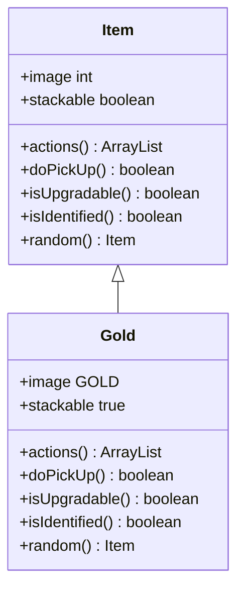

# Gold 类文档

## 1. 基本信息
| 属性 | 值 |
|------|-----|
| 文件路径 | core/src/main/java/com/shatteredpixel/shatteredpixeldungeon/items/Gold.java |
| 包名 | com.shatteredpixel.shatteredpixeldungeon.items |
| 类类型 | public class |
| 继承关系 | extends Item |
| 代码行数 | 95 行 |

## 2. 类职责说明
Gold（金币）是游戏的基础货币。拾取后直接增加到金币储备，用于在商店购买物品和服务。金币数量基于地下城深度随机生成，深度越高金币越多。

## 4. 继承与协作关系


## 静态常量表
无静态常量。

## 实例字段表
| 字段名 | 类型 | 修饰符 | 说明 |
|--------|------|--------|------|
| image | int | 初始化块 | 精灵图为 GOLD |
| stackable | boolean | 初始化块 | 可堆叠 true |

## 7. 方法详解

### 构造函数
**签名**: `public Gold()` / `public Gold(int value)`
**功能**: 创建金币
**参数**:
- value: int - 数量（默认为1）

### actions
**签名**: `public ArrayList<String> actions(Hero hero)`
**功能**: 获取可用动作列表
**返回值**: ArrayList\<String\> - 空列表（无可用动作）

### doPickUp
**签名**: `public boolean doPickUp(Hero hero, int pos)`
**功能**: 拾取金币，直接增加到金币储备
**参数**:
- hero: Hero - 英雄角色
- pos: int - 拾取位置
**返回值**: boolean - 是否成功拾取
**实现逻辑**:
```java
// 第60-77行：拾取处理
Catalog.setSeen(getClass());
Statistics.itemTypesDiscovered.add(getClass());

Dungeon.gold += quantity;                        // 增加金币
Statistics.goldCollected += quantity;            // 统计收集
Badges.validateGoldCollected();                  // 验证徽章

GameScene.pickUp(this, pos);
hero.sprite.showStatusWithIcon(CharSprite.NEUTRAL, Integer.toString(quantity), FloatingText.GOLD);
hero.spendAndNext(pickupDelay());

Sample.INSTANCE.play(Assets.Sounds.GOLD, 1, 1, Random.Float(0.9f, 1.1f));
updateQuickslot();

return true;
```

### isUpgradable
**签名**: `public boolean isUpgradable()`
**功能**: 是否可升级
**返回值**: boolean - false

### isIdentified
**签名**: `public boolean isIdentified()`
**功能**: 是否已鉴定
**返回值**: boolean - true

### random
**签名**: `public Item random()`
**功能**: 随机生成金币数量
**返回值**: Item - 当前物品
**实现逻辑**:
```java
// 第90-93行：随机生成数量
// 30 + 深度*10 到 60 + 深度*20
quantity = Random.IntRange(30 + Dungeon.depth * 10, 60 + Dungeon.depth * 20);
return this;
```

## 11. 使用示例
```java
// 创建金币
Gold gold = new Gold(100);

// 拾取后直接增加金币
// Dungeon.gold += 100

// 金币用于商店购买
// 深度越高，金币掉落越多
```

## 注意事项
1. 拾取后直接增加金币，不占用背包
2. 金币数量基于深度随机生成
3. 有收集统计和徽章系统
4. 金币可以在商店使用

## 最佳实践
1. 收集金币以购买商店物品
2. 深层地下城金币更多
3. 财富戒指可以增加金币掉落
4. 金币收集有相关徽章