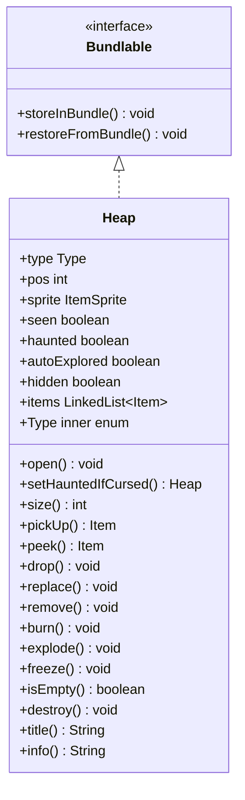

# Heap 类文档

## 1. 基本信息
| 属性 | 值 |
|------|-----|
| 文件路径 | core/src/main/java/com/shatteredpixel/shatteredpixeldungeon/items/Heap.java |
| 包名 | com.shatteredpixel.shatteredpixeldungeon.items |
| 类类型 | public class |
| 继承关系 | implements Bundlable |
| 代码行数 | 464 行 |

## 2. 类职责说明
Heap（物品堆）是地牢中物品的容器对象。支持多种类型：普通堆、商店、宝箱、上锁宝箱、水晶宝箱、坟墓、骨架、遗骸。可以被燃烧、爆炸、冻结，会触发相应物品变化。诅咒物品会使堆变成鬼魂陷阱。

## 4. 继承与协作关系


## 静态常量表
| 常量名 | 类型 | 值 | 说明 |
|--------|------|-----|------|
| POS | String | "pos" | Bundle 存储键 - 位置 |
| SEEN | String | "seen" | Bundle 存储键 - 已见 |
| TYPE | String | "type" | Bundle 存储键 - 类型 |
| ITEMS | String | "items" | Bundle 存储键 - 物品 |
| HAUNTED | String | "haunted" | Bundle 存储键 - 鬼魂 |
| AUTO_EXPLORED | String | "auto_explored" | Bundle 存储键 - 自动探索 |
| HIDDEN | String | "hidden" | Bundle 存储键 - 隐藏 |

## 实例字段表
| 字段名 | 类型 | 修饰符 | 说明 |
|--------|------|--------|------|
| type | Type | public | 堆类型 |
| pos | int | public | 位置 |
| sprite | ItemSprite | public | 精灵 |
| seen | boolean | public | 是否已见 |
| haunted | boolean | public | 是否鬼魂陷阱 |
| autoExplored | boolean | public | 是否自动探索 |
| hidden | boolean | public | 是否隐藏 |
| items | LinkedList\<Item\> | public | 物品列表 |

## 内部枚举详解

### Type
**类型**: public enum
**功能**: 堆类型枚举
**值**:
- HEAP: 普通堆
- FOR_SALE: 商店出售
- CHEST: 宝箱
- LOCKED_CHEST: 上锁宝箱
- CRYSTAL_CHEST: 水晶宝箱
- TOMB: 坟墓
- SKELETON: 骨架
- REMAINS: 遗骸

## 7. 方法详解

### open
**签名**: `public void open(Hero hero)`
**功能**: 打开容器
**参数**:
- hero: Hero - 英雄角色
**实现逻辑**:
```java
// 第84-116行：打开容器
switch (type) {
case TOMB:
    Wraith.spawnAround(hero.pos);                // 坟墓生成幽灵
    break;
case REMAINS:
case SKELETON:
    CellEmitter.center(pos).start(Speck.factory(Speck.RATTLE), 0.1f, 3);
    break;
}

if (haunted) {
    // 鬼魂陷阱
    if (Wraith.spawnAt(pos) == null) {
        hero.sprite.emitter().burst(ShadowParticle.CURSE, 6);
        hero.damage(hero.HP / 2, this);
        if (!hero.isAlive()) {
            Dungeon.fail(Wraith.class);
            GLog.n(Messages.capitalize(Messages.get(Char.class, "kill", Messages.get(Wraith.class, "name"))));
        }
    }
    Sample.INSTANCE.play(Assets.Sounds.CURSED);
}

type = Type.HEAP;                                // 转为普通堆
// 财富戒指加成
ArrayList<Item> bonus = RingOfWealth.tryForBonusDrop(hero, 1);
if (bonus != null && !bonus.isEmpty()) {
    items.addAll(0, bonus);
    RingOfWealth.showFlareForBonusDrop(sprite);
}
sprite.link();
sprite.drop();
```

### setHauntedIfCursed
**签名**: `public Heap setHauntedIfCursed()`
**功能**: 如果包含诅咒物品则设置鬼魂陷阱
**返回值**: Heap - 当前堆

### pickUp
**签名**: `public Item pickUp()`
**功能**: 拾取顶部物品
**返回值**: Item - 拾取的物品

### peek
**签名**: `public Item peek()`
**功能**: 查看顶部物品
**返回值**: Item - 顶部物品

### drop
**签名**: `public void drop(Item item)`
**功能**: 丢弃物品到堆
**参数**:
- item: Item - 要丢弃的物品

### burn
**签名**: `public void burn()`
**功能**: 燃烧处理
**实现逻辑**:
```java
// 第212-261行：燃烧效果
// 烧毁卷轴
// 蒸发露珠
// 烤熟神秘肉
// 引爆炸弹
```

### explode
**签名**: `public void explode()`
**功能**: 爆炸处理
**实现逻辑**:
```java
// 第264-316行：爆炸效果
// 打开宝箱和骨架
// 破碎药剂
// 引爆炸弹
// 销毁非装备物品
```

### freeze
**签名**: `public void freeze()`
**功能**: 冻结处理
**实现逻辑**:
```java
// 第318-345行：冻结效果
// 冷冻神秘肉
// 破碎药剂
// 冻结炸弹引信
```

## 11. 使用示例
```java
// 创建物品堆
Heap heap = new Heap();
heap.pos = position;
heap.type = Heap.Type.CHEST;
heap.items.add(item);

// 打开宝箱
heap.open(hero);

// 燃烧/爆炸/冻结
heap.burn();
heap.explode();
heap.freeze();
```

## 注意事项
1. 不同类型有不同行为
2. 诅咒物品会使堆变成鬼魂陷阱
3. 环境（火、爆炸、冰冻）会影响物品
4. 商店类型有特殊价格显示

## 最佳实践
1. 打开坟墓前准备好战斗
2. 注意诅咒物品可能触发鬼魂
3. 火焰可以烤熟食物
4. 爆炸可能引爆炸弹