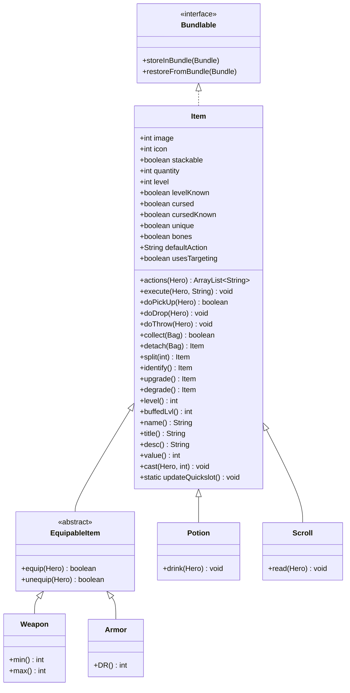

# Item 源码详解

## 1. 基本信息

| 属性 | 值 |
|------|-----|
| **文件路径** | core/src/main/java/com/shatteredpixel/shatteredpixeldungeon/items/Item.java |
| **包名** | com.shatteredpixel.shatteredpixeldungeon.items |
| **类类型** | class（非抽象） |
| **继承关系** | implements Bundlable |
| **代码行数** | 725 |

---

## 类职责

Item 是游戏中所有"物品"的基类。它是游戏物品系统的核心，处理：

1. **基础属性**：图像、名称、数量、等级
2. **状态管理**：鉴定、诅咒、唯一性
3. **物品操作**：拾取、丢弃、投掷
4. **堆叠系统**：可堆叠物品的合并
5. **序列化**：存档/读档支持

**设计模式**：
- **模板方法模式**：`execute()` 定义操作框架，子类重写具体行为
- **原型模式**：通过 Bundle 复制物品

---

## 4. 继承与协作关系



---

## 静态常量

### 时间常量

| 字段名 | 类型 | 值 | 说明 |
|--------|------|-----|------|
| `TIME_TO_THROW` | float | 1.0f | 投掷所需时间 |
| `TIME_TO_PICK_UP` | float | 1.0f | 拾取所需时间 |
| `TIME_TO_DROP` | float | 1.0f | 丢弃所需时间 |

### 动作常量

| 字段名 | 类型 | 值 | 说明 |
|--------|------|-----|------|
| `AC_DROP` | String | "DROP" | 丢弃动作 |
| `AC_THROW` | String | "THROW" | 投掷动作 |

---

## 实例字段

### 视觉属性

| 字段名 | 类型 | 默认值 | 说明 |
|--------|------|--------|------|
| `image` | int | 0 | 物品图像索引 |
| `icon` | int | -1 | 物品图标索引（用于随机图像物品） |

### 堆叠属性

| 字段名 | 类型 | 默认值 | 说明 |
|--------|------|--------|------|
| `stackable` | boolean | false | 是否可堆叠 |
| `quantity` | int | 1 | 数量 |
| `dropsDownHeap` | boolean | false | 是否掉落到物品堆下方 |

### 等级属性

| 字段名 | 类型 | 默认值 | 说明 |
|--------|------|--------|------|
| `level` | int | 0 | 物品等级 |
| `levelKnown` | boolean | false | 等级是否已知 |

### 诅咒属性

| 字段名 | 类型 | 默认值 | 说明 |
|--------|------|--------|------|
| `cursed` | boolean | false | 是否被诅咒 |
| `cursedKnown` | boolean | false | 诅咒状态是否已知 |

### 特殊属性

| 字段名 | 类型 | 默认值 | 说明 |
|--------|------|--------|------|
| `unique` | boolean | false | 是否唯一（复活后保留） |
| `keptThoughLostInvent` | boolean | false | 是否在丢失背包后保留 |
| `bones` | boolean | false | 是否可以出现在英雄遗骸中 |
| `customNoteID` | int | -1 | 自定义笔记ID |

### 行为属性

| 字段名 | 类型 | 默认值 | 说明 |
|--------|------|--------|------|
| `defaultAction` | String | null | 默认动作 |
| `usesTargeting` | boolean | false | 是否需要选择目标 |

---

## 静态字段

| 字段名 | 类型 | 说明 |
|--------|------|------|
| `itemComparator` | Comparator&lt;Item&gt; | 物品排序比较器 |
| `curUser` | Hero | 当前使用物品的英雄 |
| `curItem` | Item | 当前使用的物品 |
| `thrower` | CellSelector.Listener | 投掷目标选择器 |

---

## 7. 方法详解

### actions(Hero hero)

```java
public ArrayList<String> actions( Hero hero ) {
    ArrayList<String> actions = new ArrayList<>();
    actions.add( AC_DROP );   // 所有物品都可以丢弃
    actions.add( AC_THROW );  // 所有物品都可以投掷
    return actions;
}
```

**方法作用**：返回该物品可用的动作列表。

**参数**：
- `hero` (Hero)：英雄

**返回值**：动作名称列表

**重写说明**：子类添加特定动作，如 `AC_DRINK`、`AC_READ`、`AC_EQUIP` 等

---

### actionName(String action, Hero hero)

```java
public String actionName(String action, Hero hero){
    return Messages.get(this, "ac_" + action);
}
```

**方法作用**：返回动作的显示名称。

**参数**：
- `action` (String)：动作标识符
- `hero` (Hero)：英雄

**返回值**：本地化的动作名称

---

### doPickUp(Hero hero, int pos)

```java
public boolean doPickUp(Hero hero, int pos) {
    if (collect( hero.belongings.backpack )) {
        GameScene.pickUp( this, pos );  // 播放拾取动画
        Sample.INSTANCE.play( Assets.Sounds.ITEM );  // 播放音效
        hero.spendAndNext( pickupDelay() );  // 消耗时间
        return true;
    } else {
        return false;  // 背包已满
    }
}
```

**方法作用**：执行拾取物品。

**参数**：
- `hero` (Hero)：拾取者
- `pos` (int)：物品位置

**返回值**：是否成功拾取

---

### doDrop(Hero hero)

```java
public void doDrop( Hero hero ) {
    hero.spendAndNext(TIME_TO_DROP);
    int pos = hero.pos;
    Dungeon.level.drop(detachAll(hero.belongings.backpack), pos).sprite.drop(pos);
}
```

**方法作用**：执行丢弃物品。

---

### doThrow(Hero hero)

```java
public void doThrow( Hero hero ) {
    GameScene.selectCell(thrower);  // 显示目标选择界面
}
```

**方法作用**：执行投掷物品（显示目标选择）。

---

### execute(Hero hero, String action)

```java
public void execute( Hero hero, String action ) {
    GameScene.cancel();  // 取消当前操作
    curUser = hero;
    curItem = this;
    
    if (action.equals( AC_DROP )) {
        if (hero.belongings.backpack.contains(this) || isEquipped(hero)) {
            doDrop(hero);
        }
    } else if (action.equals( AC_THROW )) {
        if (hero.belongings.backpack.contains(this) || isEquipped(hero)) {
            doThrow(hero);
        }
    }
}
```

**方法作用**：执行指定动作。

**参数**：
- `hero` (Hero)：执行者
- `action` (String)：动作标识符

---

### onThrow(int cell)

```java
protected void onThrow( int cell ) {
    Heap heap = Dungeon.level.drop( this, cell );  // 在目标位置创建物品堆
    if (!heap.isEmpty()) {
        heap.sprite.drop( cell );  // 播放掉落动画
    }
}
```

**方法作用**：物品落地时的处理。

**参数**：
- `cell` (int)：目标格子

**重写说明**：
- 投掷武器：对目标造成伤害
- 药水：破碎并产生效果
- 炸弹：点燃并爆炸

---

### collect(Bag container)

```java
public boolean collect( Bag container ) {
    if (quantity <= 0){
        return true;  // 空物品自动成功
    }

    ArrayList<Item> items = container.items;

    if (items.contains( this )) {
        return true;  // 已在容器中
    }

    // 第1-10行：尝试放入子背包
    for (Item item:items) {
        if (item instanceof Bag && ((Bag)item).canHold( this )) {
            if (collect( (Bag)item )){
                return true;
            }
        }
    }

    if (!container.canHold(this)){
        return false;  // 容器已满
    }
    
    // 第11-30行：处理可堆叠物品
    if (stackable) {
        for (Item item:items) {
            if (isSimilar( item )) {
                item.merge( this );  // 合并到现有堆叠
                item.updateQuickslot();
                // 触发徽章和天赋
                if (Dungeon.hero != null && Dungeon.hero.isAlive()) {
                    Badges.validateItemLevelAquired( this );
                    Talent.onItemCollected(Dungeon.hero, item);
                    if (isIdentified()) {
                        Catalog.setSeen(getClass());
                        Statistics.itemTypesDiscovered.add(getClass());
                    }
                }
                return true;
            }
        }
    }

    // 第31-50行：添加到容器
    if (Dungeon.hero != null && Dungeon.hero.isAlive()) {
        Badges.validateItemLevelAquired( this );
        Talent.onItemCollected( Dungeon.hero, this );
        if (isIdentified()){
            Catalog.setSeen(getClass());
            Statistics.itemTypesDiscovered.add(getClass());
        }
    }

    items.add( this );
    Dungeon.quickslot.replacePlaceholder(this);
    Collections.sort( items, itemComparator );
    updateQuickslot();
    return true;
}
```

**方法作用**：将物品收集到容器中。

**参数**：
- `container` (Bag)：目标容器

**返回值**：是否成功

**收集逻辑**：
1. 检查是否已在容器中
2. 尝试放入子背包
3. 检查容器容量
4. 如果可堆叠，尝试合并
5. 添加到容器并排序

---

### merge(Item other)

```java
public Item merge( Item other ){
    if (isSimilar( other )){
        quantity += other.quantity;
        other.quantity = 0;
    }
    return this;
}
```

**方法作用**：合并两个相似物品。

**参数**：
- `other` (Item)：要合并的物品

**返回值**：合并后的物品（通常是this）

---

### isSimilar(Item item)

```java
public boolean isSimilar( Item item ) {
    return getClass() == item.getClass();  // 默认：同类物品可合并
}
```

**方法作用**：判断两个物品是否可以合并。

**重写说明**：某些物品需要更严格的判断，如不同等级的药水

---

### split(int amount)

```java
public Item split( int amount ){
    if (amount <= 0 || amount >= quantity()) {
        return null;
    } else {
        // 通过Bundle复制物品
        Item split = Reflection.newInstance(getClass());
        if (split == null){
            return null;
        }
        Bundle copy = new Bundle();
        this.storeInBundle(copy);
        split.restoreFromBundle(copy);
        split.quantity(amount);
        quantity -= amount;
        return split;
    }
}
```

**方法作用**：从堆叠中分离指定数量的物品。

**参数**：
- `amount` (int)：要分离的数量

**返回值**：新物品实例，失败返回null

---

### detach(Bag container)

```java
public final Item detach( Bag container ) {
    if (quantity <= 0) {
        return null;
    } else if (quantity == 1) {
        if (stackable){
            Dungeon.quickslot.convertToPlaceholder(this);  // 转换为占位符
        }
        return detachAll( container );
    } else {
        Item detached = split(1);  // 分离一个
        updateQuickslot();
        if (detached != null) detached.onDetach( );
        return detached;
    }
}
```

**方法作用**：从容器中取出一个物品。

**参数**：
- `container` (Bag)：容器

**返回值**：取出的物品

---

### detachAll(Bag container)

```java
public final Item detachAll( Bag container ) {
    Dungeon.quickslot.clearItem( this );

    for (Item item : container.items) {
        if (item == this) {
            container.items.remove(this);
            item.onDetach();
            container.grabItems();  // 尝试填充空位
            updateQuickslot();
            return this;
        } else if (item instanceof Bag) {
            Bag bag = (Bag)item;
            if (bag.contains( this )) {
                return detachAll( bag );
            }
        }
    }

    updateQuickslot();
    return this;
}
```

**方法作用**：从容器中取出整个堆叠。

---

### level() / trueLevel() / buffedLvl()

```java
// 真实等级（不考虑任何修正）
public final int trueLevel(){
    return level;
}

// 持久等级（只考虑持久修正如诅咒注入）
public int level(){
    return level;
}

// 缓冲后等级（考虑临时修正如退化）
public int buffedLvl(){
    if (Dungeon.hero != null && Dungeon.hero.buff( Degrade.class ) != null
        && (isEquipped( Dungeon.hero ) || Dungeon.hero.belongings.contains( this ))) {
        return Degrade.reduceLevel(level());
    } else {
        return level();
    }
}
```

**方法作用**：获取物品等级，不同方法考虑不同的修正。

---

### upgrade() / degrade()

```java
public Item upgrade() {
    this.level++;
    updateQuickslot();
    return this;  // 链式调用
}

public Item degrade() {
    this.level--;
    return this;
}
```

**方法作用**：升级/降级物品。

**返回值**：this（支持链式调用）

---

### identify()

```java
public final Item identify(){
    return identify(true);
}

public Item identify( boolean byHero ) {
    if (byHero && Dungeon.hero != null && Dungeon.hero.isAlive()){
        Catalog.setSeen(getClass());
        Statistics.itemTypesDiscovered.add(getClass());
    }

    levelKnown = true;
    cursedKnown = true;
    Item.updateQuickslot();
    
    return this;
}
```

**方法作用**：鉴定物品。

**参数**：
- `byHero` (boolean)：是否由英雄鉴定

---

### isIdentified()

```java
public boolean isIdentified() {
    return levelKnown && cursedKnown;
}
```

**方法作用**：判断物品是否完全鉴定。

---

### visiblyUpgraded()

```java
public int visiblyUpgraded() {
    return levelKnown ? level() : 0;
}
```

**方法作用**：返回显示的升级值（未知则返回0）。

---

### title()

```java
public String title() {
    String name = name();

    // 添加升级值
    if (visiblyUpgraded() != 0)
        name = Messages.format( TXT_TO_STRING_LVL, name, visiblyUpgraded() );

    // 添加数量
    if (quantity > 1)
        name = Messages.format( TXT_TO_STRING_X, name, quantity );

    return name;
}
```

**方法作用**：返回物品的完整显示名称。

**格式示例**：
- `"长剑 +3"`
- `"治疗药水 x5"`

---

### name() / trueName()

```java
public String name() {
    return trueName();
}

public final String trueName() {
    return Messages.get(this, "name");
}
```

**方法作用**：返回物品名称。

---

### desc()

```java
public String desc() {
    return Messages.get(this, "desc");
}
```

**方法作用**：返回物品描述。

---

### info()

```java
public String info() {
    if (Dungeon.hero != null) {
        Notes.CustomRecord note = Notes.findCustomRecord(customNoteID);
        if (note != null) {
            return Messages.get(this, "custom_note", note.title()) + "\n\n" + desc();
        }
        // 检查类型笔记
        note = Notes.findCustomRecord(getClass());
        if (note != null) {
            return Messages.get(this, "custom_note_type", note.title()) + "\n\n" + desc();
        }
    }
    return desc();
}
```

**方法作用**：返回物品完整信息（包含自定义笔记）。

---

### cast(Hero user, int dst)

```java
public void cast( final Hero user, final int dst ) {
    final int cell = throwPos( user, dst );
    user.sprite.zap( cell );  // 播放投掷动画
    user.busy();

    throwSound();

    Char enemy = Actor.findChar( cell );
    QuickSlotButton.target(enemy);
    
    final float delay = castDelay(user, cell);

    if (enemy != null) {
        // 有目标：飞向敌人
        ((MissileSprite) user.sprite.parent.recycle(MissileSprite.class)).
                reset(user.sprite, enemy.sprite, this, new Callback() {
                    @Override
                    public void call() {
                        curUser = user;
                        Item i = Item.this.detach(user.belongings.backpack);
                        if (i != null) i.onThrow(cell);
                        // 即兴投掷物天赋
                        if (curUser.hasTalent(Talent.IMPROVISED_PROJECTILES)
                                && !(Item.this instanceof MissileWeapon)
                                && curUser.buff(Talent.ImprovisedProjectileCooldown.class) == null){
                            if (enemy != null && enemy.alignment != curUser.alignment){
                                Buff.affect(enemy, Blindness.class, ...);
                            }
                        }
                        // 致命动能天赋
                        if (user.buff(Talent.LethalMomentumTracker.class) != null){
                            user.next();  // 立即行动
                        } else {
                            user.spendAndNext(delay);
                        }
                    }
                });
    } else {
        // 无目标：飞向格子
        ((MissileSprite) user.sprite.parent.recycle(MissileSprite.class)).
                reset(user.sprite, cell, this, new Callback() {
                    @Override
                    public void call() {
                        curUser = user;
                        Item i = Item.this.detach(user.belongings.backpack);
                        user.spend(delay);
                        if (i != null) i.onThrow(cell);
                        user.next();
                    }
                });
    }
}
```

**方法作用**：执行投掷动画和逻辑。

**参数**：
- `user` (Hero)：投掷者
- `dst` (int)：目标位置

---

### throwPos(Hero user, int dst)

```java
public int throwPos( Hero user, int dst){
    return new Ballistica( user.pos, dst, Ballistica.PROJECTILE ).collisionPos;
}
```

**方法作用**：计算投掷的实际落点。

**参数**：
- `user` (Hero)：投掷者
- `dst` (int)：目标位置

**返回值**：碰撞位置

---

## 静态方法详解

### updateQuickslot()

```java
public static void updateQuickslot() {
    GameScene.updateItemDisplays = true;
}
```

**方法作用**：标记快捷栏需要更新。

---

### evoke(Hero hero)

```java
public static void evoke( Hero hero ) {
    hero.sprite.emitter().burst( Speck.factory( Speck.EVOKE ), 5 );
}
```

**方法作用**：播放物品激发特效。

---

## 与其他类的交互

### 被哪些类继承

| 类名 | 说明 |
|------|------|
| `EquipableItem` | 可装备物品基类 |
| `Potion` | 药水 |
| `Scroll` | 卷轴 |
| `Wand` | 法杖 |
| `Ring` | 戒指 |
| `Artifact` | 神器 |
| `Food` | 食物 |
| `Bomb` | 炸弹 |
| `Spell` | 法术 |
| `Key` | 钥匙 |

### 使用了哪些类

| 类名 | 用于什么目的 |
|------|-------------|
| `Hero` | 物品使用者 |
| `Bag` | 物品容器 |
| `Heap` | 地上的物品堆 |
| `Bundle` | 序列化 |
| `Messages` | 国际化文本 |
| `GameScene` | 场景交互 |
| `Ballistica` | 弹道计算 |

---

## 11. 使用示例

### 创建自定义物品

```java
public class CustomItem extends Item {
    {
        image = ItemSpriteSheet.CUSTOM;
        stackable = true;
        defaultAction = AC_USE;
    }
    
    public static final String AC_USE = "USE";
    
    @Override
    public ArrayList<String> actions(Hero hero) {
        ArrayList<String> actions = super.actions(hero);
        actions.add(AC_USE);
        return actions;
    }
    
    @Override
    public void execute(Hero hero, String action) {
        super.execute(hero, action);
        if (action.equals(AC_USE)) {
            // 使用逻辑
            hero.spendAndNext(1f);
        }
    }
    
    @Override
    public String desc() {
        return "这是一个自定义物品。";
    }
    
    @Override
    public int value() {
        return 100 * quantity;
    }
}
```

### 使用物品

```java
// 拾取
item.doPickUp(hero);

// 丢弃
item.doDrop(hero);

// 投掷
item.cast(hero, targetPos);

// 升级
item.upgrade();

// 鉴定
item.identify();

// 分离堆叠
Item single = stackableItem.split(1);
```

---

## 注意事项

### 堆叠规则

1. **isSimilar()** 判断是否可合并，默认为同类物品
2. **merge()** 执行合并操作
3. **split()** 分离时通过 Bundle 复制

### 等级系统

1. **trueLevel()**：原始等级
2. **level()**：持久等级
3. **buffedLvl()**：考虑临时修正的等级

### 常见的坑

1. **忘记调用 updateQuickslot()**：快捷栏不会更新
2. **quantity 未正确管理**：堆叠物品行为异常
3. **onDetach() 未重写**：分离时缺少清理逻辑

### 最佳实践

1. 使用 `upgrade()` 返回 this 支持链式调用
2. 重写 `desc()` 提供详细描述
3. 重写 `value()` 设置合理售价
4. 使用 `defaultAction` 设置常用操作