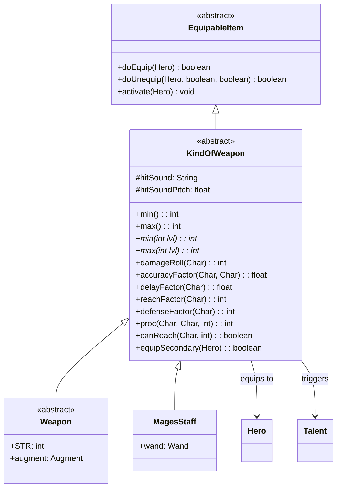

# KindOfWeapon 类文档

## 1. 基本信息

| 属性 | 值 |
|------|-----|
| 文件路径 | core/src/main/java/com/shatteredpixel/shatteredpixeldungeon/items/KindOfWeapon.java |
| 包名 | com.shatteredpixel.shatteredpixeldungeon.items |
| 类类型 | abstract class |
| 继承关系 | extends EquipableItem |
| 代码行数 | 293 行 |
| 许可证 | GNU GPL v3 |

## 2. 类职责说明

`KindOfWeapon` 是所有武器类型的抽象基类，负责：

1. **武器装备管理** - 处理主/副手武器装备逻辑，支持决斗家(Champion)子职业的双武器系统
2. **战斗属性接口** - 定义伤害范围、命中率、攻击延迟、攻击距离等核心战斗属性
3. **天赋系统集成** - 支持快速装备(Swift Equip)和神圣直觉(Holy Intuition)天赋
4. **诅咒机制** - 处理诅咒武器的装备惩罚和检测
5. **音效系统** - 管理武器命中时的音效播放

## 4. 继承与协作关系



## 静态常量表

| 常量名 | 类型 | 值 | 说明 |
|--------|------|-----|------|
| (继承自EquipableItem) | - | - | AC_EQUIP, AC_UNEQUIP 等动作常量 |

## 实例字段表

| 字段名 | 类型 | 修饰符 | 默认值 | 说明 |
|--------|------|--------|--------|------|
| hitSound | String | protected | Assets.Sounds.HIT | 武器命中时的音效资源路径 |
| hitSoundPitch | float | protected | 1f | 音效音高倍率 |
| isSwiftEquipping | boolean | private static | false | 是否正在执行快速装备 |

## 7. 方法详解

### execute(Hero hero, String action)

**签名**: `@Override public void execute(Hero hero, String action)`

**功能**: 处理武器的动作执行，为决斗家子职业提供主/副手选择界面。

**参数**:
- `hero`: Hero - 执行动作的英雄
- `action`: String - 动作类型（如 AC_EQUIP）

**实现逻辑**:

```
第50-92行：重写execute方法，处理决斗家双武器装备逻辑
├─ 第51行：检查是否为决斗家子职业且动作为装备
│  ├─ 第52行：禁用目标锁定
│  ├─ 第53-56行：获取主/副手武器名称，超过18字符则截断
│  ├─ 第57-88行：显示装备选择窗口
│  │  ├─ 第61行：选项1 - 装备到主手
│  │  └─ 第62行：选项2 - 装备到副手
│  └─ 第65-86行：onSelect回调处理
│     ├─ 第72-73行：选择主手则调用doEquip()
│     └─ 第74-75行：选择副手则调用equipSecondary()
└─ 第89-91行：非决斗家或非装备动作，调用父类方法
```

### isEquipped(Hero hero)

**签名**: `@Override public boolean isEquipped(Hero hero)`

**功能**: 检查武器是否已装备在主手或副手。

**返回值**: `boolean` - 如果在主手或副手则返回true

**实现逻辑**:
```java
// 第95-97行：检查hero非空且武器在主手或副手位置
return hero != null && (hero.belongings.weapon() == this || hero.belongings.secondWep() == this);
```

### timeToEquip(Hero hero)

**签名**: `protected float timeToEquip(Hero hero)`

**功能**: 返回装备所需时间，支持快速装备天赋时返回0。

**返回值**: `float` - 装备时间（回合数）

**实现逻辑**:
```java
// 第101-103行：如果正在快速装备则返回0，否则返回父类时间
return isSwiftEquipping ? 0f : super.timeToEquip(hero);
```

### doEquip(Hero hero)

**签名**: `@Override public boolean doEquip(Hero hero)`

**功能**: 将武器装备到英雄主手。

**返回值**: `boolean` - 装备成功返回true

**实现逻辑**:

```
第106-159行：主手装备流程
├─ 第108-114行：检查快速装备天赋
│  └─ 如果有SwiftEquip天赋且无冷却或可二次使用，设置isSwiftEquipping=true
├─ 第117-123行：神圣直觉天赋检测诅咒（非牧师职业）
│  └─ 15%/25%概率在装备诅咒武器前发现诅咒
├─ 第125行：从背包移除武器
├─ 第127-152行：如果主手为空或当前武器可卸下
│  ├─ 第129行：设置主手武器
│  ├─ 第130行：激活武器效果
│  ├─ 第131行：触发Talent.onItemEquipped()
│  ├─ 第135行：标记诅咒已知
│  ├─ 第136-139行：如果诅咒则应用诅咒效果
│  ├─ 第141行：消耗装备时间
│  └─ 第142-151行：处理快速装备冷却
└─ 第154-158行：装备失败则收回背包
```

### equipSecondary(Hero hero)

**签名**: `public boolean equipSecondary(Hero hero)`

**功能**: 将武器装备到英雄副手（决斗家专属）。

**返回值**: `boolean` - 装备成功返回true

**实现逻辑**:

```
第161-206行：副手装备流程
├─ 第163-169行：检查快速装备天赋（同doEquip）
├─ 第171-172行：从背包移除武器
├─ 第174-199行：如果副手为空或当前副武器可卸下
│  ├─ 第176行：设置副手武器
│  ├─ 第177-180行：激活效果、触发天赋、更新快捷栏
│  ├─ 第182-186行：处理诅咒
│  └─ 第188-198行：处理快速装备冷却
└─ 第201-205行：装备失败则收回背包
```

### doUnequip(Hero hero, boolean collect, boolean single)

**签名**: `@Override public boolean doUnequip(Hero hero, boolean collect, boolean single)`

**功能**: 卸下武器，支持主手和副手。

**参数**:
- `hero`: Hero - 英雄
- `collect`: boolean - 是否收回背包
- `single`: boolean - 是否单次操作

**返回值**: `boolean` - 卸下成功返回true

**实现逻辑**:
```java
// 第208-232行：处理副手武器卸下逻辑
boolean second = hero.belongings.secondWep == this;  // 检查是否为副手
if (second) {
    hero.belongings.secondWep = null;  // 先清空副手槽位
}
if (super.doUnequip(hero, collect, single)) {
    if (!second) {
        hero.belongings.weapon = null;  // 主手卸下后清空主手槽位
    }
    return true;
} else {
    if (second) {
        hero.belongings.secondWep = this;  // 失败则恢复副手
    }
    return false;
}
```

### min() / max()

**签名**: `public int min()` / `public int max()`

**功能**: 返回武器的最小/最大基础伤害。

**实现逻辑**:
```java
// 第234-240行：调用抽象方法获取当前强化等级的伤害值
public int min() { return min(buffedLvl()); }
public int max() { return max(buffedLvl()); }

// 抽象方法，子类必须实现
abstract public int min(int lvl);
abstract public int max(int lvl);
```

### damageRoll(Char owner)

**签名**: `public int damageRoll(Char owner)`

**功能**: 计算实际伤害值。

**返回值**: `int` - 随机伤害值

**实现逻辑**:
```java
// 第245-251行：根据持有者类型选择不同的随机算法
if (owner instanceof Hero) {
    return Hero.heroDamageIntRange(min(), max());  // 英雄使用特殊随机算法
} else {
    return Random.NormalIntRange(min(), max());    // 其他角色使用普通随机
}
```

### accuracyFactor(Char owner, Char target)

**签名**: `public float accuracyFactor(Char owner, Char target)`

**功能**: 返回命中率因子，默认1.0。

**返回值**: `float` - 命中率倍率

**实现逻辑**:
```java
// 第253-255行：默认返回1.0，子类可重写
return 1f;
```

### delayFactor(Char owner)

**签名**: `public float delayFactor(Char owner)`

**功能**: 返回攻击延迟因子，默认1.0。

**返回值**: `float` - 延迟倍率

**实现逻辑**:
```java
// 第257-259行：默认返回1.0，子类可重写
return 1f;
```

### reachFactor(Char owner)

**签名**: `public int reachFactor(Char owner)`

**功能**: 返回攻击距离，默认1格。

**返回值**: `int` - 攻击距离（格数）

**实现逻辑**:
```java
// 第261-263行：默认返回1，子类可重写（如长柄武器）
return 1;
```

### canReach(Char owner, int target)

**签名**: `public boolean canReach(Char owner, int target)`

**功能**: 检查是否能攻击到目标位置。

**参数**:
- `owner`: Char - 攻击者
- `target`: int - 目标位置

**返回值**: `boolean` - 能否到达目标

**实现逻辑**:

```
第265-279行：攻击距离判定
├─ 第266-269行：如果直线距离超过reach则返回false
├─ 第270-273行：构建可通行数组，排除其他角色
├─ 第275行：从目标位置构建距离图
└─ 第277行：检查攻击者位置是否在可达范围内
```

### defenseFactor(Char owner)

**签名**: `public int defenseFactor(Char owner)`

**功能**: 返回防御加成，默认0。

**返回值**: `int` - 防御值加成

**实现逻辑**:
```java
// 第281-283行：默认返回0，子类可重写
return 0;
```

### proc(Char attacker, Char defender, int damage)

**签名**: `public int proc(Char attacker, Char defender, int damage)`

**功能**: 处理命中时的特效（如附魔效果）。

**返回值**: `int` - 修正后的伤害值

**实现逻辑**:
```java
// 第285-287行：默认返回原伤害，子类可重写
return damage;
```

### hitSound(float pitch)

**签名**: `public void hitSound(float pitch)`

**功能**: 播放武器命中音效。

**参数**:
- `pitch`: float - 音高倍率

**实现逻辑**:
```java
// 第289-291行：播放hitSound音效，叠加hitSoundPitch和传入的pitch
Sample.INSTANCE.play(hitSound, 1, pitch * hitSoundPitch);
```

## 11. 使用示例

### 创建自定义武器

```java
public class CustomSword extends KindOfWeapon {
    
    public CustomSword() {
        hitSound = Assets.Sounds.HIT_SLASH;  // 设置挥砍音效
        hitSoundPitch = 1.1f;  // 稍高的音高
    }
    
    @Override
    public int min(int lvl) {
        return 5 + lvl;  // 最小伤害 = 5 + 强化等级
    }
    
    @Override
    public int max(int lvl) {
        return 15 + 3 * lvl;  // 最大伤害 = 15 + 3*强化等级
    }
    
    @Override
    public float delayFactor(Char owner) {
        return 1.2f;  // 比普通武器稍慢
    }
    
    @Override
    public int reachFactor(Char owner) {
        return 1;  // 普通距离
    }
}
```

### 处理武器装备

```java
// 装备武器到主手
KindOfWeapon weapon = new CustomSword();
if (weapon.doEquip(hero)) {
    GLog.i("武器装备成功！");
}

// 决斗家装备副手武器
if (hero.subClass == HeroSubClass.CHAMPION) {
    weapon.equipSecondary(hero);
}

// 检查武器是否已装备
if (weapon.isEquipped(hero)) {
    int damage = weapon.damageRoll(hero);
}
```

### 计算伤害

```java
// 获取伤害范围
int minDmg = weapon.min();  // 最小伤害
int maxDmg = weapon.max();  // 最大伤害

// 计算实际伤害
int actualDmg = weapon.damageRoll(hero);

// 应用命中特效
actualDmg = weapon.proc(attacker, defender, actualDmg);
```

## 注意事项

1. **双武器系统** - 只有决斗家(Champion)子职业可以使用副手武器
2. **快速装备天赋** - SwiftEquip天赋可以让装备不消耗回合，但有冷却限制
3. **诅咒检测** - HolyIntuition天赋有概率在装备诅咒武器前发现诅咒
4. **抽象方法** - 子类必须实现`min(int lvl)`和`max(int lvl)`方法
5. **伤害随机** - 英雄使用`Hero.heroDamageIntRange()`确保伤害分布合理

## 最佳实践

### 实现新武器类型

```java
public class NewWeapon extends KindOfWeapon {
    
    @Override
    public int min(int lvl) {
        // 定义最小伤害公式
        return baseMin + scaling * lvl;
    }
    
    @Override
    public int max(int lvl) {
        // 定义最大伤害公式
        return baseMax + scaling * lvl;
    }
    
    @Override
    public float accuracyFactor(Char owner, Char target) {
        // 可选：调整命中率
        return 1.0f;
    }
    
    @Override
    public int proc(Char attacker, Char defender, int damage) {
        // 可选：添加命中特效
        return damage;
    }
}
```

### 扩展攻击距离

```java
// 长柄武器示例
@Override
public int reachFactor(Char owner) {
    return 2;  // 可以攻击2格距离
}

@Override
public float accuracyFactor(Char owner, Char target) {
    // 近距离惩罚
    int dist = Dungeon.level.distance(owner.pos, target.pos);
    if (dist == 1) {
        return 0.8f;  // 相邻格子命中率降低
    }
    return 1.0f;
}
```

## 相关文件

| 文件 | 说明 |
|------|------|
| EquipableItem.java | 父类，可装备物品基类 |
| Weapon.java | 子类，标准武器实现 |
| MagesStaff.java | 子类，法师法杖 |
| Belongings.java | 英雄物品栏管理 |
| Talent.java | 天赋系统集成 |