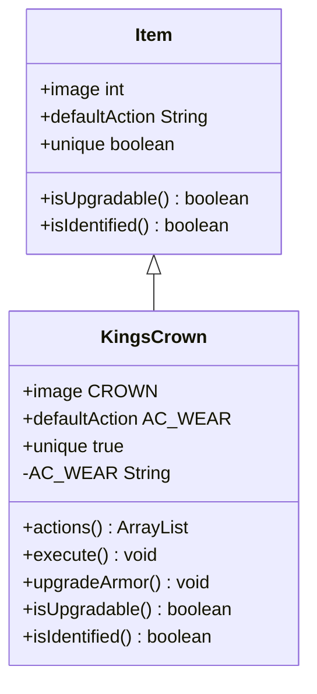

# KingsCrown 类文档

## 1. 基本信息
| 属性 | 值 |
|------|-----|
| 文件路径 | core/src/main/java/com/shatteredpixel/shatteredpixeldungeon/items/KingsCrown.java |
| 包名 | com.shatteredpixel.shatteredpixeldungeon.items |
| 类类型 | public class |
| 继承关系 | extends Item |
| 代码行数 | 129 行 |

## 2. 类职责说明
KingsCrown（国王皇冠）是特殊物品，用于将普通护甲升级为职业护甲。使用皇冠需要穿着护甲，升级后护甲获得职业特殊能力。这是角色成长的重要里程碑物品。

## 4. 继承与协作关系


## 静态常量表
| 常量名 | 类型 | 值 | 说明 |
|--------|------|-----|------|
| AC_WEAR | String | "WEAR" | 佩戴动作标识 |

## 实例字段表
| 字段名 | 类型 | 修饰符 | 说明 |
|--------|------|--------|------|
| image | int | 初始化块 | 精灵图为 CROWN |
| defaultAction | String | 初始化块 | 默认动作 AC_WEAR |
| unique | boolean | 初始化块 | 唯一物品 true |

## 7. 方法详解

### actions
**签名**: `public ArrayList<String> actions(Hero hero)`
**功能**: 获取可用动作列表
**返回值**: ArrayList\<String\> - 包含佩戴动作

### execute
**签名**: `public void execute(Hero hero, String action)`
**功能**: 执行动作，打开能力选择窗口
**参数**:
- hero: Hero - 英雄角色
- action: String - 动作名称
**实现逻辑**:
```java
// 第64-78行：执行佩戴动作
super.execute(hero, action);

if (action.equals(AC_WEAR)) {
    curUser = hero;
    if (hero.belongings.armor() != null) {
        GameScene.show(new WndChooseAbility(this, hero.belongings.armor(), hero));  // 打开能力选择窗口
    } else {
        GLog.w(Messages.get(this, "naked"));      // 没穿护甲警告
    }
}
```

### upgradeArmor
**签名**: `public void upgradeArmor(Hero hero, Armor armor, ArmorAbility ability)`
**功能**: 升级护甲为职业护甲
**参数**:
- hero: Hero - 英雄角色
- armor: Armor - 要升级的护甲
- ability: ArmorAbility - 选择的职业能力
**实现逻辑**:
```java
// 第90-127行：升级护甲
detach(hero.belongings.backpack);                 // 消耗皇冠
Catalog.countUse(getClass());

hero.sprite.emitter().burst(Speck.factory(Speck.CROWN), 12);
hero.spend(Actor.TICK);
hero.busy();

if (armor != null) {
    if (ability instanceof Ratmogrify) {
        GLog.p(Messages.get(this, "ratgraded"));  // 特殊消息
    } else {
        GLog.p(Messages.get(this, "upgraded"));   // 升级消息
    }
    
    ClassArmor classArmor = ClassArmor.upgrade(hero, armor);
    if (hero.belongings.armor == armor) {
        hero.belongings.armor = classArmor;
        ((HeroSprite) hero.sprite).updateArmor();
        classArmor.activate(hero);
    } else {
        armor.detach(hero.belongings.backpack);
        classArmor.collect(hero.belongings.backpack);
    }
}

hero.armorAbility = ability;                      // 设置职业能力
Talent.initArmorTalents(hero);                    // 初始化护甲天赋

hero.sprite.operate(hero.pos);
Sample.INSTANCE.play(Assets.Sounds.MASTERY);
```

### isUpgradable
**签名**: `public boolean isUpgradable()`
**功能**: 是否可升级
**返回值**: boolean - false

### isIdentified
**签名**: `public boolean isIdentified()`
**功能**: 是否已鉴定
**返回值**: boolean - true

## 11. 使用示例
```java
// 获得国王皇冠
KingsCrown crown = new KingsCrown();

// 需要穿着护甲才能使用
if (hero.belongings.armor() != null) {
    // 打开能力选择窗口
    // 选择职业能力后升级护甲
}
```

## 注意事项
1. 必须穿着护甲才能使用
2. 升级后护甲变为职业护甲
3. 每个职业有不同的能力选择
4. 皇冠使用后消耗

## 最佳实践
1. 选择与职业匹配的能力
2. 优先升级高级护甲
3. 职业护甲解锁新天赋
4. 不同能力适合不同玩法