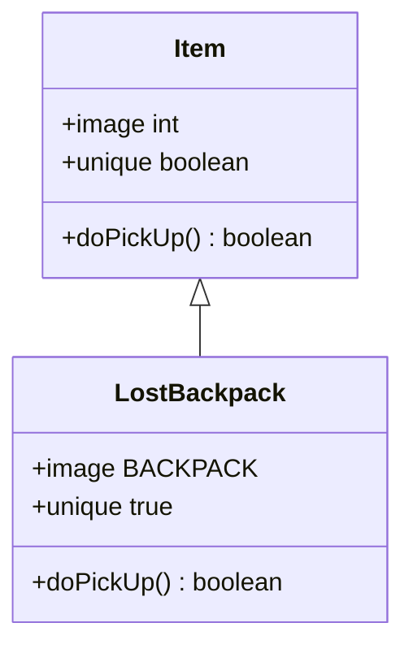

# LostBackpack 类文档

## 1. 基本信息
| 属性 | 值 |
|------|-----|
| 文件路径 | core/src/main/java/com/shatteredpixel/shatteredpixeldungeon/items/LostBackpack.java |
| 包名 | com.shatteredpixel.shatteredpixeldungeon.items |
| 类类型 | public class |
| 继承关系 | extends Item |
| 代码行数 | 87 行 |

## 2. 类职责说明
LostBackpack（丢失的背包）是玩家死亡后留下的物品容器。拾取后恢复所有丢失的物品和状态，包括移除丢失物品状态、重新激活装备效果、更新生命上限等。是复活后找回物品的关键道具。

## 4. 继承与协作关系


## 静态常量表
无静态常量。

## 实例字段表
| 字段名 | 类型 | 修饰符 | 说明 |
|--------|------|--------|------|
| image | int | 初始化块 | 精灵图为 BACKPACK |
| unique | boolean | 初始化块 | 唯一物品 true |

## 7. 方法详解

### doPickUp
**签名**: `public boolean doPickUp(Hero hero, int pos)`
**功能**: 拾取背包，恢复所有丢失的物品和状态
**参数**:
- hero: Hero - 英雄角色
- pos: int - 拾取位置
**返回值**: boolean - 是否成功拾取
**实现逻辑**:
```java
// 第48-86行：拾取处理
// 1. 移除丢失物品状态
if (hero.buff(LostInventory.class) != null) {
    hero.buff(LostInventory.class).detach();
}

// 2. 重新激活装备效果
MagicalHolster holster = hero.belongings.getItem(MagicalHolster.class);
for (Item i : hero.belongings) {
    if (i.keptThroughLostInventory()) {
        i.keptThoughLostInvent = false;           // 已经激活过的不再重复激活
    } else {
        // 激活各种装备效果
        if (i instanceof EquipableItem && i.isEquipped(hero)) {
            ((EquipableItem) i).activate(hero);
        } else if (i instanceof CloakOfShadows && hero.hasTalent(Talent.LIGHT_CLOAK)) {
            ((CloakOfShadows) i).activate(hero);
        } else if (i instanceof HolyTome && hero.hasTalent(Talent.LIGHT_READING)) {
            ((HolyTome) i).activate(hero);
        } else if (i instanceof Wand) {
            if (holster != null && holster.contains(i)) {
                ((Wand) i).charge(hero, MagicalHolster.HOLSTER_SCALE_FACTOR);
            } else {
                ((Wand) i).charge(hero);
            }
        } else if (i instanceof MagesStaff) {
            ((MagesStaff) i).applyWandChargeBuff(hero);
        }
    }
}

// 3. 更新生命上限
hero.updateHT(false);

// 4. 更新界面
Item.updateQuickslot();
Sample.INSTANCE.play(Assets.Sounds.DEWDROP);
hero.spendAndNext(pickupDelay());
GameScene.pickUp(this, pos);
((HeroSprite) hero.sprite).updateArmor();

// 5. 移除地图标记
Notes.remove(Notes.Landmark.LOST_PACK);
return true;
```

## 11. 使用示例
```java
// 玩家死亡后留下丢失的背包
// 复活后回到死亡地点

// 拾取背包恢复所有物品
LostBackpack backpack = new LostBackpack();
backpack.doPickUp(hero, pos);

// 所有丢失的物品恢复
// 装备效果重新激活
```

## 注意事项
1. 死亡后物品不会消失，而是留在背包中
2. 拾取背包恢复所有物品和状态
3. 已激活的装备不会重复激活
4. 会移除丢失物品状态

## 最佳实践
1. 记住死亡地点，尽快取回背包
2. 背包在地图上有标记
3. 某些天赋可以让物品保留
4. 安卡复活不会丢失物品