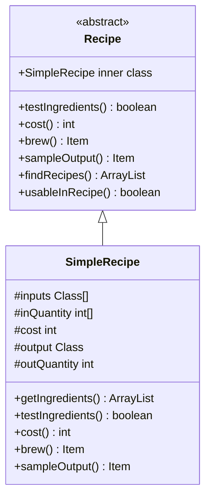

# Recipe 类文档

## 1. 基本信息
| 属性 | 值 |
|------|-----|
| 文件路径 | core/src/main/java/com/shatteredpixel/shatteredpixeldungeon/items/Recipe.java |
| 包名 | com.shatteredpixel.shatteredpixeldungeon.items |
| 类类型 | public abstract class |
| 继承关系 | 无继承 |
| 代码行数 | 271 行 |

## 2. 类职责说明
Recipe（配方）是炼金系统的核心抽象类。定义了配方的基本接口：测试材料、计算花费、制作物品、预览输出。包含SimpleRecipe子类用于简单配方，以及静态配方列表管理所有游戏配方。

## 4. 继承与协作关系


## 静态常量表
无静态常量，但有静态配方数组：
- variableRecipes: 可变配方（当前为空）
- oneIngredientRecipes: 单材料配方
- twoIngredientRecipes: 双材料配方
- threeIngredientRecipes: 三材料配方

## 实例字段表
无实例字段（抽象类）。

## 7. 方法详解

### testIngredients
**签名**: `public abstract boolean testIngredients(ArrayList<Item> ingredients)`
**功能**: 测试材料是否符合配方
**参数**:
- ingredients: ArrayList\<Item\> - 材料列表
**返回值**: boolean - 是否符合

### cost
**签名**: `public abstract int cost(ArrayList<Item> ingredients)`
**功能**: 计算配方花费（能量）
**返回值**: int - 能量花费

### brew
**签名**: `public abstract Item brew(ArrayList<Item> ingredients)`
**功能**: 制作物品
**返回值**: Item - 制作的物品

### sampleOutput
**签名**: `public abstract Item sampleOutput(ArrayList<Item> ingredients)`
**功能**: 预览输出物品
**返回值**: Item - 输出物品示例

### findRecipes (静态方法)
**签名**: `public static ArrayList<Recipe> findRecipes(ArrayList<Item> ingredients)`
**功能**: 查找适用于指定材料的配方
**返回值**: ArrayList\<Recipe\> - 可用配方列表

### usableInRecipe (静态方法)
**签名**: `public static boolean usableInRecipe(Item item)`
**功能**: 判断物品是否可用于配方
**返回值**: boolean - 是否可用
**实现逻辑**:
```java
// 第257-268行：判断物品可用性
// 装备物品：需要已鉴定、未诅咒、是可升级投掷武器
// 魔杖：需要已鉴定、未诅咒
// 其他物品：未诅咒即可
```

## 内部类详解

### SimpleRecipe
**类型**: public static abstract class extends Recipe
**功能**: 简单配方实现，用于固定输入输出的配方
**实现逻辑**:
```java
// 第77-163行：简单配方实现
// 子类只需填写：
// - inputs: 输入物品类型数组
// - inQuantity: 输入数量数组
// - cost: 能量花费
// - output: 输出物品类型
// - outQuantity: 输出数量

// 自动实现所有配方方法
```

## 配方列表

### 单材料配方
- Scroll.ScrollToStone: 卷轴转石头
- ExoticPotion.PotionToExotic: 药剂转异域药剂
- ExoticScroll.ScrollToExotic: 卷轴转异域卷轴
- ArcaneResin.Recipe: 魔杖转树脂
- LiquidMetal.Recipe: 投掷武器转液态金属
- 各种酿造和灵药配方

### 双材料配方
- Blandfruit.CookFruit: 烹饪平淡果
- Bomb.EnhanceBomb: 强化炸弹
- 各种酿造和法术配方

### 三材料配方
- Potion.SeedToPotion: 种子转药剂
- StewedMeat.threeMeat: 三块炖肉
- MeatPie.Recipe: 肉派

## 11. 使用示例
```java
// 查找可用配方
ArrayList<Recipe> recipes = Recipe.findRecipes(ingredients);

// 测试材料
if (recipe.testIngredients(ingredients)) {
    // 查看花费和输出
    int cost = recipe.cost(ingredients);
    Item output = recipe.sampleOutput(ingredients);
    
    // 制作
    Item result = recipe.brew(ingredients);
}
```

## 注意事项
1. 抽象类，不能直接实例化
2. 使用SimpleRecipe创建简单配方
3. 配方数量基于材料数量分组
4. 诅咒物品通常不可用于配方

## 最佳实践
1. 继承SimpleRecipe创建简单配方
2. 使用findRecipes查找可用配方
3. 先预览输出再确认制作
4. 注意配方的能量花费