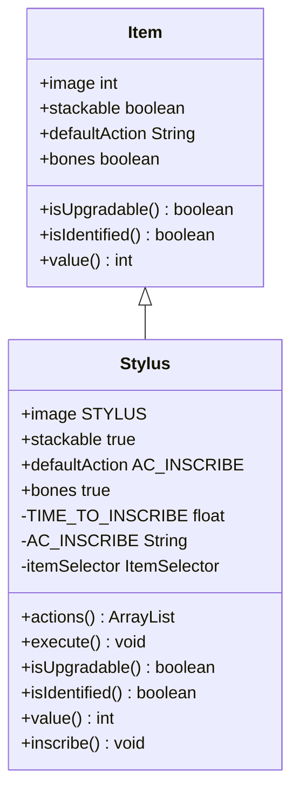

# Stylus 类文档

## 1. 基本信息
| 属性 | 值 |
|------|-----|
| 文件路径 | core/src/main/java/com/shatteredpixel/shatteredpixeldungeon/items/Stylus.java |
| 包名 | com.shatteredpixel.shatteredpixeldungeon.items |
| 类类型 | public class |
| 继承关系 | extends Item |
| 代码行数 | 142 行 |

## 2. 类职责说明
Stylus（刻笔）用于给护甲添加随机符文。使用后选择已鉴定的非诅咒护甲，添加一个随机符文。符文提供各种被动效果，是增强护甲的重要道具。

## 4. 继承与协作关系


## 静态常量表
| 常量名 | 类型 | 值 | 说明 |
|--------|------|-----|------|
| TIME_TO_INSCRIBE | float | 2 | 刻写时间 |
| AC_INSCRIBE | String | "INSCRIBE" | 刻写动作标识 |

## 实例字段表
| 字段名 | 类型 | 修饰符 | 说明 |
|--------|------|--------|------|
| image | int | 初始化块 | 精灵图为 STYLUS |
| stackable | boolean | 初始化块 | 可堆叠 true |
| defaultAction | String | 初始化块 | 默认动作 AC_INSCRIBE |
| bones | boolean | 初始化块 | 可从骨头继承 true |

## 7. 方法详解

### actions
**签名**: `public ArrayList<String> actions(Hero hero)`
**功能**: 获取可用动作列表
**返回值**: ArrayList\<String\> - 包含刻写动作

### execute
**签名**: `public void execute(Hero hero, String action)`
**功能**: 执行动作，打开护甲选择界面

### inscribe
**签名**: `private void inscribe(Armor armor)`
**功能**: 为护甲刻写符文
**参数**:
- armor: Armor - 目标护甲
**实现逻辑**:
```java
// 第87-111行：刻写符文
if (!armor.cursedKnown) {
    GLog.w(Messages.get(this, "identify"));       // 需要已鉴定
    return;
} else if (armor.cursed || armor.hasCurseGlyph()) {
    GLog.w(Messages.get(this, "cursed"));         // 诅咒护甲不能刻写
    return;
}

detach(curUser.belongings.backpack);               // 消耗刻笔
Catalog.countUse(getClass());

GLog.w(Messages.get(this, "inscribed"));

armor.inscribe();                                  // 添加随机符文

curUser.sprite.operate(curUser.pos);
curUser.sprite.centerEmitter().start(PurpleParticle.BURST, 0.05f, 10);
Enchanting.show(curUser, armor);
Sample.INSTANCE.play(Assets.Sounds.BURNING);

curUser.spend(TIME_TO_INSCRIBE);
curUser.busy();
```

### isUpgradable
**签名**: `public boolean isUpgradable()`
**功能**: 是否可升级
**返回值**: boolean - false

### isIdentified
**签名**: `public boolean isIdentified()`
**功能**: 是否已鉴定
**返回值**: boolean - true

### value
**签名**: `public int value()`
**功能**: 获取出售价格
**返回值**: int - 30 * 数量

## 11. 使用示例
```java
// 创建刻笔
Stylus stylus = new Stylus();

// 为已鉴定的非诅咒护甲添加符文
// 选择护甲后自动添加随机符文
```

## 注意事项
1. 需要已鉴定的护甲
2. 诅咒护甲不能刻写
3. 添加随机符文（可能是任何类型）
4. 刻写需要2回合时间

## 最佳实践
1. 优先为高级护甲刻写符文
2. 符文效果各异，注意配合玩法
3. 刻笔比较稀有，谨慎使用
4. 符文可以通过升级卷轴移除重置