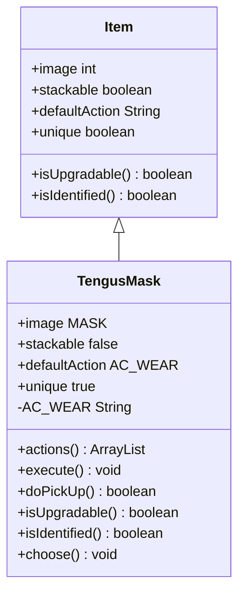

# TengusMask 类文档

## 1. 基本信息
| 属性 | 值 |
|------|-----|
| 文件路径 | core/src/main/java/com/shatteredpixel/shatteredpixeldungeon/items/TengusMask.java |
| 包名 | com.shatteredpixel.shatteredpixeldungeon.items |
| 类类型 | public class |
| 继承关系 | extends Item |
| 代码行数 | 118 行 |

## 2. 类职责说明
TengusMask（天狗面具）是选择副职业的关键物品。使用后可以选择一个副职业，获得新的天赋和能力。击败天狗Boss后掉落，是角色成长的重要里程碑。

## 4. 继承与协作关系


## 静态常量表
| 常量名 | 类型 | 值 | 说明 |
|--------|------|-----|------|
| AC_WEAR | String | "WEAR" | 佩戴动作标识 |

## 实例字段表
| 字段名 | 类型 | 修饰符 | 说明 |
|--------|------|--------|------|
| image | int | 初始化块 | 精灵图为 MASK |
| stackable | boolean | 初始化块 | 不可堆叠 false |
| defaultAction | String | 初始化块 | 默认动作 AC_WEAR |
| unique | boolean | 初始化块 | 唯一物品 true |

## 7. 方法详解

### actions
**签名**: `public ArrayList<String> actions(Hero hero)`
**功能**: 获取可用动作列表
**返回值**: ArrayList\<String\> - 包含佩戴动作

### execute
**签名**: `public void execute(Hero hero, String action)`
**功能**: 执行动作，打开副职业选择窗口
**实现逻辑**:
```java
// 第65-76行：执行佩戴动作
super.execute(hero, action);

if (action.equals(AC_WEAR)) {
    curUser = hero;
    GameScene.show(new WndChooseSubclass(this, hero));  // 打开副职业选择窗口
}
```

### doPickUp
**签名**: `public boolean doPickUp(Hero hero, int pos)`
**功能**: 拾取时验证精通徽章
**返回值**: boolean - 是否成功拾取
**实现逻辑**:
```java
// 第79-82行：拾取处理
Badges.validateMastery();                          // 验证精通徽章
return super.doPickUp(hero, pos);
```

### isUpgradable
**签名**: `public boolean isUpgradable()`
**功能**: 是否可升级
**返回值**: boolean - false

### isIdentified
**签名**: `public boolean isIdentified()`
**功能**: 是否已鉴定
**返回值**: boolean - true

### choose
**签名**: `public void choose(HeroSubClass way)`
**功能**: 选择副职业
**参数**:
- way: HeroSubClass - 选择的副职业
**实现逻辑**:
```java
// 第94-117行：选择副职业
detach(curUser.belongings.backpack);                // 消耗面具
Catalog.countUse(getClass());

curUser.spend(Actor.TICK);
curUser.busy();

curUser.subClass = way;                             // 设置副职业
Talent.initSubclassTalents(curUser);                // 初始化副职业天赋

// 刺客特殊处理：如果隐身则激活准备状态
if (way == HeroSubClass.ASSASSIN && curUser.invisible > 0) {
    Buff.affect(curUser, Preparation.class);
}

curUser.sprite.operate(curUser.pos);
Sample.INSTANCE.play(Assets.Sounds.MASTERY);

// 特效
Emitter e = curUser.sprite.centerEmitter();
e.pos(e.x-2, e.y-6, 4, 4);
e.start(Speck.factory(Speck.MASK), 0.05f, 20);
GLog.p(Messages.get(this, "used"));
```

## 11. 使用示例
```java
// 击败天狗后获得面具
TengusMask mask = new TengusMask();

// 使用后选择副职业
// 每个职业有两个副职业可选
// 选择后获得新的天赋树
```

## 注意事项
1. 击败天狗Boss后掉落
2. 每个职业有两个不同的副职业
3. 选择后解锁新的天赋
4. 面具使用后消耗

## 最佳实践
1. 根据玩法风格选择副职业
2. 副职业解锁新的天赋树
3. 选择后角色能力大幅提升
4. 不同副职业适合不同策略