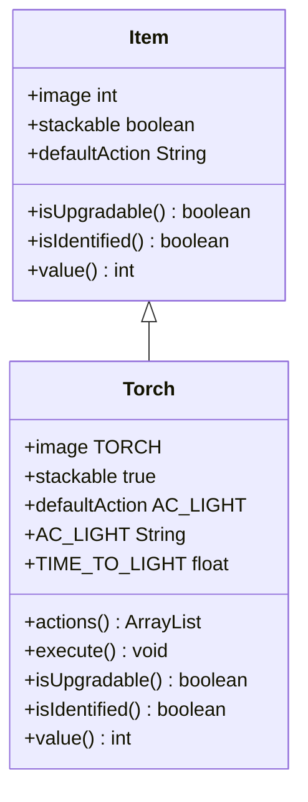

# Torch 类文档

## 1. 基本信息
| 属性 | 值 |
|------|-----|
| 文件路径 | core/src/main/java/com/shatteredpixel/shatteredpixeldungeon/items/Torch.java |
| 包名 | com.shatteredpixel.shatteredpixeldungeon.items |
| 类类型 | public class |
| 继承关系 | extends Item |
| 代码行数 | 96 行 |

## 2. 类职责说明
Torch（火把）是基础光源物品。使用后提供持续一定时间的照明效果，照亮周围环境。在黑暗区域探索时非常重要，可以避免因视野不足导致的危险。

## 4. 继承与协作关系


## 静态常量表
| 常量名 | 类型 | 值 | 说明 |
|--------|------|-----|------|
| AC_LIGHT | String | "LIGHT" | 点燃动作标识 |
| TIME_TO_LIGHT | float | 1 | 点燃时间（回合） |

## 实例字段表
| 字段名 | 类型 | 修饰符 | 说明 |
|--------|------|--------|------|
| image | int | 初始化块 | 精灵图为 TORCH |
| stackable | boolean | 初始化块 | 可堆叠 true |
| defaultAction | String | 初始化块 | 默认动作 AC_LIGHT |

## 7. 方法详解

### actions
**签名**: `public ArrayList<String> actions(Hero hero)`
**功能**: 获取可用动作列表
**返回值**: ArrayList\<String\> - 包含点燃动作

### execute
**签名**: `public void execute(Hero hero, String action)`
**功能**: 执行动作，点燃火把
**参数**:
- hero: Hero - 英雄角色
- action: String - 动作名称
**实现逻辑**:
```java
// 第58-79行：点燃火把
super.execute(hero, action);

if (action.equals(AC_LIGHT)) {
    hero.spend(TIME_TO_LIGHT);                      // 消耗1回合
    hero.busy();
    
    hero.sprite.operate(hero.pos);
    
    detach(hero.belongings.backpack);               // 消耗火把
    Catalog.countUse(getClass());
    
    Buff.affect(hero, Light.class, Light.DURATION); // 添加照明效果
    Sample.INSTANCE.play(Assets.Sounds.BURNING);
    
    // 火焰粒子特效
    Emitter emitter = hero.sprite.centerEmitter();
    emitter.start(FlameParticle.FACTORY, 0.2f, 3);
}
```

### isUpgradable
**签名**: `public boolean isUpgradable()`
**功能**: 是否可升级
**返回值**: boolean - false

### isIdentified
**签名**: `public boolean isIdentified()`
**功能**: 是否已鉴定
**返回值**: boolean - true

### value
**签名**: `public int value()`
**功能**: 获取出售价格
**返回值**: int - 8 * 数量

## 11. 使用示例
```java
// 创建火把
Torch torch = new Torch();
torch.quantity(5);

// 点燃火把获得照明
// 照明持续Light.DURATION回合
// 可以在黑暗区域探索
```

## 注意事项
1. 使用后消耗，不可重复使用
2. 提供固定持续时间的照明
3. 点燃需要1回合时间
4. 可以堆叠携带多个

## 最佳实践
1. 在黑暗区域保持火把储备
2. 配合照明药剂使用
3. 探索隐藏区域时使用
4. 火把价格低廉，多备几个