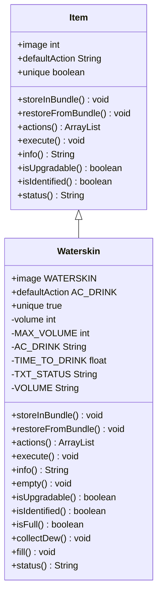

# Waterskin 类文档

## 1. 基本信息
| 属性 | 值 |
|------|-----|
| 文件路径 | core/src/main/java/com/shatteredpixel/shatteredpixeldungeon/items/Waterskin.java |
| 包名 | com.shatteredpixel.shatteredpixeldungeon.items |
| 类类型 | public class |
| 继承关系 | extends Item |
| 代码行数 | 196 行 |

## 2. 类职责说明
Waterskin（水袋）用于收集露珠并储存。满水袋可以祝福安卡或直接饮用回复生命。最大容量20滴露珠，每滴回复5%最大生命值。护盾露珠天赋可以将部分效果转化为护盾。

## 4. 继承与协作关系


## 静态常量表
| 常量名 | 类型 | 值 | 说明 |
|--------|------|-----|------|
| MAX_VOLUME | int | 20 | 最大容量 |
| AC_DRINK | String | "DRINK" | 饮用动作标识 |
| TIME_TO_DRINK | float | 1f | 饮用时间 |
| TXT_STATUS | String | "%d/%d" | 状态显示格式 |
| VOLUME | String | "volume" | Bundle 存储键 |

## 实例字段表
| 字段名 | 类型 | 修饰符 | 说明 |
|--------|------|--------|------|
| image | int | 初始化块 | 精灵图为 WATERSKIN |
| defaultAction | String | 初始化块 | 默认动作 AC_DRINK |
| unique | boolean | 初始化块 | 唯一物品 true |
| volume | int | private | 当前水量 |

## 7. 方法详解

### storeInBundle / restoreFromBundle
**功能**: 保存/恢复水量状态

### actions
**签名**: `public ArrayList<String> actions(Hero hero)`
**功能**: 获取可用动作列表
**返回值**: ArrayList\<String\> - 有水时包含饮用动作

### execute
**签名**: `public void execute(final Hero hero, String action)`
**功能**: 执行动作，饮用水回复生命
**实现逻辑**:
```java
// 第83-136行：饮用逻辑
if (action.equals(AC_DRINK)) {
    if (volume > 0) {
        // 计算需要的露珠数量
        float missingHealthPercent = 1f - (hero.HP / (float) hero.HT);
        float dropsNeeded = missingHealthPercent / 0.05f;  // 每滴回复5%
        
        // 血瓶效果调整
        if (dropsNeeded > 1.01f && VialOfBlood.delayBurstHealing()) {
            dropsNeeded /= VialOfBlood.totalHealMultiplier();
        }
        
        // 护盾露珠天赋
        int curShield = 0;
        if (hero.buff(Barrier.class) != null) curShield = hero.buff(Barrier.class).shielding();
        int maxShield = Math.round(hero.HT * 0.2f * hero.pointsInTalent(Talent.SHIELDING_DEW));
        if (hero.hasTalent(Talent.SHIELDING_DEW)) {
            float missingShieldPercent = 1f - (curShield / (float) maxShield);
            missingShieldPercent *= 0.2f * hero.pointsInTalent(Talent.SHIELDING_DEW);
            if (missingShieldPercent > 0) {
                dropsNeeded += missingShieldPercent / 0.05f;
            }
        }
        
        // 消耗露珠并回复
        int dropsToConsume = (int) Math.ceil(dropsNeeded - 0.01f);
        dropsToConsume = (int) GameMath.gate(1, dropsToConsume, volume);
        
        if (Dewdrop.consumeDew(dropsToConsume, hero, true)) {
            volume -= dropsToConsume;
            Catalog.countUses(Dewdrop.class, dropsToConsume);
            
            hero.spend(TIME_TO_DRINK);
            hero.busy();
            
            Sample.INSTANCE.play(Assets.Sounds.DRINK);
            hero.sprite.operate(hero.pos);
            
            updateQuickslot();
        }
    } else {
        GLog.w(Messages.get(this, "empty"));
    }
}
```

### info
**签名**: `public String info()`
**功能**: 获取描述信息
**返回值**: String - 根据水量返回不同描述

### empty
**签名**: `public void empty()`
**功能**: 清空水袋

### isFull
**签名**: `public boolean isFull()`
**功能**: 是否已满
**返回值**: boolean - 水量 >= 20

### collectDew
**签名**: `public void collectDew(Dewdrop dew)`
**功能**: 收集露珠
**参数**:
- dew: Dewdrop - 露珠物品

### fill
**签名**: `public void fill()`
**功能**: 填满水袋

### status
**签名**: `public String status()`
**功能**: 获取状态显示
**返回值**: String - 当前水量/最大水量

## 11. 使用示例
```java
// 创建水袋
Waterskin waterskin = new Waterskin();

// 收集露珠
waterskin.collectDew(dewdrop);

// 饮用回复生命
if (waterskin.volume > 0) {
    waterskin.execute(hero, Waterskin.AC_DRINK);
}

// 祝福安卡需要满水袋
if (waterskin.isFull()) {
    ankh.execute(hero, Ankh.AC_BLESS);
}
```

## 注意事项
1. 最大容量20滴露珠
2. 每滴回复5%最大生命
3. 满水袋可以祝福安卡
4. 露珠自动收集到水袋

## 最佳实践
1. 保持水袋有足够的水
2. 满水袋用于祝福安卡
3. 护盾露珠天赋增加生存能力
4. 水袋是重要的生存道具