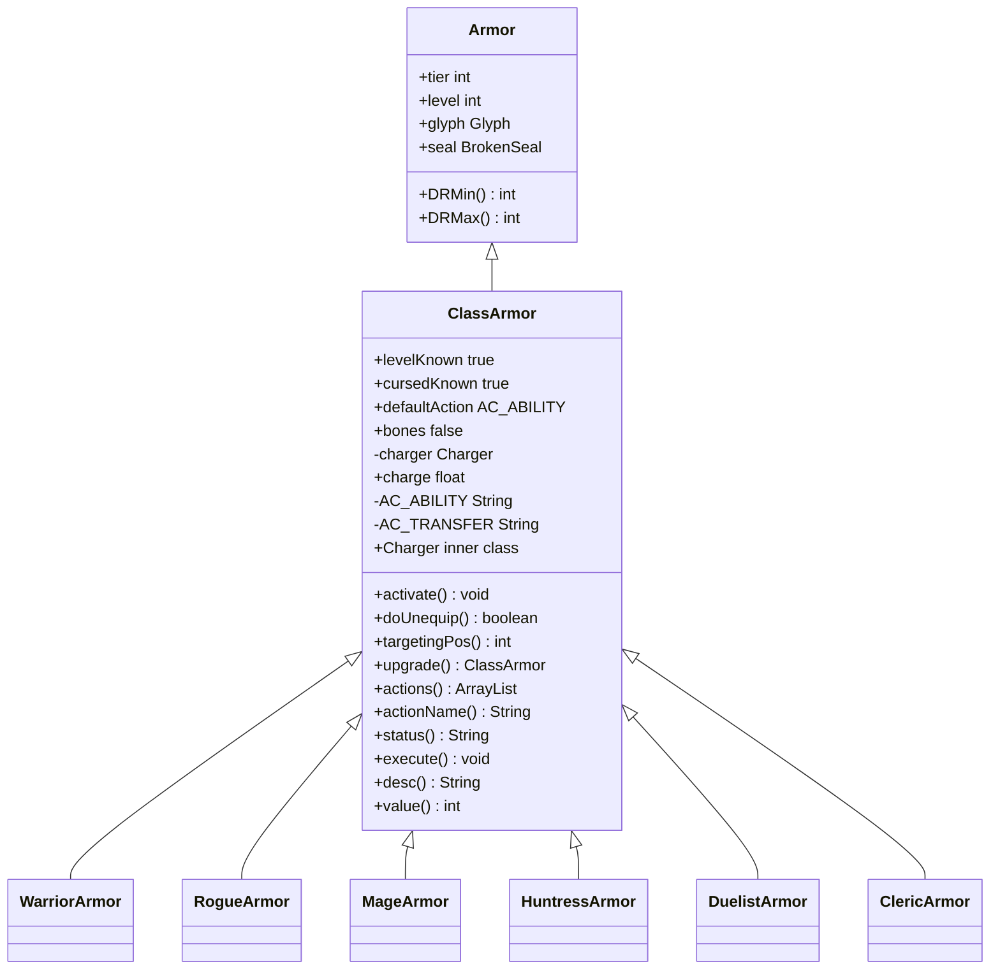

# ClassArmor 类文档

## 1. 基本信息
| 属性 | 值 |
|------|-----|
| 文件路径 | core/src/main/java/com/shatteredpixel/shatteredpixeldungeon/items/armor/ClassArmor.java |
| 包名 | com.shatteredpixel.shatteredpixeldungeon.items.armor |
| 类类型 | abstract public class |
| 继承关系 | extends Armor |
| 代码行数 | 350 行 |

## 2. 类职责说明
ClassArmor（职业护甲）是使用国王皇冠升级后的护甲基类。提供职业能力充能系统，可以消耗充能使用职业特殊能力。支持从其他护甲转移属性，拥有充能Buff自动恢复充能。

## 4. 继承与协作关系


## 静态常量表
| 常量名 | 类型 | 值 | 说明 |
|--------|------|-----|------|
| AC_ABILITY | String | "ABILITY" | 使用能力动作 |
| AC_TRANSFER | String | "TRANSFER" | 转移属性动作 |
| ARMOR_TIER | String | "armortier" | Bundle存储键 |
| CHARGE | String | "charge" | Bundle存储键 |

## 实例字段表
| 字段名 | 类型 | 修饰符 | 说明 |
|--------|------|--------|------|
| levelKnown | boolean | 初始化块 | 已知等级 true |
| cursedKnown | boolean | 初始化块 | 已知诅咒 true |
| defaultAction | String | 初始化块 | 默认动作 AC_ABILITY |
| bones | boolean | 初始化块 | 不可从骨头继承 false |
| charger | Charger | private | 充能Buff |
| charge | float | public | 当前充能值 |

## 7. 方法详解

### activate
**签名**: `public void activate(Char ch)`
**功能**: 装备时激活充能Buff

### doUnequip
**签名**: `public boolean doUnequip(Hero hero, boolean collect, boolean single)`
**功能**: 卸下时移除充能Buff

### targetingPos
**签名**: `public int targetingPos(Hero user, int dst)`
**功能**: 获取能力目标位置

### upgrade (静态方法)
**签名**: `public static ClassArmor upgrade(Hero owner, Armor armor)`
**功能**: 从普通护甲升级为职业护甲
**参数**:
- owner: Hero - 英雄角色
- armor: Armor - 原始护甲
**返回值**: ClassArmor - 职业护甲实例
**实现逻辑**:
```java
// 第98-144行：根据职业创建对应护甲
ClassArmor classArmor = null;
switch (owner.heroClass) {
    case WARRIOR: classArmor = new WarriorArmor(); break;
    case ROGUE: classArmor = new RogueArmor(); break;
    case MAGE: classArmor = new MageArmor(); break;
    case HUNTRESS: classArmor = new HuntressArmor(); break;
    case DUELIST: classArmor = new DuelistArmor(); break;
    case CLERIC: classArmor = new ClericArmor(); break;
}

// 转移所有属性
classArmor.level(armor.trueLevel());
classArmor.tier = armor.tier;
classArmor.augment = armor.augment;
classArmor.inscribe(armor.glyph);
// ... 更多属性转移
classArmor.charge = 50;  // 初始50%充能
```

### actions
**签名**: `public ArrayList<String> actions(Hero hero)`
**功能**: 获取可用动作
**返回值**: ArrayList\<String\> - 包含能力和转移动作

### status
**签名**: `public String status()`
**功能**: 获取状态显示（充能百分比）
**返回值**: String - 充能百分比字符串

### execute
**签名**: `public void execute(Hero hero, String action)`
**功能**: 执行动作
**实现逻辑**:
```java
// 第188-293行：动作处理
if (action.equals(AC_ABILITY)) {
    // 使用职业能力
    if (hero.armorAbility == null) {
        GameScene.show(new WndChooseAbility(null, this, hero));  // 选择能力
    } else if (!isEquipped(hero)) {
        GLog.w(Messages.get(this, "not_equipped"));
    } else if (charge < hero.armorAbility.chargeUse(hero)) {
        GLog.w(Messages.get(this, "low_charge"));
    } else {
        hero.armorAbility.use(this, hero);  // 使用能力
    }
} else if (action.equals(AC_TRANSFER)) {
    // 转移属性到其他护甲
    // 打开护甲选择窗口
}
```

## 内部类详解

### Charger
**类型**: public class extends Buff
**功能**: 充能Buff，每回合恢复充能
**实现逻辑**:
```java
// 第321-349行：充能逻辑
public boolean act() {
    if (Regeneration.regenOn()) {
        float chargeGain = 100 / 500f;  // 500回合充满
        chargeGain *= RingOfEnergy.armorChargeMultiplier(target);
        charge += chargeGain;
        updateQuickslot();
        if (charge > 100) charge = 100;
    }
    spend(TICK);
    return true;
}
```

## 11. 使用示例
```java
// 使用国王皇冠升级护甲
ClassArmor classArmor = ClassArmor.upgrade(hero, armor);

// 使用职业能力（需要足够充能）
if (classArmor.charge >= hero.armorAbility.chargeUse(hero)) {
    hero.armorAbility.use(classArmor, hero);
}

// 充能自动恢复，500回合充满
// 能量戒指可以加速充能
```

## 注意事项
1. 抽象类，不能直接实例化
2. 使用国王皇冠升级获得
3. 充能满100%可使用能力
4. 可以转移属性到其他护甲

## 最佳实践
1. 选择适合的职业能力
2. 能量戒指加速充能恢复
3. 合理使用能力时机
4. 高等级护甲转移属性更优