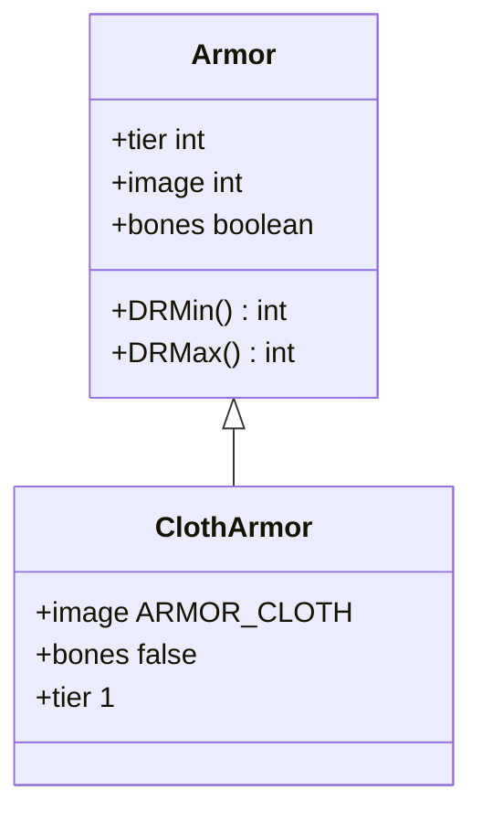

# ClothArmor 类文档

## 1. 基本信息
| 属性 | 值 |
|------|-----|
| 文件路径 | core/src/main/java/com/shatteredpixel/shatteredpixeldungeon/items/armor/ClothArmor.java |
| 包名 | com.shatteredpixel.shatteredpixeldungeon.items.armor |
| 类类型 | public class |
| 继承关系 | extends Armor |
| 代码行数 | 38 行 |

## 2. 类职责说明
ClothArmor（布甲）是最基础的护甲类型，层级为1。提供最低的伤害减免，但不会从骨头堆中继承。通常作为角色的初始护甲。

## 4. 继承与协作关系


## 静态常量表
无静态常量。

## 实例字段表
| 字段名 | 类型 | 修饰符 | 说明 |
|--------|------|--------|------|
| image | int | 初始化块 | 精灵图为 ARMOR_CLOTH |
| bones | boolean | 初始化块 | 不可从骨头继承 false |

## 7. 方法详解

### 构造函数
**签名**: `public ClothArmor()`
**功能**: 创建层级1的布甲
**实现逻辑**:
```java
super(1);  // 调用父类构造函数，设置tier=1
```

## 护甲属性

| 属性 | 值 |
|------|-----|
| 层级 (tier) | 1 |
| 最小伤害减免 | 0 |
| 最大伤害减免 | 2 |
| 力量需求 | 10 |

## 11. 使用示例
```java
// 创建布甲
ClothArmor cloth = new ClothArmor();

// 层级1护甲，提供基础保护
// 通常作为初始装备
```

## 注意事项
1. 最基础的护甲类型
2. 不会从骨头堆继承（避免频繁出现低级护甲）
3. 提供最低的伤害减免
4. 力量需求最低

## 最佳实践
1. 尽早更换更高级护甲
2. 可以通过升级增加保护
3. 添加符文增强效果
4. 适合力量较低的角色