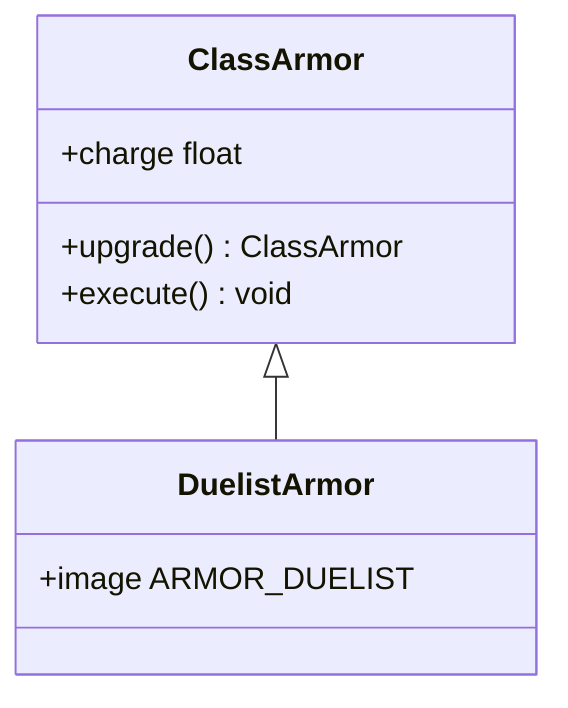

# DuelistArmor 类文档

## 1. 基本信息
| 属性 | 值 |
|------|-----|
| 文件路径 | core/src/main/java/com/shatteredpixel/shatteredpixeldungeon/items/armor/DuelistArmor.java |
| 包名 | com.shatteredpixel.shatteredpixeldungeon.items.armor |
| 类类型 | public class |
| 继承关系 | extends ClassArmor |
| 代码行数 | 32 行 |

## 2. 类职责说明
DuelistArmor（决斗家护甲）是决斗家职业使用国王皇冠升级护甲后获得的职业护甲。继承所有ClassArmor的功能，拥有决斗家特有的外观。

## 4. 继承与协作关系


## 静态常量表
无静态常量。

## 实例字段表
| 字段名 | 类型 | 修饰符 | 说明 |
|--------|------|--------|------|
| image | int | 初始化块 | 精灵图为 ARMOR_DUELIST |

## 7. 方法详解

### 构造函数
**签名**: `public DuelistArmor()`
**功能**: 创建决斗家护甲
**实现逻辑**:
```java
// 继承ClassArmor所有功能
// tier=5 (从ClassArmor构造函数)
```

## 11. 使用示例
```java
// 决斗家使用国王皇冠升级护甲
ClassArmor armor = ClassArmor.upgrade(hero, normalArmor);
// 根据职业自动创建DuelistArmor

// 使用决斗家职业能力
if (armor.charge >= hero.armorAbility.chargeUse(hero)) {
    hero.armorAbility.use(armor, hero);
}
```

## 注意事项
1. 决斗家专属职业护甲
2. 使用国王皇冠获得
3. 可以使用决斗家职业能力
4. 拥有决斗家特有的外观

## 最佳实践
1. 选择适合的决斗家能力
2. 配合剑术使用
3. 能量戒指加速充能
4. 升级护甲增加保护