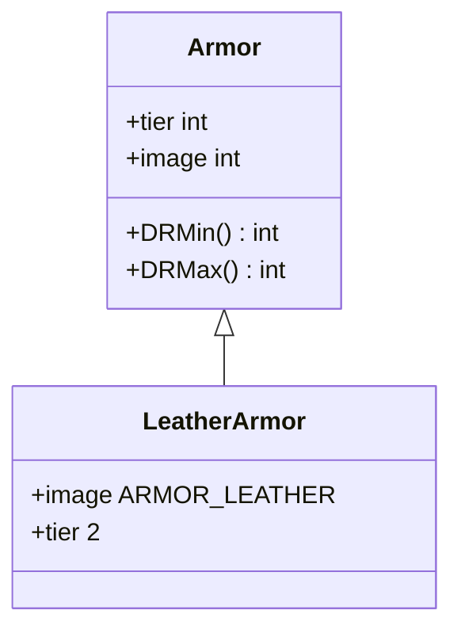

# LeatherArmor 类文档

## 1. 基本信息
| 属性 | 值 |
|------|-----|
| 文件路径 | core/src/main/java/com/shatteredpixel/shatteredpixeldungeon/items/armor/LeatherArmor.java |
| 包名 | com.shatteredpixel.shatteredpixeldungeon.items.armor |
| 类类型 | public class |
| 继承关系 | extends Armor |
| 代码行数 | 36 行 |

## 2. 类职责说明
LeatherArmor（皮甲）是层级2的护甲类型。提供适中的伤害减免，是早期游戏的主要护甲选择。力量需求适中，平衡了保护和灵活性。

## 4. 继承与协作关系


## 静态常量表
无静态常量。

## 实例字段表
| 字段名 | 类型 | 修饰符 | 说明 |
|--------|------|--------|------|
| image | int | 初始化块 | 精灵图为 ARMOR_LEATHER |

## 7. 方法详解

### 构造函数
**签名**: `public LeatherArmor()`
**功能**: 创建层级2的皮甲
**实现逻辑**:
```java
super(2);  // 调用父类构造函数，设置tier=2
```

## 护甲属性

| 属性 | 值 |
|------|-----|
| 层级 (tier) | 2 |
| 最小伤害减免 | 0 |
| 最大伤害减免 | 4 |
| 力量需求 | 12 |

## 11. 使用示例
```java
// 创建皮甲
LeatherArmor leather = new LeatherArmor();

// 层级2护甲，提供适中保护
// 适合早期游戏使用
```

## 注意事项
1. 层级2护甲
2. 力量需求12
3. 伤害减免0-4
4. 可以从骨头堆继承

## 最佳实践
1. 早期获取后尽快装备
2. 可通过升级增加保护
3. 符文可以增强效果
4. 后期考虑更换更高级护甲