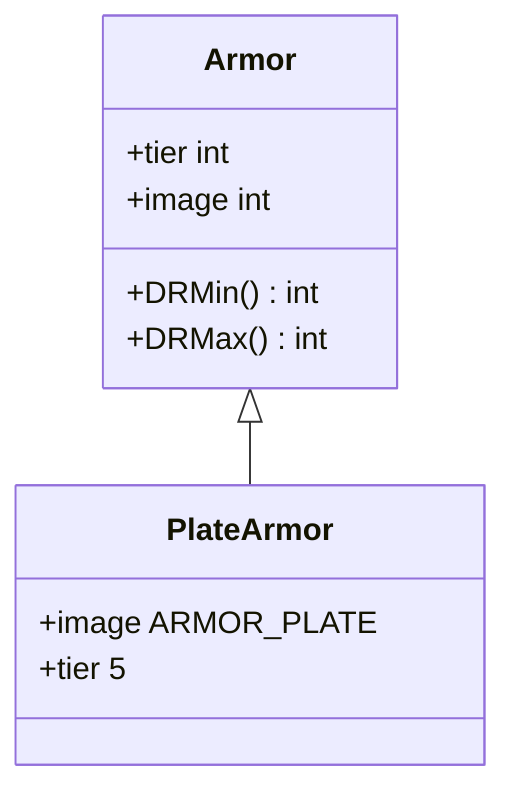

# PlateArmor 类文档

## 1. 基本信息
| 属性 | 值 |
|------|-----|
| 文件路径 | core/src/main/java/com/shatteredpixel/shatteredpixeldungeon/items/armor/PlateArmor.java |
| 包名 | com.shatteredpixel.shatteredpixeldungeon.items.armor |
| 类类型 | public class |
| 继承关系 | extends Armor |
| 代码行数 | 36 行 |

## 2. 类职责说明
PlateArmor（板甲）是层级5的最高级护甲类型。提供最强的伤害减免，是游戏中最强的普通护甲。需要最高的力量才能装备。

## 4. 继承与协作关系


## 静态常量表
无静态常量。

## 实例字段表
| 字段名 | 类型 | 修饰符 | 说明 |
|--------|------|--------|------|
| image | int | 初始化块 | 精灵图为 ARMOR_PLATE |

## 7. 方法详解

### 构造函数
**签名**: `public PlateArmor()`
**功能**: 创建层级5的板甲
**实现逻辑**:
```java
super(5);  // 调用父类构造函数，设置tier=5
```

## 护甲属性

| 属性 | 值 |
|------|-----|
| 层级 (tier) | 5 |
| 最小伤害减免 | 0 |
| 最大伤害减免 | 10 |
| 力量需求 | 18 |

## 11. 使用示例
```java
// 创建板甲
PlateArmor plate = new PlateArmor();

// 层级5护甲，提供最强保护
// 是游戏中最强的普通护甲
```

## 注意事项
1. 最高层级护甲
2. 力量需求18（最高）
3. 伤害减免0-10
4. 最强的普通护甲类型

## 最佳实践
1. 力量足够后尽快装备
2. 配合升级卷轴使用
3. 符文效果最显著
4. 可用于国王皇冠升级