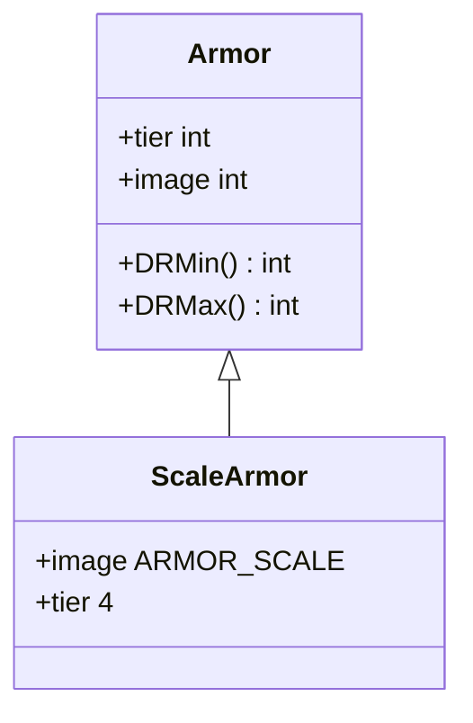

# ScaleArmor 类文档

## 1. 基本信息
| 属性 | 值 |
|------|-----|
| 文件路径 | core/src/main/java/com/shatteredpixel/shatteredpixeldungeon/items/armor/ScaleArmor.java |
| 包名 | com.shatteredpixel.shatteredpixeldungeon.items.armor |
| 类类型 | public class |
| 继承关系 | extends Armor |
| 代码行数 | 36 行 |

## 2. 类职责说明
ScaleArmor（鳞甲）是层级4的护甲类型。提供优秀的伤害减免，是后期游戏的主要护甲选择。需要较高的力量才能装备。

## 4. 继承与协作关系


## 静态常量表
无静态常量。

## 实例字段表
| 字段名 | 类型 | 修饰符 | 说明 |
|--------|------|--------|------|
| image | int | 初始化块 | 精灵图为 ARMOR_SCALE |

## 7. 方法详解

### 构造函数
**签名**: `public ScaleArmor()`
**功能**: 创建层级4的鳞甲
**实现逻辑**:
```java
super(4);  // 调用父类构造函数，设置tier=4
```

## 护甲属性

| 属性 | 值 |
|------|-----|
| 层级 (tier) | 4 |
| 最小伤害减免 | 0 |
| 最大伤害减免 | 8 |
| 力量需求 | 16 |

## 11. 使用示例
```java
// 创建鳞甲
ScaleArmor scale = new ScaleArmor();

// 层级4护甲，提供优秀保护
// 适合后期游戏使用
```

## 注意事项
1. 层级4护甲
2. 力量需求16
3. 伤害减免0-8
4. 后期游戏的主要护甲

## 最佳实践
1. 后期获取后尽快装备
2. 需要足够的力量
3. 符文提供额外效果
4. 可升级达到最强保护