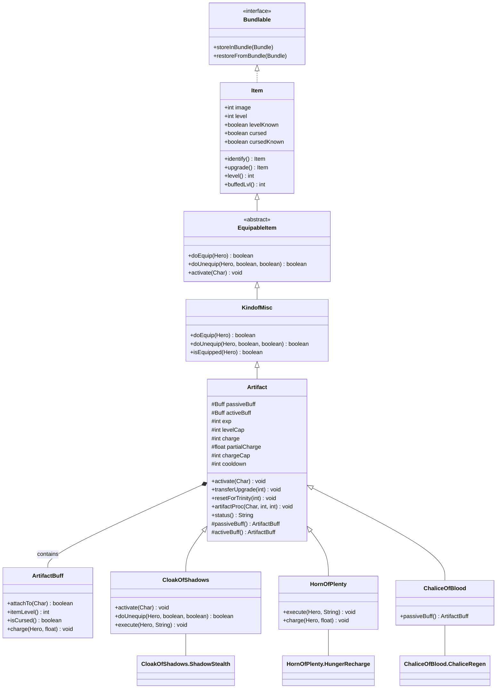

# Artifact 源码详解

## 1. 基本信息

| 属性 | 值 |
|------|-----|
| **文件路径** | core/src/main/java/com/shatteredpixel/shatteredpixeldungeon/items/artifacts/Artifact.java |
| **包名** | com.shatteredpixel.shatteredpixeldungeon.items.artifacts |
| **类类型** | class（非抽象） |
| **继承关系** | extends KindofMisc |
| **代码行数** | 301 |

---

## 类职责

Artifact 是游戏中所有"神器"物品的基类。它是神器系统的核心，处理：

1. **被动效果系统**：通过被动Buff提供持续效果
2. **主动效果系统**：通过主动Buff提供可触发效果
3. **充能机制**：管理神器的充能值和充能上限
4. **等级系统**：神器可升级，有等级上限
5. **经验累积**：部分神器通过经验值升级
6. **冷却系统**：管理使用冷却时间

**设计模式**：
- **模板方法模式**：`passiveBuff()` 和 `activeBuff()` 由子类实现
- **组合模式**：ArtifactBuff 内部类实现具体效果
- **状态模式**：通过 charge/cooldown/exp 等字段管理状态

---

## 4. 继承与协作关系



---

## 静态常量表

### 序列化键

| 常量名 | 值 | 说明 |
|--------|-----|------|
| `EXP` | "exp" | 经验值存储键 |
| `CHARGE` | "charge" | 充能值存储键 |
| `PARTIALCHARGE` | "partialcharge" | 部分充能存储键 |

---

## 实例字段表

### 核心字段

| 字段名 | 类型 | 默认值 | 说明 |
|--------|------|--------|------|
| `passiveBuff` | Buff | null | 被动效果Buff实例 |
| `activeBuff` | Buff | null | 主动效果Buff实例 |
| `exp` | int | 0 | 当前经验值（用于升级） |
| `levelCap` | int | 0 | 等级上限 |
| `charge` | int | 0 | 当前充能值 |
| `partialCharge` | float | 0 | 部分充能（小数累积） |
| `chargeCap` | int | 0 | 充能上限 |
| `cooldown` | int | 0 | 冷却回合数 |

### 继承字段

| 字段名 | 来源 | 说明 |
|--------|------|------|
| `image` | Item | 图像索引 |
| `level` | Item | 神器等级 |
| `cursed` | Item | 是否被诅咒 |
| `levelKnown` | Item | 等级是否已知 |

### 字段设计原理

```
充能系统设计：
┌─────────────────────────────────────────────────┐
│  partialCharge (float)                          │
│  ├── 累积小数部分                               │
│  ├── 通常达到1.0时转换为1点charge               │
│  └── 避免频繁的类型转换                         │
│                                                 │
│  charge (int)                                   │
│  ├── 当前可用充能                               │
│  └── 配合chargeCap显示为"x/y"或"x%"             │
│                                                 │
│  chargeCap (int)                                │
│  ├── 充能上限                                   │
│  └── 0表示无上限或该神器不使用充能              │
└─────────────────────────────────────────────────┘
```

---

## 7. 方法详解

### doEquip(final Hero hero)

```java
@Override
public boolean doEquip( final Hero hero ) {

    // 检查是否已装备同类神器（神器不能装备两个相同类型）
    if ((hero.belongings.artifact != null && hero.belongings.artifact.getClass() == this.getClass())
            || (hero.belongings.misc != null && hero.belongings.misc.getClass() == this.getClass())){

        GLog.w( Messages.get(Artifact.class, "cannot_wear_two") );
        return false;

    } else {

        if (super.doEquip( hero )){

            identify();  // 装备时自动鉴定
            return true;

        } else {

            return false;

        }

    }

}
```

**方法作用**：装备神器到角色身上。

**执行流程**：
1. 检查是否已装备同类型神器（检查artifact槽位和misc槽位）
2. 如果已装备同类型，显示警告并返回false
3. 调用父类doEquip完成装备
4. 装备成功后自动鉴定神器

**特殊规则**：
- 神器不能重复装备（同类型只能有一个）
- 与Ring不同，Ring可以装备两个同类型

---

### activate(Char ch)

```java
public void activate( Char ch ) {
    // 移除已存在的被动Buff
    if (passiveBuff != null){
        if (passiveBuff.target != null) passiveBuff.detach();
        passiveBuff = null;
    }
    // 创建并附加新的被动Buff
    passiveBuff = passiveBuff();
    passiveBuff.attachTo(ch);
}
```

**方法作用**：激活神器的被动效果。

**参数**：
- `ch` (Char)：装备者

**执行流程**：
1. 移除已存在的被动Buff（避免重复）
2. 调用`passiveBuff()`创建新的Buff（由子类实现）
3. 将Buff附加到角色

**调用时机**：装备神器时由父类调用

---

### doUnequip(Hero hero, boolean collect, boolean single)

```java
@Override
public boolean doUnequip( Hero hero, boolean collect, boolean single ) {
    if (super.doUnequip( hero, collect, single )) {

        // 卸下时移除被动Buff
        if (passiveBuff != null) {
            if (passiveBuff.target != null) passiveBuff.detach();
            passiveBuff = null;
        }

        return true;

    } else {

        return false;

    }
}
```

**方法作用**：卸下神器，移除被动效果。

**参数**：
- `hero` (Hero)：卸下者
- `collect` (boolean)：是否放回背包
- `single` (boolean)：是否单独操作

**返回值**：是否成功卸下

**注意**：
- 只移除被动Buff
- 主动Buff需要子类自行处理（如CloakOfShadows）

---

### isUpgradable()

```java
@Override
public boolean isUpgradable() {
    return false;
}
```

**方法作用**：神器不可通过常规方式升级。

**设计说明**：
- 神器有自己独特的升级机制
- 不是通过升级卷轴升级
- 而是通过使用经验、充能等方式升级

---

### visiblyUpgraded()

```java
@Override
public int visiblyUpgraded() {
    return levelKnown ? Math.round((level()*10)/(float)levelCap): 0;
}
```

**方法作用**：返回可见的升级等级（用于UI显示）。

**计算公式**：`(当前等级 × 10) ÷ 等级上限`

**示例**：
| 等级 | 等级上限 | 显示值 |
|------|---------|--------|
| 0 | 10 | +0 |
| 5 | 10 | +5 |
| 10 | 10 | +10 |
| 3 | 5 | +6 |

**设计目的**：将神器等级映射为0-10的显示范围，与其他物品显示格式统一

---

### buffedVisiblyUpgraded() / buffedLvl()

```java
@Override
public int buffedVisiblyUpgraded() {
    return visiblyUpgraded();
}

@Override
public int buffedLvl() {
    //level isn't affected by buffs/debuffs
    return level();
}
```

**方法作用**：神器的等级不受Buff/Debuff影响。

**设计说明**：
- 与武器/护甲不同
- 神器是魔法物品，等级是固有属性
- 不会被Degrade等Debuff影响

---

### transferUpgrade(int transferLvl)

```java
public void transferUpgrade(int transferLvl) {
    upgrade(Math.round((transferLvl*levelCap)/10f));
}
```

**方法作用**：从另一个神器转移升级等级。

**参数**：
- `transferLvl` (int)：转移的显示等级（0-10）

**使用场景**：
- 三位一体天赋（Trinity）
- 在神器之间转移进度

**计算公式**：将显示等级转换回实际等级

---

### resetForTrinity(int visibleLevel)

```java
public void resetForTrinity(int visibleLevel){
    level(Math.round((visibleLevel*levelCap)/10f));
    exp = Integer.MIN_VALUE; //ensures no levelling
    charge = chargeCap;
    cooldown = 0;
}
```

**方法作用**：为三位一体天赋重置神器状态。

**参数**：
- `visibleLevel` (int)：目标显示等级

**执行内容**：
1. 设置等级
2. 设置exp为MIN_VALUE（禁止升级）
3. 充满充能
4. 清除冷却

**特殊处理**：`exp = Integer.MIN_VALUE` 确保神器无法再升级

---

### artifactProc(Char target, int artifLevel, int chargesUsed)

```java
public static void artifactProc(Char target, int artifLevel, int chargesUsed){
    // 牧师子职业 + 照明效果 = 额外伤害
    if (Dungeon.hero.subClass == HeroSubClass.PRIEST 
            && target.buff(GuidingLight.Illuminated.class) != null) {
        target.buff(GuidingLight.Illuminated.class).detach();
        target.damage(5+Dungeon.hero.lvl, GuidingLight.INSTANCE);
    }

    // 灼热之光天赋触发照明
    if (target.alignment != Char.Alignment.ALLY
            && Dungeon.hero.heroClass != HeroClass.CLERIC
            && Dungeon.hero.hasTalent(Talent.SEARING_LIGHT)
            && Dungeon.hero.buff(Talent.SearingLightCooldown.class) == null){
        Buff.affect(target, GuidingLight.Illuminated.class);
        Buff.affect(Dungeon.hero, Talent.SearingLightCooldown.class, 20f);
    }

    // 阳光射线天赋触发致盲
    if (target.alignment != Char.Alignment.ALLY
            && Dungeon.hero.heroClass != HeroClass.CLERIC
            && Dungeon.hero.hasTalent(Talent.SUNRAY)){
        // 15/25% chance
        if (Random.Int(20) < 1 + 2*Dungeon.hero.pointsInTalent(Talent.SUNRAY)){
            Buff.prolong(target, Blindness.class, 4f);
        }
    }
}
```

**方法作用**：神器使用时触发的通用效果（天赋联动）。

**参数**：
- `target` (Char)：目标角色
- `artifLevel` (int)：神器等级
- `chargesUsed` (int)：消耗的充能

**触发的天赋效果**：

| 天赋 | 效果 | 条件 |
|------|------|------|
| PRIEST子职业 | 照明目标受到额外伤害 | 目标被照明 |
| SearingLight | 使目标被照明 | 非牧师职业，20回合冷却 |
| SUNRAY | 致盲目标4回合 | 非牧师职业，15%/25%几率 |

**设计说明**：这是神器系统的"钩子"，让神器使用能与天赋系统联动

---

### info()

```java
@Override
public String info() {
    if (cursed && cursedKnown && !isEquipped( Dungeon.hero )) {
        return super.info() + "\n\n" + Messages.get(Artifact.class, "curse_known");
        
    } else if (!isIdentified() && cursedKnown && !isEquipped( Dungeon.hero)) {
        return super.info() + "\n\n" + Messages.get(Artifact.class, "not_cursed");
        
    } else {
        return super.info();
        
    }
}
```

**方法作用**：返回神器的完整信息文本。

**信息内容**：
1. 基础描述
2. 诅咒状态提示（已知诅咒/已知未诅咒）

**显示条件**：
- 只在未装备时显示诅咒状态提示

---

### status()

```java
@Override
public String status() {
    
    //if the artifact isn't IDed, or is cursed, don't display anything
    if (!isIdentified() || cursed){
        return null;
    }

    //display the current cooldown
    if (cooldown != 0)
        return Messages.format( "%d", cooldown );

    //display as percent
    if (chargeCap == 100)
        return Messages.format( "%d%%", charge );

    //display as #/#
    if (chargeCap > 0)
        return Messages.format( "%d/%d", charge, chargeCap );

    //if there's no cap -
    //- but there is charge anyway, display that charge
    if (charge != 0)
        return Messages.format( "%d", charge );

    //otherwise, if there's no charge, return null.
    return null;
}
```

**方法作用**：返回神器的状态字符串（显示在物品栏）。

**显示优先级**：

| 条件 | 显示格式 | 示例 |
|------|---------|------|
| 未鉴定/诅咒 | 不显示 | - |
| 冷却中 | 数字 | `5` |
| chargeCap=100 | 百分比 | `75%` |
| chargeCap>0 | 分数 | `3/5` |
| 有充能无上限 | 数字 | `10` |
| 无充能 | 不显示 | - |

---

### random()

```java
@Override
public Item random() {
    //always +0
    
    //30% chance to be cursed
    if (Random.Float() < 0.3f) {
        cursed = true;
    }
    return this;
}
```

**方法作用**：生成随机属性的神器。

**属性规则**：
- 等级始终为+0（神器有独特升级机制）
- 30%概率带有诅咒

---

### value()

```java
@Override
public int value() {
    int price = 100;  // 基础价格
    if (level() > 0)
        price += 20*visiblyUpgraded();  // 升级加价
    if (cursed && cursedKnown) {
        price /= 2;  // 已知诅咒减半
    }
    if (price < 1) {
        price = 1;
    }
    return price;
}
```

**方法作用**：计算神器的出售价格。

**价格计算**：
1. 基础价格100金币
2. 升级：价格 += 20 × 显示等级
3. 已知诅咒：价格减半
4. 最低1金币

---

### passiveBuff()

```java
protected ArtifactBuff passiveBuff() {
    return null;
}
```

**方法作用**：创建被动效果Buff（模板方法）。

**重写说明**：子类应重写此方法返回具体的ArtifactBuff实例。

**示例**：
```java
// ChaliceOfBlood中
@Override
protected ArtifactBuff passiveBuff() {
    return new ChaliceRegen();
}
```

---

### activeBuff()

```java
protected ArtifactBuff activeBuff() {return null; }
```

**方法作用**：创建主动效果Buff（模板方法）。

**重写说明**：有主动技能的神器应重写此方法。

**示例**：
```java
// CloakOfShadows中
@Override
protected ArtifactBuff activeBuff() {
    return new ShadowStealth();
}
```

---

### charge(Hero target, float amount)

```java
public void charge(Hero target, float amount){
    //do nothing by default;
}
```

**方法作用**：响应充能事件。

**参数**：
- `target` (Hero)：获得充能的角色
- `amount` (float)：充能量

**重写说明**：需要充能机制的神器应重写此方法。

**示例**：
```java
// HornOfPlenty中
@Override
public void charge(Hero target, float amount) {
    if (charge < chargeCap){
        partialCharge += 0.5f * amount;  // 每2点充能增加1点charge
        while (partialCharge >= 1){
            charge++;
            partialCharge--;
        }
        updateQuickslot();
    }
}
```

---

## ArtifactBuff 内部类详解

```java
public class ArtifactBuff extends Buff {

    @Override
    public boolean attachTo( Char target ) {
        if (super.attachTo( target )) {
            //if we're loading in and the hero has partially spent a turn, delay for 1 turn
            if (target instanceof Hero && Dungeon.hero == null && cooldown() == 0 && target.cooldown() > 0) {
                spend(TICK);
            }
            return true;
        }
        return false;
    }

    public int itemLevel() {
        return level();
    }

    public boolean isCursed() {
        return target.buff(MagicImmune.class) == null && cursed;
    }

    public void charge(Hero target, float amount){
        Artifact.this.charge(target, amount);
    }

}
```

**类作用**：神器效果的具体实现载体。

**关键特性**：
1. **内部类**：可以访问外部Artifact实例
2. **魔法免疫检测**：`isCursed()` 考虑MagicImmune状态
3. **充能转发**：`charge()` 方法转发到外部Artifact
4. **加载处理**：处理游戏加载时的回合延迟

**子类实现示例**：
```java
// CloakOfShadows中的ShadowStealth
public class ShadowStealth extends ArtifactBuff {
    @Override
    public boolean act() {
        charge--;  // 每回合消耗1点充能
        if (charge <= 0) {
            detach();  // 充能耗尽，效果结束
        }
        spend(TICK);
        return true;
    }
}

// ChaliceOfBlood中的ChaliceRegen
public class ChaliceRegen extends ArtifactBuff {
    @Override
    public boolean act() {
        // 根据等级提供生命恢复
        if (target.HP < target.HT && !target.buff(Regeneration.class).isPaused()){
            target.HP = Math.min(target.HT, target.HP + level());
        }
        spend(TICK);
        return true;
    }
}
```

---

## 与其他类的交互

### 被哪些类继承

| 类名 | 说明 |
|------|------|
| `CloakOfShadows` | 暗影斗篷（盗贼初始神器） |
| `HornOfPlenty` | 丰饶之角（食物充能神器） |
| `ChaliceOfBlood` | 鲜血圣杯（生命恢复神器） |
| `EtherealChains` | 虚灵锁链（位移神器） |
| `TimekeepersHourglass` | 守时者沙漏（时间控制神器） |
| `TalismanOfForesight` | 远视护符（预警神器） |
| `UnstableSpellbook` | 不稳定法术书（随机法术神器） |
| `LloydsBeacon` | 劳埃德信标（传送神器） |
| `DriedRose` | 干枯玫瑰（召唤幽灵神器） |
| `SandalsOfNature` | 自然之鞋（植物神器） |
| `MasterThievesArmband` | 盗贼大师袖章（金币神器） |
| `AlchemistsToolkit` | 炼金术士工具包（炼金神器） |
| `CapeOfThorns` | 荆棘披风（反弹神器） |
| `HolyTome` | 神圣典籍（牧师初始神器） |

### 使用了哪些类

| 类名 | 用于什么目的 |
|------|-------------|
| `Buff` | 效果实现 |
| `Hero` | 英雄交互 |
| `Dungeon` | 游戏状态访问 |
| `Messages` | 国际化文本 |
| `Bundle` | 序列化 |
| `GuidingLight` | 神器天赋联动 |
| `Talent` | 天赋系统交互 |
| `MagicImmune` | 魔法免疫检测 |
| `Blindness` | 致盲效果 |

---

## 11. 使用示例

### 创建被动型神器

```java
public class ExampleChalice extends Artifact {

    {
        image = ItemSpriteSheet.ARTIFACT_EXAMPLE;
        levelCap = 10;
    }

    @Override
    protected ArtifactBuff passiveBuff() {
        return new ChaliceHeal();
    }

    // 被动效果：生命恢复
    public class ChaliceHeal extends ArtifactBuff {
        @Override
        public boolean act() {
            if (target.HP < target.HT) {
                target.HP = Math.min(target.HT, target.HP + level());
            }
            spend(TICK);
            return true;
        }
    }
}
```

### 创建主动型神器

```java
public class ExampleCloak extends Artifact {

    {
        image = ItemSpriteSheet.ARTIFACT_EXAMPLE;
        levelCap = 10;
        chargeCap = 10;
        defaultAction = AC_STEALTH;
    }

    public static final String AC_STEALTH = "STEALTH";

    @Override
    public ArrayList<String> actions(Hero hero) {
        ArrayList<String> actions = super.actions(hero);
        if (isEquipped(hero) && charge > 0 && !cursed) {
            actions.add(AC_STEALTH);
        }
        return actions;
    }

    @Override
    public void execute(Hero hero, String action) {
        super.execute(hero, action);
        if (action.equals(AC_STEALTH) && charge > 0) {
            activeBuff = activeBuff();
            activeBuff.attachTo(hero);
            charge--;
            updateQuickslot();
        }
    }

    @Override
    protected ArtifactBuff passiveBuff() {
        return new CloakRecharge();  // 被动：充能
    }

    @Override
    protected ArtifactBuff activeBuff() {
        return new CloakStealth();   // 主动：隐身
    }

    // 被动效果：每回合恢复充能
    public class CloakRecharge extends ArtifactBuff {
        @Override
        public boolean act() {
            if (charge < chargeCap) {
                partialCharge += 0.1f;
                if (partialCharge >= 1) {
                    charge++;
                    partialCharge--;
                    updateQuickslot();
                }
            }
            spend(TICK);
            return true;
        }
    }

    // 主动效果：隐身
    public class CloakStealth extends ArtifactBuff {
        @Override
        public boolean attachTo(Char target) {
            if (super.attachTo(target)) {
                target.invisible++;
                return true;
            }
            return false;
        }

        @Override
        public void detach() {
            target.invisible--;
            super.detach();
        }

        @Override
        public boolean act() {
            spend(TICK);
            return true;
        }
    }
}
```

### 创建充能型神器

```java
public class ExampleHorn extends Artifact {

    {
        image = ItemSpriteSheet.ARTIFACT_EXAMPLE;
        levelCap = 10;
        chargeCap = 100;
    }

    @Override
    public void charge(Hero target, float amount) {
        if (charge < chargeCap) {
            partialCharge += amount;
            while (partialCharge >= 1 && charge < chargeCap) {
                charge++;
                partialCharge--;
            }
            updateQuickslot();
        }
    }

    @Override
    protected ArtifactBuff passiveBuff() {
        return new HornCharge();
    }

    public class HornCharge extends ArtifactBuff {
        // 可以转发充能事件
        @Override
        public void charge(Hero target, float amount) {
            ExampleHorn.this.charge(target, amount);
        }
    }
}
```

### 使用神器效果

```java
// 在英雄获得经验时充能
public void onHeroGainExp(float levelPercent, Hero hero) {
    Artifact artifact = hero.belongings.artifact();
    if (artifact != null) {
        artifact.charge(hero, levelPercent);
    }
}

// 在天赋触发时使用神器
public void onArtifactUsed(Hero hero) {
    if (hero.subClass == HeroSubClass.PRIEST) {
        // 牧师子职业的特殊处理
        Buff.affect(hero, GuidingLight.Illuminated.class);
    }
}
```

---

## 注意事项

### 充能系统

1. **partialCharge vs charge**：
   - `partialCharge` 是float，用于累积小数
   - `charge` 是int，是实际可用充能
   - 避免频繁类型转换，提高精度

2. **chargeCap的含义**：
   - `chargeCap > 0`：有上限，显示为"x/y"或"x%"
   - `chargeCap = 0`：无上限或该神器不使用充能系统

3. **充能来源**：
   - 食物（HornOfPlenty）
   - 经验值
   - 回合数
   - 特定行为（如获得金币）

### 装备限制

1. **唯一性**：同类型神器只能装备一个
2. **槽位**：神器可装备在artifact槽位或misc槽位
3. **与戒指共用**：misc槽位可以放神器或戒指

### 升级机制

1. **非传统升级**：神器不能通过升级卷轴升级
2. **经验升级**：部分神器通过`exp`字段累积升级
3. **等级映射**：使用`visiblyUpgraded()`将等级映射到0-10显示范围

### 常见的坑

1. **忘记处理activeBuff**：卸下神器时只移除passiveBuff，activeBuff需子类处理
2. **充能溢出**：充能时需检查`charge < chargeCap`
3. **魔法免疫**：MagicImmune会禁用神器效果
4. **诅咒状态**：诅咒状态下神器可能失效或有负面效果

---

## 最佳实践

### 子类实现清单

```java
public class MyArtifact extends Artifact {

    // 1. 初始化配置
    {
        image = ItemSpriteSheet.ARTIFACT_MY;
        levelCap = 10;
        chargeCap = 5;
        defaultAction = AC_USE;  // 如果有主动技能
    }

    // 2. 定义常量
    public static final String AC_USE = "USE";

    // 3. 重写passiveBuff()
    @Override
    protected ArtifactBuff passiveBuff() {
        return new MyPassiveEffect();
    }

    // 4. 如有主动技能，重写activeBuff()
    @Override
    protected ArtifactBuff activeBuff() {
        return new MyActiveEffect();
    }

    // 5. 如需充能，重写charge()
    @Override
    public void charge(Hero target, float amount) {
        // 充能逻辑
    }

    // 6. 如有主动技能，重写actions()和execute()
    @Override
    public ArrayList<String> actions(Hero hero) {
        ArrayList<String> actions = super.actions(hero);
        if (canUse(hero)) {
            actions.add(AC_USE);
        }
        return actions;
    }

    @Override
    public void execute(Hero hero, String action) {
        super.execute(hero, action);
        if (action.equals(AC_USE)) {
            // 使用逻辑
        }
    }

    // 7. 处理卸下时的activeBuff
    @Override
    public boolean doUnequip(Hero hero, boolean collect, boolean single) {
        if (super.doUnequip(hero, collect, single)) {
            if (activeBuff != null) {
                activeBuff.detach();
                activeBuff = null;
            }
            return true;
        }
        return false;
    }

    // 8. 定义效果Buff类
    public class MyPassiveEffect extends ArtifactBuff {
        @Override
        public boolean act() {
            // 效果逻辑
            spend(TICK);
            return true;
        }
    }
}
```

### 状态显示最佳实践

```java
@Override
public String status() {
    // 如果不需要显示状态
    if (!isIdentified() || cursed) return null;
    
    // 冷却优先
    if (cooldown > 0) return Integer.toString(cooldown);
    
    // 百分比显示（当chargeCap=100时）
    if (chargeCap == 100) return charge + "%";
    
    // 分数显示
    if (chargeCap > 0) return charge + "/" + chargeCap;
    
    return null;
}
```

### 充能逻辑最佳实践

```java
@Override
public void charge(Hero target, float amount) {
    if (charge >= chargeCap) return;  // 已满
    
    // 应用等级加成
    partialCharge += amount * (1 + level() * 0.1f);
    
    // 转换为整数充能
    while (partialCharge >= 1 && charge < chargeCap) {
        charge++;
        partialCharge--;
    }
    
    // 确保不溢出
    charge = Math.min(charge, chargeCap);
    partialCharge = Math.min(partialCharge, 1);
    
    updateQuickslot();
}
```

### 性能考虑

1. **避免在act()中创建对象**：Buff的act()每回合调用
2. **缓存计算结果**：频繁使用的值应缓存
3. **及时更新Quickslot**：充能变化时调用`updateQuickslot()`
4. **避免过度序列化**：只存储必要的状态