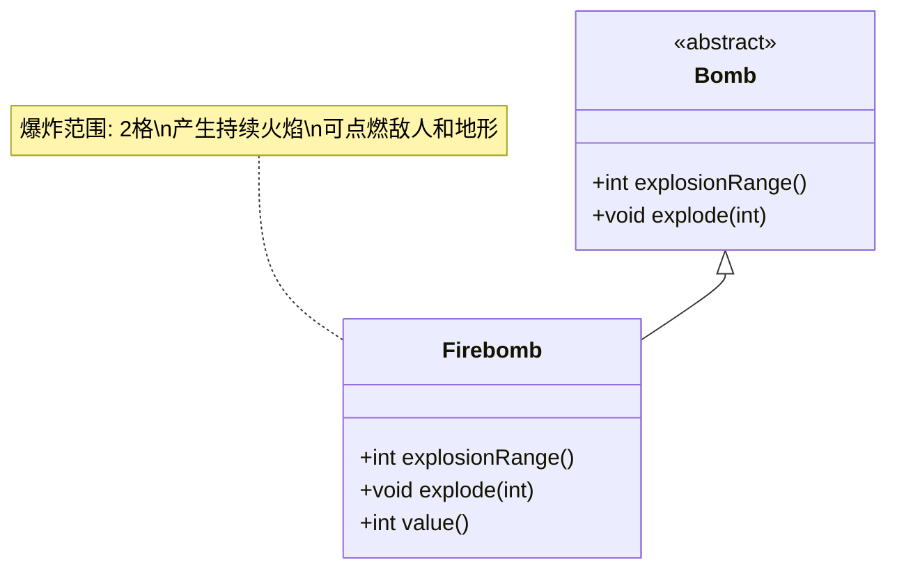

# Firebomb 类文档

## 1. 基本信息
| 属性 | 值 |
|------|-----|
| 文件路径 | core/src/main/java/com/shatteredpixel/shatteredpixeldungeon/items/bombs/Firebomb.java |
| 包名 | com.shatteredpixel.shatteredpixeldungeon.items.bombs |
| 类类型 | public class |
| 继承关系 | extends Bomb |
| 代码行数 | 70行 |

## 2. 类职责说明
火焰炸弹是一种特殊炸弹，爆炸后会在范围内产生火焰。爆炸范围为2格，比普通炸弹更大，并且会在受影响区域留下持续的火焰效果。

## 4. 继承与协作关系


## 实例字段表
| 字段名 | 类型 | 修饰符 | 说明 |
|--------|------|--------|------|
| image | int | - | 物品图标（FIRE_BOMB） |

## 7. 方法详解

### explosionRange()
**签名**: `int explosionRange()`
**功能**: 获取爆炸范围
**参数**: 无
**返回值**: int - 2格
**实现逻辑**:
- 返回2（第44行）

### explode(int cell)
**签名**: `void explode(int cell)`
**功能**: 在指定位置爆炸并产生火焰
**参数**:
- cell: int - 爆炸位置
**返回值**: void
**实现逻辑**:
1. 调用父类explode方法（第49行）
2. 计算受影响区域（第51行）
3. 在每个受影响的单元格产生火焰（第52-61行）：
   - 坑位置产生少量火焰（2回合）
   - 普通位置产生持续火焰（10回合）
   - 播放火焰粒子效果
4. 播放燃烧音效（第62行）

### value()
**签名**: `int value()`
**功能**: 获取物品价值
**参数**: 无
**返回值**: int - 价值（50 * 数量）

## 火焰炸弹效果

| 位置类型 | 火焰持续时间 |
|---------|-------------|
| 普通地面 | 10回合 |
| 坑洞 | 2回合 |
| 爆炸范围 | 2格半径 |

## 11. 使用示例
```java
// 创建火焰炸弹
Firebomb firebomb = new Firebomb();

// 点燃并投掷
firebomb.execute(hero, Bomb.AC_LIGHTTHROW);
// 2回合后爆炸
// 爆炸范围2格
// 留下持续火焰

// 合成配方
// 炸弹 + 液体火焰药水 = 火焰炸弹
// 成本: 1点炼金能量
```

## 注意事项
1. 爆炸范围比普通炸弹大（2格 vs 1格）
2. 火焰会持续燃烧10回合
3. 可以点燃敌人和可燃地形
4. 坑洞中火焰持续时间较短
5. 小心不要烧到自己

## 最佳实践
1. 用于对付多个敌人
2. 封锁敌人行进路线
3. 清除可燃障碍物
4. 在狭窄通道使用效果最佳
5. 配合冰霜效果使用可产生蒸汽