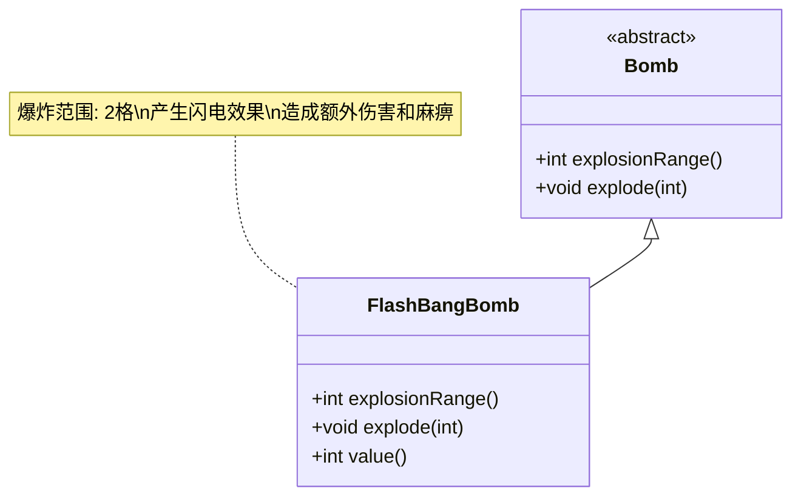

# FlashBangBomb 类文档

## 1. 基本信息
| 属性 | 值 |
|------|-----|
| 文件路径 | core/src/main/java/com/shatteredpixel/shatteredpixeldungeon/items/bombs/FlashBangBomb.java |
| 包名 | com.shatteredpixel.shatteredpixeldungeon.items.bombs |
| 类类型 | public class |
| 继承关系 | extends Bomb |
| 代码行数 | 99行 |

## 2. 类职责说明
闪光弹是一种特殊炸弹，爆炸后会在范围内产生闪电效果和麻痹状态。爆炸范围为2格，会对范围内的敌人造成额外伤害并麻痹10回合。

## 4. 继承与协作关系


## 实例字段表
| 字段名 | 类型 | 修饰符 | 说明 |
|--------|------|--------|------|
| image | int | - | 物品图标（FLASHBANG） |

## 7. 方法详解

### explosionRange()
**签名**: `int explosionRange()`
**功能**: 获取爆炸范围
**参数**: 无
**返回值**: int - 2格
**实现逻辑**:
- 返回2（第55行）

### explode(int cell)
**签名**: `void explode(int cell)`
**功能**: 在指定位置爆炸并产生闪电效果
**参数**:
- cell: int - 爆炸位置
**返回值**: void
**实现逻辑**:
1. 调用父类explode方法（第60行）
2. 收集受影响的角色（第62-68行）
3. 对每个受影响的角色（第71-87行）：
   - 造成25%额外闪电伤害（第73-74行）
   - 麻痹10回合（第75行）
   - 添加闪电弧线效果（第76行）
   - 如果击杀英雄，记录死亡原因
4. 播放闪电粒子效果和音效（第89-91行）

### value()
**签名**: `int value()`
**功能**: 获取物品价值
**参数**: 无
**返回值**: int - 价值（50 * 数量）

## 闪光弹效果

| 效果类型 | 数值 |
|---------|------|
| 额外伤害 | 基础伤害的25% |
| 麻痹时间 | 10回合 |
| 爆炸范围 | 2格半径 |
| 伤害类型 | 闪电 |

## 11. 使用示例
```java
// 创建闪光弹
FlashBangBomb flashBang = new FlashBangBomb();

// 点燃并投掷
flashBang.execute(hero, Bomb.AC_LIGHTTHROW);
// 2回合后爆炸
// 爆炸范围2格
// 造成闪电伤害和麻痹

// 合成配方
// 炸弹 + 充能卷轴 = 闪光弹
// 成本: 2点炼金能量
```

## 注意事项
1. 爆炸范围比普通炸弹大（2格 vs 1格）
2. 造成额外25%闪电伤害
3. 麻痹效果持续10回合
4. 对英雄也有视觉效果
5. 如果炸死英雄会被记录

## 最佳实践
1. 用于控制多个敌人
2. 麻痹效果可以打断敌人行动
3. 在危险情况下逃脱
4. 配合其他攻击使用
5. 注意不要麻痹自己