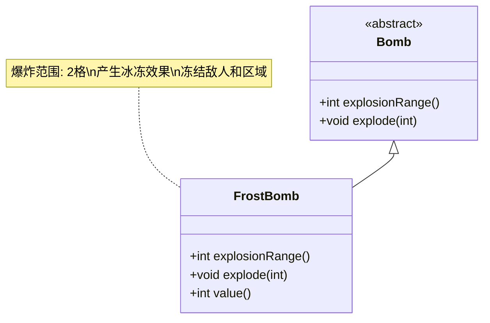

# FrostBomb 类文档

## 1. 基本信息
| 属性 | 值 |
|------|-----|
| 文件路径 | core/src/main/java/com/shatteredpixel/shatteredpixeldungeon/items/bombs/FrostBomb.java |
| 包名 | com.shatteredpixel.shatteredpixeldungeon.items.bombs |
| 类类型 | public class |
| 继承关系 | extends Bomb |
| 代码行数 | 67行 |

## 2. 类职责说明
冰霜炸弹是一种特殊炸弹，爆炸后会在范围内产生冰冻效果。爆炸范围为2格，会使区域内的角色受到冰冻状态，并在地面留下冰冻区域。

## 4. 继承与协作关系


## 实例字段表
| 字段名 | 类型 | 修饰符 | 说明 |
|--------|------|--------|------|
| image | int | - | 物品图标（FROST_BOMB） |

## 7. 方法详解

### explosionRange()
**签名**: `int explosionRange()`
**功能**: 获取爆炸范围
**参数**: 无
**返回值**: int - 2格
**实现逻辑**:
- 返回2（第44行）

### explode(int cell)
**签名**: `void explode(int cell)`
**功能**: 在指定位置爆炸并产生冰冻效果
**参数**:
- cell: int - 爆炸位置
**返回值**: void
**实现逻辑**:
1. 调用父类explode方法（第49行）
2. 计算受影响区域（第50行）
3. 在每个受影响的单元格（第51-58行）：
   - 添加冰冻区域效果（10回合）
   - 如果有角色，施加冰冻状态（2回合）

### value()
**签名**: `int value()`
**功能**: 获取物品价值
**参数**: 无
**返回值**: int - 价值（50 * 数量）

## 冰霜炸弹效果

| 效果类型 | 持续时间 |
|---------|---------|
| 冰冻区域 | 10回合 |
| 冰冻状态（角色） | 2回合 |
| 爆炸范围 | 2格半径 |

## 11. 使用示例
```java
// 创建冰霜炸弹
FrostBomb frostBomb = new FrostBomb();

// 点燃并投掷
frostBomb.execute(hero, Bomb.AC_LIGHTTHROW);
// 2回合后爆炸
// 爆炸范围2格
// 产生冰冻效果

// 合成配方
// 炸弹 + 冰霜药水 = 冰霜炸弹
// 成本: 0点炼金能量
```

## 注意事项
1. 爆炸范围比普通炸弹大（2格 vs 1格）
2. 冰冻区域持续10回合
3. 区域内的角色会被冻结
4. 可以冻结敌人和火焰
5. 合成成本为0，性价比高

## 最佳实践
1. 用于控制敌人行动
2. 扑灭火焰效果
3. 创建安全区域
4. 配合火焰炸弹产生蒸汽
5. 在逃跑时使用阻挡敌人