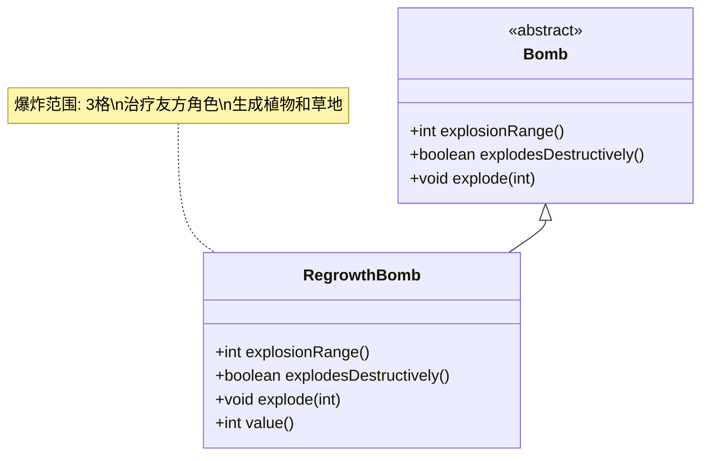

# RegrowthBomb 类文档

## 1. 基本信息
| 属性 | 值 |
|------|-----|
| 文件路径 | core/src/main/java/com/shatteredpixel/shatteredpixeldungeon/items/bombs/RegrowthBomb.java |
| 包名 | com.shatteredpixel.shatteredpixeldungeon.items.bombs |
| 类类型 | public class |
| 继承关系 | extends Bomb |
| 代码行数 | 123行 |

## 2. 类职责说明
再生炸弹是一种有益型炸弹，爆炸后会在范围内产生再生效果，治疗友方角色并生成植物。爆炸范围为3格，不会造成破坏性伤害。

## 4. 继承与协作关系


## 实例字段表
| 字段名 | 类型 | 修饰符 | 说明 |
|--------|------|--------|------|
| image | int | - | 物品图标（REGROWTH_BOMB） |

## 7. 方法详解

### explodesDestructively()
**签名**: `boolean explodesDestructively()`
**功能**: 爆炸是否具有破坏性
**参数**: 无
**返回值**: boolean - false（不具有破坏性）
**实现逻辑**:
- 返回false（第52行）

### explosionRange()
**签名**: `int explosionRange()`
**功能**: 获取爆炸范围
**参数**: 无
**返回值**: int - 3格
**实现逻辑**:
- 返回3（第57行）

### explode(int cell)
**签名**: `void explode(int cell)`
**功能**: 在指定位置爆炸并产生再生效果
**参数**:
- cell: int - 爆炸位置
**返回值**: void
**实现逻辑**:
1. 调用父类explode方法（第62行）
2. 显示绿色溅射效果（第64-66行）
3. 收集可种植位置（第68-88行）：
   - 对友方角色施放治疗和净化效果（第75-80行）
   - 收集适合种植的空地（第81-85行）
   - 在每个位置添加再生效果（第86行）
4. 随机生成普通种子植物（第90-98行）
5. 生成特殊植物（露珠捕手、种子荚、星花）（第100-115行）

### value()
**签名**: `int value()`
**功能**: 获取物品价值
**参数**: 无
**返回值**: int - 价值（50 * 数量）

## 再生炸弹效果

| 效果类型 | 说明 |
|---------|------|
| 治疗 | 治疗药水效果（友方） |
| 净化 | 清除负面状态 |
| 再生区域 | 10回合持续效果 |
| 植物生成 | 随机种子+特殊植物 |
| 爆炸范围 | 3格半径 |

## 特殊植物生成概率

| 植物类型 | 概率 |
|---------|------|
| 露珠捕手 | 6/10 |
| 种子荚 | 3/10 |
| 星花 | 1/10 |

## 11. 使用示例
```java
// 创建再生炸弹
RegrowthBomb regrowthBomb = new RegrowthBomb();

// 点燃并投掷
regrowthBomb.execute(hero, Bomb.AC_LIGHTTHROW);
// 2回合后爆炸
// 爆炸范围3格
// 治疗友方、生成植物

// 合成配方
// 炸弹 + 治疗药水 = 再生炸弹
// 成本: 3点炼金能量
```

## 注意事项
1. 不会造成伤害
2. 爆炸范围最大（3格）
3. 对友方有治疗效果
4. 会生成有用的植物
5. 非常适合探索时使用

## 最佳实践
1. 在受伤时自我治疗
2. 在需要种子时使用
3. 生成露珠捕手获得露珠
4. 生成星花获得祝福效果
5. 配合自然主题build使用