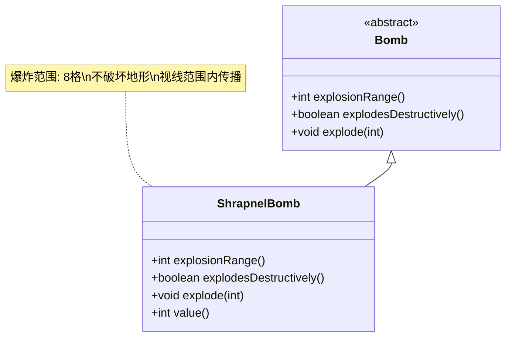

# ShrapnelBomb 类文档

## 1. 基本信息
| 属性 | 值 |
|------|-----|
| 文件路径 | core/src/main/java/com/shatteredpixel/shatteredpixeldungeon/items/bombs/ShrapnelBomb.java |
| 包名 | com.shatteredpixel.shatteredpixeldungeon.items.bombs |
| 类类型 | public class |
| 继承关系 | extends Bomb |
| 代码行数 | 90行 |

## 2. 类职责说明
碎片炸弹是一种远程炸弹，爆炸范围高达8格，可以通过视线传播伤害。爆炸不会破坏地形，适合在开阔区域对付大量敌人。

## 4. 继承与协作关系


## 实例字段表
| 字段名 | 类型 | 修饰符 | 说明 |
|--------|------|--------|------|
| image | int | - | 物品图标（SHRAPNEL_BOMB） |

## 7. 方法详解

### explodesDestructively()
**签名**: `boolean explodesDestructively()`
**功能**: 爆炸是否具有破坏性
**参数**: 无
**返回值**: boolean - false（不具有破坏性）
**实现逻辑**:
- 返回false（第44行）

### explosionRange()
**签名**: `int explosionRange()`
**功能**: 获取爆炸范围
**参数**: 无
**返回值**: int - 8格
**实现逻辑**:
- 返回8（第49行）

### explode(int cell)
**签名**: `void explode(int cell)`
**功能**: 在指定位置爆炸并在视线范围内造成伤害
**参数**:
- cell: int - 爆炸位置
**返回值**: void
**实现逻辑**:
1. 调用父类explode方法（第54行）
2. 计算视野范围内的所有位置（第56-58行）
3. 收集受影响的角色（第60-72行）：
   - 在非实心格显示爆炸粒子效果
   - 收集视野内的角色
4. 对每个受影响的角色造成伤害（第74-82行）：
   - 造成基础伤害，考虑护甲
   - 如果击杀英雄，记录失败原因

### value()
**签名**: `int value()`
**功能**: 获取物品价值
**参数**: 无
**返回值**: int - 价值（70 * 数量）

## 碎片炸弹效果

| 特性 | 效果 |
|------|------|
| 爆炸范围 | 8格半径 |
| 破坏地形 | 否 |
| 伤害传播 | 视线传播 |
| 伤害计算 | 基础伤害-护甲 |

## 11. 使用示例
```java
// 创建碎片炸弹
ShrapnelBomb shrapnelBomb = new ShrapnelBomb();

// 点燃并投掷
shrapnelBomb.execute(hero, Bomb.AC_LIGHTTHROW);
// 2回合后爆炸
// 爆炸范围8格
// 视线内造成伤害

// 合成配方
// 炸弹 + 金属碎片 = 碎片炸弹
// 成本: 6点炼金能量
```

## 注意事项
1. 爆炸范围最大（8格）
2. 伤害通过视线传播
3. 不会破坏地形
4. 合成成本较高（6点能量）
5. 需要金属碎片作为原料

## 最佳实践
1. 在开阔区域对付大量敌人
2. 利用视线清除远处的敌人
3. 在Boss战中对付小怪
4. 保护地形不被破坏
5. 注意不要误伤自己