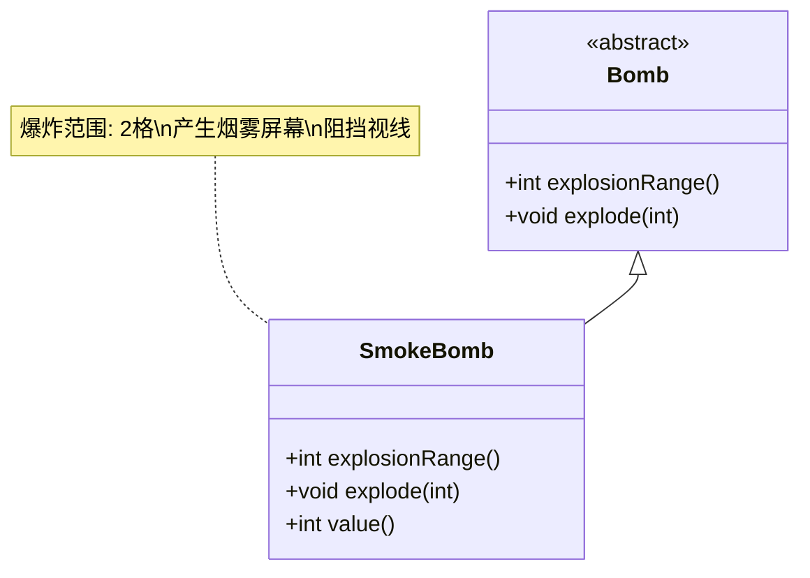

# SmokeBomb 类文档

## 1. 基本信息
| 属性 | 值 |
|------|-----|
| 文件路径 | core/src/main/java/com/shatteredpixel/shatteredpixeldungeon/items/bombs/SmokeBomb.java |
| 包名 | com.shatteredpixel.shatteredpixeldungeon.items.bombs |
| 类类型 | public class |
| 继承关系 | extends Bomb |
| 代码行数 | 68行 |

## 2. 类职责说明
烟雾炸弹是一种控制型炸弹，爆炸后会在范围内产生烟雾屏幕。烟雾会阻挡视线，使范围内的角色无法被看到。爆炸范围为2格。

## 4. 继承与协作关系


## 实例字段表
| 字段名 | 类型 | 修饰符 | 说明 |
|--------|------|--------|------|
| image | int | - | 物品图标（SMOKE_BOMB） |

## 7. 方法详解

### explosionRange()
**签名**: `int explosionRange()`
**功能**: 获取爆炸范围
**参数**: 无
**返回值**: int - 2格
**实现逻辑**:
- 返回2（第40行）

### explode(int cell)
**签名**: `void explode(int cell)`
**功能**: 在指定位置爆炸并产生烟雾屏幕
**参数**:
- cell: int - 爆炸位置
**返回值**: void
**实现逻辑**:
1. 调用父类explode方法（第45行）
2. 计算烟雾总体积（初始1000，即40*25）（第47行）
3. 在每个受影响的单元格添加烟雾（第48-54行）：
   - 添加40体积的烟雾
   - 减少中心体积
4. 如果有剩余体积，添加到中心位置（第57-59行）

### value()
**签名**: `int value()`
**功能**: 获取物品价值
**参数**: 无
**返回值**: int - 价值（60 * 数量）

## 烟雾炸弹效果

| 特性 | 效果 |
|------|------|
| 爆炸范围 | 2格半径 |
| 烟雾持续时间 | 约40回合 |
| 主要用途 | 阻挡视线 |
| 视觉效果 | 灰色烟雾 |

## 11. 使用示例
```java
// 创建烟雾炸弹
SmokeBomb smokeBomb = new SmokeBomb();

// 点燃并投掷
smokeBomb.execute(hero, Bomb.AC_LIGHTTHROW);
// 2回合后爆炸
// 爆炸范围2格
// 产生烟雾屏幕

// 合成配方
// 炸弹 + 隐身药水 = 烟雾炸弹
// 成本: 2点炼金能量
```

## 注意事项
1. 烟雾会阻挡视线
2. 不会造成伤害
3. 烟雾持续约40回合
4. 可用于逃跑或伏击
5. 合成成本适中

## 最佳实践
1. 在逃跑时使用阻挡敌人视线
2. 创建安全的治疗/休息区域
3. 在伏击前使用掩护自己
4. 配合远程攻击使用
5. 在狭窄通道使用效果最佳