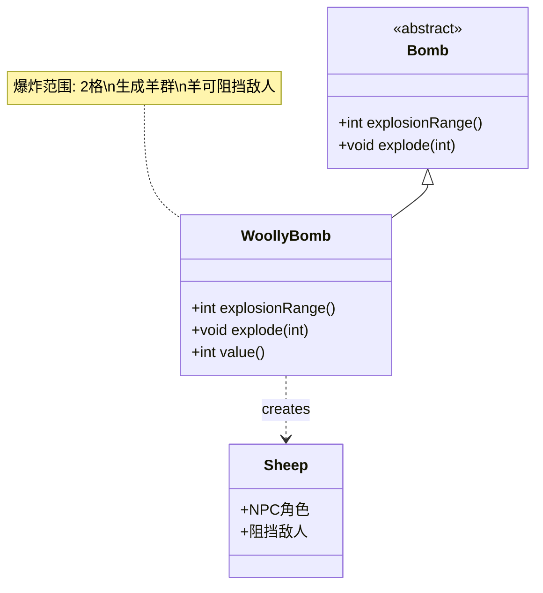

# WoollyBomb 类文档

## 1. 基本信息
| 属性 | 值 |
|------|-----|
| 文件路径 | core/src/main/java/com/shatteredpixel/shatteredpixeldungeon/items/bombs/WoollyBomb.java |
| 包名 | com.shatteredpixel.shatteredpixeldungeon.items.bombs |
| 类类型 | public class |
| 继承关系 | extends Bomb |
| 代码行数 | 84行 |

## 2. 类职责说明
羊毛炸弹是一种特殊炸弹，爆炸后会在范围内生成大量的羊。羊是无害的NPC，可以阻挡敌人和保护玩家。爆炸范围为2格，还会额外生成2格范围内的羊。

## 4. 继承与协作关系


## 实例字段表
| 字段名 | 类型 | 修饰符 | 说明 |
|--------|------|--------|------|
| image | int | - | 物品图标（WOOLY_BOMB） |

## 7. 方法详解

### explosionRange()
**签名**: `int explosionRange()`
**功能**: 获取爆炸范围
**参数**: 无
**返回值**: int - 2格
**实现逻辑**:
- 返回2（第46行）

### explode(int cell)
**签名**: `void explode(int cell)`
**功能**: 在指定位置爆炸并生成羊群
**参数**:
- cell: int - 爆炸位置
**返回值**: void
**实现逻辑**:
1. 调用父类explode方法（第51行）
2. 计算4格范围内的所有位置（第53-59行）
3. 在有效位置生成羊（第61-72行）：
   - 必须在地图内
   - 没有其他角色
   - 不是坑洞
   - 羊存活200回合（Boss层20回合）
   - 显示羊毛粒子效果
4. 播放音效（第74-75行）

### value()
**签名**: `int value()`
**功能**: 获取物品价值
**参数**: 无
**返回值**: int - 价值（50 * 数量）

## 羊毛炸弹效果

| 特性 | 效果 |
|------|------|
| 爆炸范围 | 2格半径 |
| 羊生成范围 | 4格半径 |
| 羊存活时间 | 200回合 |
| Boss层存活时间 | 20回合 |
| 羊的作用 | 阻挡敌人 |

## 11. 使用示例
```java
// 创建羊毛炸弹
WoollyBomb woollyBomb = new WoollyBomb();

// 点燃并投掷
woollyBomb.execute(hero, Bomb.AC_LIGHTTHROW);
// 2回合后爆炸
// 爆炸范围2格
// 生成大量羊

// 合成配方
// 炸弹 + 镜像卷轴 = 羊毛炸弹
// 成本: 0点炼金能量
```

## 注意事项
1. 羊是无害的NPC
2. 羊会阻挡敌人
3. 羊存活时间有限
4. 在Boss层存活时间更短
5. 合成成本为0

## 最佳实践
1. 在逃跑时阻挡敌人
2. 创建安全区域
3. 分散敌人注意力
4. 配合其他控制手段
5. 性价比极高的炸弹