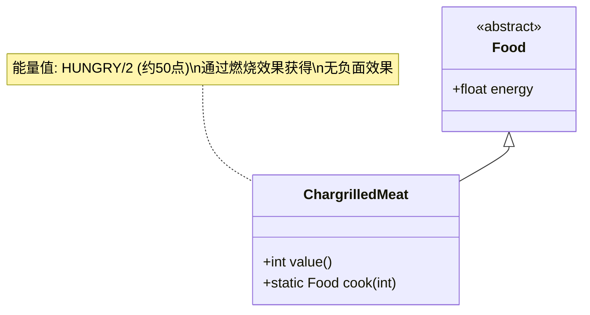

# ChargrilledMeat 类文档

## 1. 基本信息
| 属性 | 值 |
|------|-----|
| 文件路径 | core/src/main/java/com/shatteredpixel/shatteredpixeldungeon/items/food/ChargrilledMeat.java |
| 包名 | com.shatteredpixel.shatteredpixeldungeon.items.food |
| 类类型 | public class |
| 继承关系 | extends Food |
| 代码行数 | 44行 |

## 2. 类职责说明
烤肉是通过燃烧效果将神秘肉烤熟获得的安全食物。当英雄被燃烧效果影响时，身上的神秘肉会自动变成烤肉。食用后不会产生负面效果，是处理神秘肉的安全方式之一。

## 4. 继承与协作关系


## 实例字段表
| 字段名 | 类型 | 修饰符 | 说明 |
|--------|------|--------|------|
| image | int | - | 物品图标（STEAK） |
| energy | float | - | 能量值（HUNGRY/2，约50点） |

## 7. 方法详解

### value()
**签名**: `int value()`
**功能**: 获取物品价值
**参数**: 无
**返回值**: int - 价值（8 * 数量）

### cook(int quantity)
**签名**: `static Food cook(int quantity)`
**功能**: 创建指定数量的烤肉
**参数**:
- quantity: int - 数量
**返回值**: Food - 烤肉
**实现逻辑**:
1. 创建新的ChargrilledMeat实例（第40行）
2. 设置数量（第41行）
3. 返回结果（第42行）

## 11. 使用示例
```java
// 烤肉通常通过燃烧效果获得
// 当英雄被燃烧时，神秘肉自动变成烤肉
Burning burning = Buff.affect(hero, Burning.class);
// 神秘肉 -> 烤肉

// 手动创建烤肉
ChargrilledMeat steak = (ChargrilledMeat) ChargrilledMeat.cook(3);
// 创建3个烤肉

// 食用烤肉
steak.execute(hero, Food.AC_EAT);
// 恢复饥饿值（约50点）
// 无负面效果
```

## 注意事项
1. 烤肉通过燃烧效果自动获得
2. 不会产生负面效果
3. 能量值与神秘肉相同（约50点）
4. 价值比神秘肉稍高（8金币 vs 5金币）
5. 不能通过炼金制作

## 最佳实践
1. 如果有燃烧效果，可以利用它烤肉
2. 不要故意让自己燃烧来烤肉（风险太大）
3. 如果获得烤肉，可以安全食用
4. 炖肉是更可靠的处理方式
5. 冷冻肉可能有额外效果，但烤肉更安全