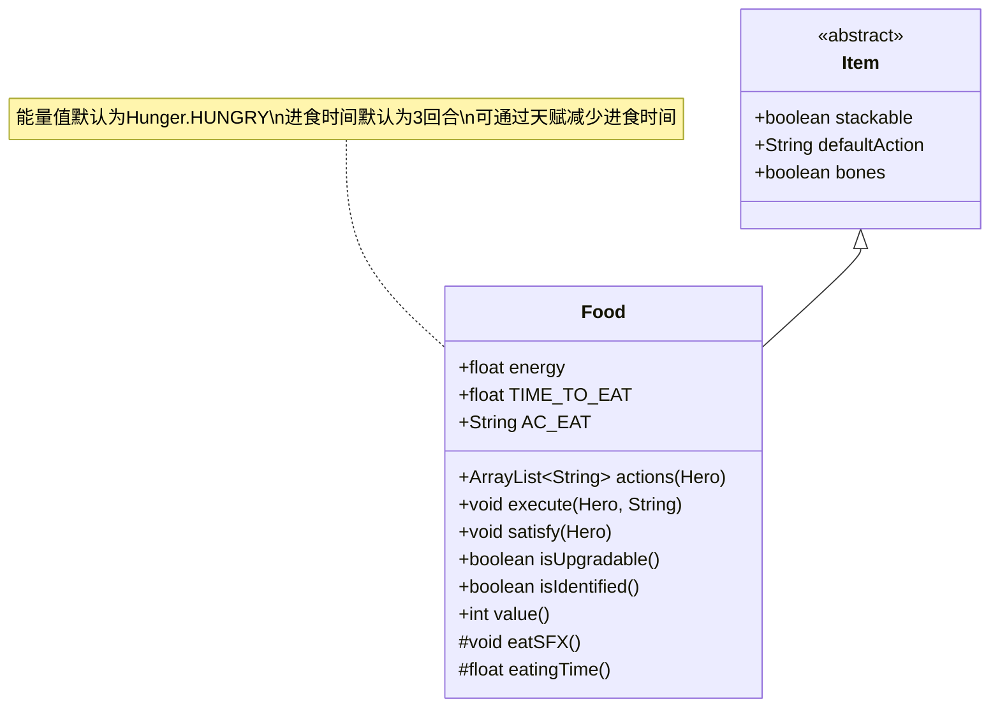

# Food 类文档

## 1. 基本信息
| 属性 | 值 |
|------|-----|
| 文件路径 | core/src/main/java/com/shatteredpixel/shatteredpixeldungeon/items/food/Food.java |
| 包名 | com.shatteredpixel.shatteredpixeldungeon.items.food |
| 类类型 | public class |
| 继承关系 | extends Item |
| 代码行数 | 143行 |

## 2. 类职责说明
食物是所有可食用物品的基类，定义了进食的基本行为。食物具有能量值，进食后可以满足英雄的饥饿需求。食物可以被堆叠，进食时间默认为3回合，某些天赋可以减少进食时间。

## 4. 继承与协作关系


## 静态常量表
| 常量名 | 类型 | 值 | 说明 |
|--------|------|-----|------|
| TIME_TO_EAT | float | 3.0 | 默认进食时间（回合） |
| AC_EAT | String | "EAT" | 进食动作标识 |

## 实例字段表
| 字段名 | 类型 | 修饰符 | 说明 |
|--------|------|--------|------|
| stackable | boolean | - | 是否可堆叠（true） |
| image | int | - | 物品图标（RATION） |
| defaultAction | String | - | 默认动作（AC_EAT） |
| bones | boolean | - | 是否可出现在遗骨中（true） |
| energy | float | public | 食物能量值，默认为Hunger.HUNGRY |

## 7. 方法详解

### actions(Hero hero)
**签名**: `ArrayList<String> actions(Hero hero)`
**功能**: 获取该物品可用的动作列表
**参数**:
- hero: Hero - 英雄对象
**返回值**: ArrayList<String> - 动作名称列表
**实现逻辑**:
1. 调用父类actions方法（第64行）
2. 添加进食动作（第65行）

### execute(Hero hero, String action)
**签名**: `void execute(Hero hero, String action)`
**功能**: 执行指定的物品动作
**参数**:
- hero: Hero - 执行动作的英雄
- action: String - 要执行的动作名称
**返回值**: void
**实现逻辑**:
1. 调用父类execute方法（第72行）
2. 如果动作是AC_EAT（第74-94行）：
   - 从背包移除物品（第76行）
   - 记录使用统计（第77行）
   - 满足饥饿需求（第79行）
   - 显示进食消息（第80行）
   - 播放动画和音效（第82-85行）
   - 花费进食时间（第87行）
   - 触发进食天赋（第89行）
   - 更新统计和徽章（第91-92行）

### eatSFX()
**签名**: `protected void eatSFX()`
**功能**: 播放进食音效
**参数**: 无
**返回值**: void
**实现逻辑**:
- 播放EAT音效（第98行）

### eatingTime()
**签名**: `protected float eatingTime()`
**功能**: 获取进食时间
**参数**: 无
**返回值**: float - 进食时间（回合）
**实现逻辑**:
1. 检查英雄是否有进食相关天赋（第102-107行）
2. 有天赋则返回TIME_TO_EAT - 2（1回合）（第108行）
3. 否则返回TIME_TO_EAT（3回合）（第110行）

### satisfy(Hero hero)
**签名**: `protected void satisfy(Hero hero)`
**功能**: 满足英雄的饥饿需求
**参数**:
- hero: Hero - 英雄
**返回值**: void
**实现逻辑**:
1. 获取食物能量值（第115行）
2. 如果开启"禁食"挑战，能量值除以3（第116-118行）
3. 如果装备诅咒的丰饶之角，能量值减少33%（第120-124行）
4. 满足饥饿需求（第126行）

### isUpgradable()
**签名**: `boolean isUpgradable()`
**功能**: 是否可升级
**参数**: 无
**返回值**: boolean - false（食物不可升级）

### isIdentified()
**签名**: `boolean isIdentified()`
**功能**: 是否已鉴定
**参数**: 无
**返回值**: boolean - true（食物默认已鉴定）

### value()
**签名**: `int value()`
**功能**: 获取物品价值
**参数**: 无
**返回值**: int - 价值（10 * 数量）

## 11. 使用示例
```java
// 创建食物
Food food = new Food();
food.energy = Hunger.HUNGRY; // 设置能量值

// 进食
food.execute(hero, Food.AC_EAT);
// 满足饥饿需求
// 花费进食时间
// 触发相关天赋

// 子类继承
public class MyFood extends Food {
    {
        energy = Hunger.STARVING; // 更高的能量值
    }
    
    @Override
    protected void satisfy(Hero hero) {
        super.satisfy(hero);
        // 额外效果
    }
}
```

## 注意事项
1. 食物默认能量值为Hunger.HUNGRY（约100点）
2. 进食时间默认为3回合，有天赋则为1回合
3. "禁食"挑战会将食物能量值降低到原来的1/3
4. 诅咒的丰饶之角会减少食物效果33%
5. 进食会触发相关天赋效果

## 最佳实践
1. 子类应重写satisfy方法添加额外效果
2. 可以重写eatingTime自定义进食时间
3. 可以重写eatSFX自定义音效
4. 设置适当的energy值来平衡食物
5. 考虑与天赋系统的交互