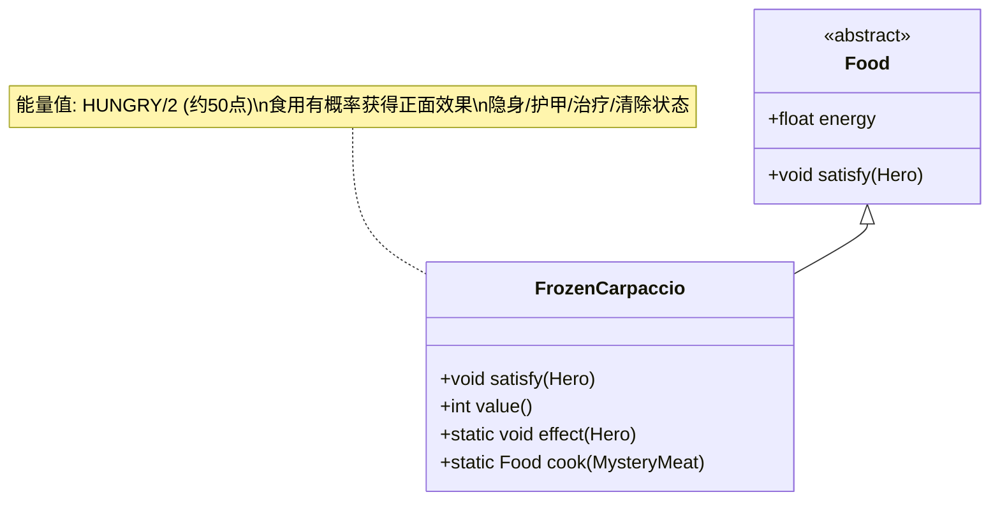

# FrozenCarpaccio 类文档

## 1. 基本信息
| 属性 | 值 |
|------|-----|
| 文件路径 | core/src/main/java/com/shatteredpixel/shatteredpixeldungeon/items/food/FrozenCarpaccio.java |
| 包名 | com.shatteredpixel.shatteredpixeldungeon.items.food |
| 类类型 | public class |
| 继承关系 | extends Food |
| 代码行数 | 81行 |

## 2. 类职责说明
冰冻肉片是通过冷冻效果将神秘肉冷冻后获得的食物。与神秘肉不同，食用冰冻肉片有概率获得正面效果：隐身、树皮护甲、清除负面状态或治疗。这是一种处理神秘肉的有益方式。

## 4. 继承与协作关系


## 实例字段表
| 字段名 | 类型 | 修饰符 | 说明 |
|--------|------|--------|------|
| image | int | - | 物品图标（CARPACCIO） |
| energy | float | - | 能量值（HUNGRY/2，约50点） |

## 7. 方法详解

### satisfy(Hero hero)
**签名**: `void satisfy(Hero hero)`
**功能**: 满足饥饿需求并触发随机效果
**参数**:
- hero: Hero - 英雄
**返回值**: void
**实现逻辑**:
1. 调用父类satisfy方法（第46行）
2. 触发随机效果（第47行）

### value()
**签名**: `int value()`
**功能**: 获取物品价值
**参数**: 无
**返回值**: int - 价值（10 * 数量）

### effect(Hero hero)
**签名**: `static void effect(Hero hero)`
**功能**: 触发随机正面效果
**参数**:
- hero: Hero - 英雄
**返回值**: void
**实现逻辑**:
1. 随机选择0-4（第55行）
2. 0: 隐身效果，持续DURATION回合（第56-59行）
3. 1: 树皮护甲，护甲值为最大生命/4（第60-63行）
4. 2: 清除负面状态（第64-67行）
5. 3: 治疗，治疗量为最大生命/4（第68-72行）
6. 4: 无效果（20%概率）

### cook(MysteryMeat ingredient)
**签名**: `static Food cook(MysteryMeat ingredient)`
**功能**: 将神秘肉冷冻成冰冻肉片
**参数**:
- ingredient: MysteryMeat - 神秘肉
**返回值**: Food - 冰冻肉片
**实现逻辑**:
1. 创建新的FrozenCarpaccio实例（第77行）
2. 保持原有数量（第78行）
3. 返回结果（第79行）

## 效果概率表

| 效果 | 概率 | 数值/持续时间 |
|------|------|--------------|
| 隐身 | 20% | Invisibility.DURATION |
| 树皮护甲 | 20% | 最大生命/4 |
| 清除负面状态 | 20% | 所有负面状态 |
| 治疗 | 20% | 最大生命/4 |
| 无效果 | 20% | - |

## 11. 使用示例
```java
// 创建冰冻肉片
FrozenCarpaccio carpaccio = new FrozenCarpaccio();

// 食用冰冻肉片
carpaccio.execute(hero, Food.AC_EAT);
// 恢复饥饿值（约50点）
// 80%概率获得正面效果

// 从神秘肉制作
FrozenCarpaccio frozen = (FrozenCarpaccio) FrozenCarpaccio.cook(mysteryMeat);

// 手动触发效果
FrozenCarpaccio.effect(hero);
// 随机获得隐身/护甲/治疗/清除效果

// 通常通过冷冻效果获得
// 当神秘肉被冷冻时自动转换
```

## 注意事项
1. 80%概率获得正面效果，20%无效果
2. 能量值与神秘肉相同（约50点）
3. 价值比炖肉和烤肉都高（10金币）
4. 效果与幻影肉类似但概率性
5. 最有价值的效果是隐身和治疗

## 最佳实践
1. 优先食用冰冻肉片而非神秘肉
2. 隐身效果适合伏击或逃脱
3. 树皮护甲在战斗中有用
4. 清除效果适合中毒后使用
5. 治疗效果适合恢复生命