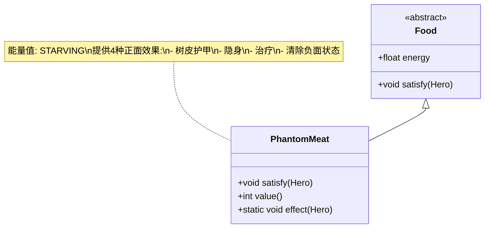

# PhantomMeat 类文档

## 1. 基本信息
| 属性 | 值 |
|------|-----|
| 文件路径 | core/src/main/java/com/shatteredpixel/shatteredpixeldungeon/items/food/PhantomMeat.java |
| 包名 | com.shatteredpixel.shatteredpixeldungeon.items.food |
| 类类型 | public class |
| 继承关系 | extends Food |
| 代码行数 | 62行 |

## 2. 类职责说明
幻影肉是一种高级食物，食用后会获得多种正面效果：树皮护甲、隐身、治疗和清除负面状态。幻影肉的能量值很高（STARVING），是一种非常有价值的食物。

## 4. 继承与协作关系


## 实例字段表
| 字段名 | 类型 | 修饰符 | 说明 |
|--------|------|--------|------|
| image | int | - | 物品图标（PHANTOM_MEAT） |
| energy | float | - | 能量值（STARVING，约300点） |

## 7. 方法详解

### satisfy(Hero hero)
**签名**: `void satisfy(Hero hero)`
**功能**: 满足饥饿需求并触发正面效果
**参数**:
- hero: Hero - 英雄
**返回值**: void
**实现逻辑**:
1. 调用父类satisfy方法（第43行）
2. 触发正面效果（第44行）

### value()
**签名**: `int value()`
**功能**: 获取物品价值
**参数**: 无
**返回值**: int - 价值（30 * 数量）

### effect(Hero hero)
**签名**: `static void effect(Hero hero)`
**功能**: 触发所有正面效果
**参数**:
- hero: Hero - 英雄
**返回值**: void
**实现逻辑**:
1. 添加树皮护甲，护甲值为最大生命/4（第53行）
2. 添加隐身效果，持续DURATION回合（第54行）
3. 恢复生命值，治疗量为最大生命/4（第55行）
4. 显示治疗数字（第56行）
5. 清除负面状态（第57行）

## 效果详情表

| 效果 | 数值/持续时间 |
|------|--------------|
| 树皮护甲 | 最大生命/4 |
| 隐身 | Invisibility.DURATION |
| 治疗 | 最大生命/4 |
| 清除负面状态 | 所有负面状态 |

## 11. 使用示例
```java
// 创建幻影肉
PhantomMeat meat = new PhantomMeat();

// 食用幻影肉
meat.execute(hero, Food.AC_EAT);
// 恢复大量饥饿值（300点）
// 获得树皮护甲（最大生命/4）
// 获得隐身效果
// 恢复生命（最大生命/4）
// 清除所有负面状态

// 手动触发效果
PhantomMeat.effect(hero);

// 幻影肉也可用于合成肉派
// MeatPie.Recipe accepts PhantomMeat as pasty ingredient
```

## 注意事项
1. 幻影肉提供四种正面效果
2. 能量值很高，相当于一个完整口粮
3. 树皮护甲随时间衰减
4. 隐身效果在攻击后会解除
5. 价值较高（30金币）

## 最佳实践
1. 在紧急情况下食用，获得生存优势
2. 隐身效果可以用于逃脱或伏击
3. 树皮护甲在战斗中提供额外保护
4. 治疗和清除效果适合危机时刻
5. 也可用于合成肉派