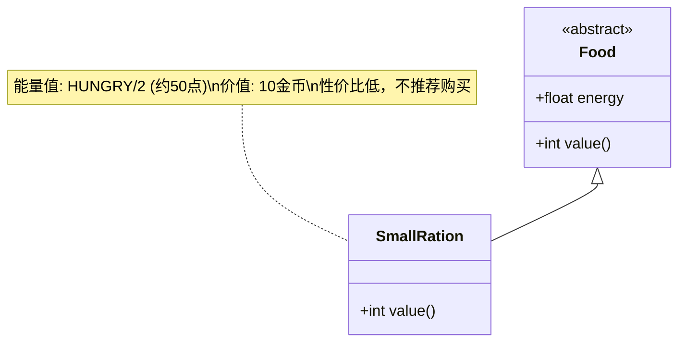

# SmallRation 类文档

## 1. 基本信息
| 属性 | 值 |
|------|-----|
| 文件路径 | core/src/main/java/com/shatteredpixel/shatteredpixeldungeon/items/food/SmallRation.java |
| 包名 | com.shatteredpixel.shatteredpixeldungeon.items.food |
| 类类型 | public class |
| 继承关系 | extends Food |
| 代码行数 | 38行 |

## 2. 类职责说明
小份口粮是一种较小份量的食物，能量值只有普通口粮的一半（HUNGRY/2）。通常从商店购买，价格与普通口粮相同但效果减半，因此被称为"高价口粮"。

## 4. 继承与协作关系


## 实例字段表
| 字段名 | 类型 | 修饰符 | 说明 |
|--------|------|--------|------|
| image | int | - | 物品图标（OVERPRICED） |
| energy | float | - | 能量值（HUNGRY/2，约50点） |

## 7. 方法详解

### value()
**签名**: `int value()`
**功能**: 获取物品价值
**参数**: 无
**返回值**: int - 价值（10 * 数量）

## 11. 使用示例
```java
// 创建小份口粮
SmallRation ration = new SmallRation();

// 食用小份口粮
ration.execute(hero, Food.AC_EAT);
// 恢复少量饥饿值（约50点）
// 效果是普通口粮的一半

// 与普通口粮比较
Food normalRation = new Food();
// normalRation.energy = HUNGRY (约100点)
// smallRation.energy = HUNGRY/2 (约50点)
// 两者价值相同（10金币）
```

## 注意事项
1. 能量值只有普通口粮的一半
2. 价格与普通口粮相同
3. 性价比很低，不推荐购买
4. 主要从商店获得
5. 紧急情况下可以使用

## 最佳实践
1. 尽量购买普通口粮而非小份口粮
2. 如果只有小份口粮可选，也可以使用
3. 在早期探索时可能需要购买
4. 后期有更好的食物选择时避免使用
5. 图标显示"OVERPRICED"提示性价比低