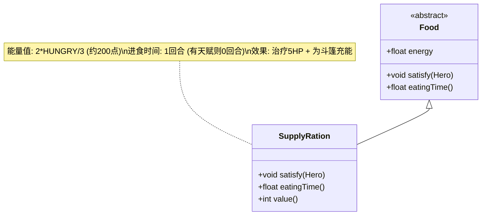

# SupplyRation 类文档

## 1. 基本信息
| 属性 | 值 |
|------|-----|
| 文件路径 | core/src/main/java/com/shatteredpixel/shatteredpixeldungeon/items/food/SupplyRation.java |
| 包名 | com.shatteredpixel.shatteredpixeldungeon.items.food |
| 类类型 | public class |
| 继承关系 | extends Food |
| 代码行数 | 76行 |

## 2. 类职责说明
补给口粮是一种特殊的口粮，食用后除了满足饥饿外，还会恢复5点生命值并为暗影斗篷充能。进食时间很短（1回合，有天赋则0回合），适合在战斗中使用。不会出现在遗骨中。

## 4. 继承与协作关系


## 实例字段表
| 字段名 | 类型 | 修饰符 | 说明 |
|--------|------|--------|------|
| image | int | - | 物品图标（SUPPLY_RATION） |
| energy | float | - | 能量值（2*HUNGRY/3，约200点） |
| bones | boolean | - | 是否可出现在遗骨中（false） |

## 7. 方法详解

### eatingTime()
**签名**: `float eatingTime()`
**功能**: 获取进食时间
**参数**: 无
**返回值**: float - 进食时间
**实现逻辑**:
1. 如果有进食相关天赋，返回0（第50-51行）
2. 否则返回1回合（第53行）

### satisfy(Hero hero)
**签名**: `void satisfy(Hero hero)`
**功能**: 满足饥饿需求并触发额外效果
**参数**:
- hero: Hero - 英雄
**返回值**: void
**实现逻辑**:
1. 调用父类satisfy方法（第59行）
2. 恢复5点生命值（第61行）
3. 显示治疗数字（第62行）
4. 如果有暗影斗篷，为其充能1点（第64-68行）

### value()
**签名**: `int value()`
**功能**: 获取物品价值
**参数**: 无
**返回值**: int - 价值（10 * 数量）

## 11. 使用示例
```java
// 创建补给口粮
SupplyRation ration = new SupplyRation();

// 食用补给口粮
ration.execute(hero, Food.AC_EAT);
// 恢复饥饿值（约200点）
// 恢复5点生命值
// 如果有暗影斗篷，充能1点
// 进食时间短（1回合，有天赋则0回合）

// 检查暗影斗篷
CloakOfShadows cloak = hero.belongings.getItem(CloakOfShadows.class);
if (cloak != null) {
    // 斗篷会被充能
}
```

## 注意事项
1. 进食时间很短，适合战斗中使用
2. 会恢复少量生命值
3. 特别适合盗贼职业（有暗影斗篷）
4. 不会出现在遗骨中
5. 能量值适中（约200点）

## 最佳实践
1. 在战斗中快速补充生命值
2. 盗贼职业优先使用（可充能斗篷）
3. 配合天赋可实现瞬间进食
4. 紧急情况下比普通食物更有用
5. 作为快速恢复手段使用