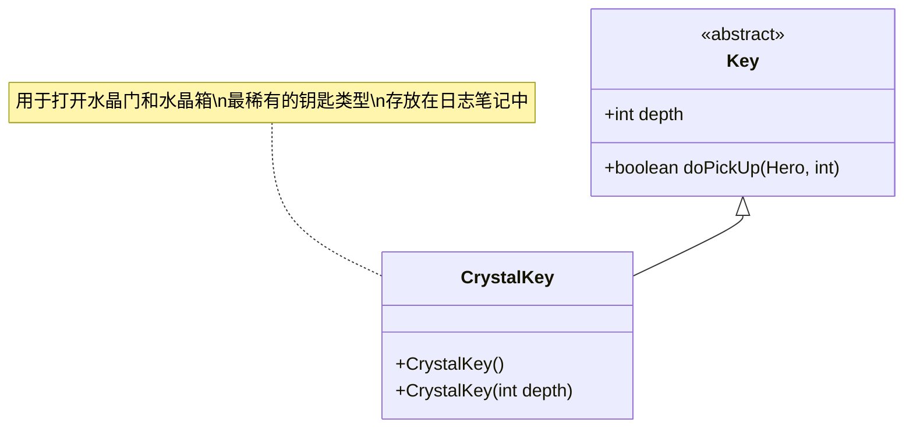

# CrystalKey 类文档

## 1. 基本信息
| 属性 | 值 |
|------|-----|
| 文件路径 | core/src/main/java/com/shatteredpixel/shatteredpixeldungeon/items/keys/CrystalKey.java |
| 包名 | com.shatteredpixel.shatteredpixeldungeon.items.keys |
| 类类型 | public class |
| 继承关系 | extends Key |
| 代码行数 | 41行 |

## 2. 类职责说明
水晶钥匙用于打开对应深度的水晶门和水晶箱。水晶门通常通往特殊区域（如远古井），水晶箱包含独特的物品。水晶钥匙是最稀有的钥匙类型，每层数量有限。

## 4. 继承与协作关系


## 实例字段表
| 字段名 | 类型 | 修饰符 | 说明 |
|--------|------|--------|------|
| image | int | - | 物品图标（CRYSTAL_KEY） |

## 7. 方法详解

### CrystalKey()
**签名**: `public CrystalKey()`
**功能**: 默认构造函数，深度为0
**实现逻辑**:
- 调用CrystalKey(0)（第33行）

### CrystalKey(int depth)
**签名**: `public CrystalKey(int depth)`
**功能**: 创建指定深度的水晶钥匙
**参数**:
- depth: int - 深度值
**实现逻辑**:
1. 调用父类构造函数（第37行）
2. 设置深度值（第38行）

## 11. 使用示例
```java
// 创建水晶钥匙
CrystalKey key = new CrystalKey(5); // 第5层的水晶钥匙

// 拾取水晶钥匙
key.doPickUp(hero, pos);
// 自动添加到日志笔记

// 使用水晶钥匙
// 当靠近水晶门或水晶箱时自动使用
// 水晶门 -> 打开通往特殊区域
// 水晶箱 -> 打开获得独特物品

// 检查钥匙数量
int count = Notes.keyCount(new CrystalKey(Dungeon.depth));
```

## 钥匙用途表

| 锁类型 | 钥匙类型 | 说明 |
|--------|---------|------|
| 水晶门 (CRYSTAL_DOOR) | 水晶钥匙 | 打开通往远古井等特殊区域 |
| 水晶箱 (CRYSTAL_CHEST) | 水晶钥匙 | 打开获得独特物品 |

## 注意事项
1. 水晶钥匙用于打开水晶门和水晶箱
2. 水晶门通常通往远古井等特殊区域
3. 水晶箱包含独特的物品
4. 水晶钥匙是最稀有的钥匙类型
5. 骷髅钥匙可以替代水晶钥匙

## 最佳实践
1. 优先使用水晶钥匙打开水晶门
2. 远古井提供重要的升级机会
3. 水晶箱物品通常很独特
4. 每层水晶钥匙数量有限，谨慎使用
5. 可以用骷髅钥匙替代节省钥匙