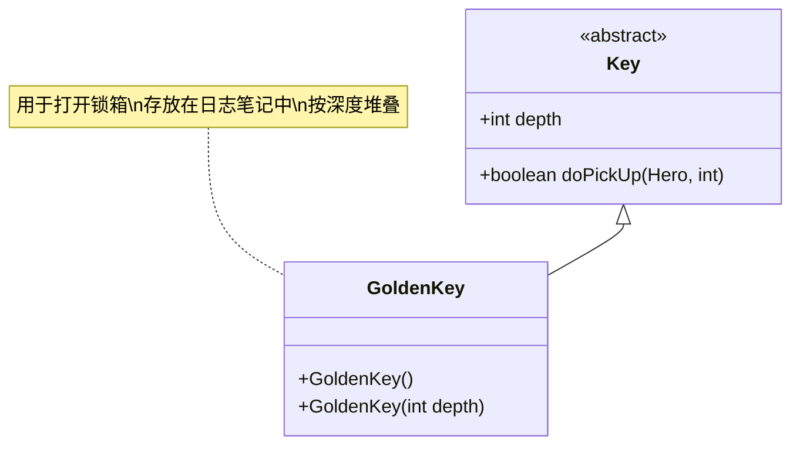

# GoldenKey 类文档

## 1. 基本信息
| 属性 | 值 |
|------|-----|
| 文件路径 | core/src/main/java/com/shatteredpixel/shatteredpixeldungeon/items/keys/GoldenKey.java |
| 包名 | com.shatteredpixel.shatteredpixeldungeon.items.keys |
| 类类型 | public class |
| 继承关系 | extends Key |
| 代码行数 | 41行 |

## 2. 类职责说明
金钥匙用于打开对应深度的锁箱。锁箱通常包含有价值的物品，金钥匙可以在探索中找到，与锁箱数量匹配。金钥匙比铁钥匙更稀有，价值也更高。

## 4. 继承与协作关系


## 实例字段表
| 字段名 | 类型 | 修饰符 | 说明 |
|--------|------|--------|------|
| image | int | - | 物品图标（GOLDEN_KEY） |

## 7. 方法详解

### GoldenKey()
**签名**: `public GoldenKey()`
**功能**: 默认构造函数，深度为0
**实现逻辑**:
- 调用GoldenKey(0)（第33行）

### GoldenKey(int depth)
**签名**: `public GoldenKey(int depth)`
**功能**: 创建指定深度的金钥匙
**参数**:
- depth: int - 深度值
**实现逻辑**:
1. 调用父类构造函数（第37行）
2. 设置深度值（第38行）

## 11. 使用示例
```java
// 创建金钥匙
GoldenKey key = new GoldenKey(5); // 第5层的金钥匙

// 拾取金钥匙
key.doPickUp(hero, pos);
// 自动添加到日志笔记

// 使用金钥匙
// 当靠近锁箱时自动使用对应深度的金钥匙
// 锁箱 -> 打开获得物品

// 检查钥匙数量
int count = Notes.keyCount(new GoldenKey(Dungeon.depth));
```

## 钥匙用途表

| 锁类型 | 钥匙类型 | 说明 |
|--------|---------|------|
| 锁箱 (LOCKED_CHEST) | 金钥匙 | 打开后获得随机物品 |

## 注意事项
1. 金钥匙用于打开对应深度的锁箱
2. 锁箱通常包含有价值的物品
3. 每层的金钥匙数量与锁箱数量匹配
4. 金钥匙比铁钥匙更稀有
5. 骷髅钥匙可以替代金钥匙

## 最佳实践
1. 优先使用金钥匙打开锁箱
2. 锁箱中的物品通常很有价值
3. 确保钥匙数量与锁箱匹配
4. 查看日志了解当前钥匙数量
5. 可以用骷髅钥匙替代节省钥匙