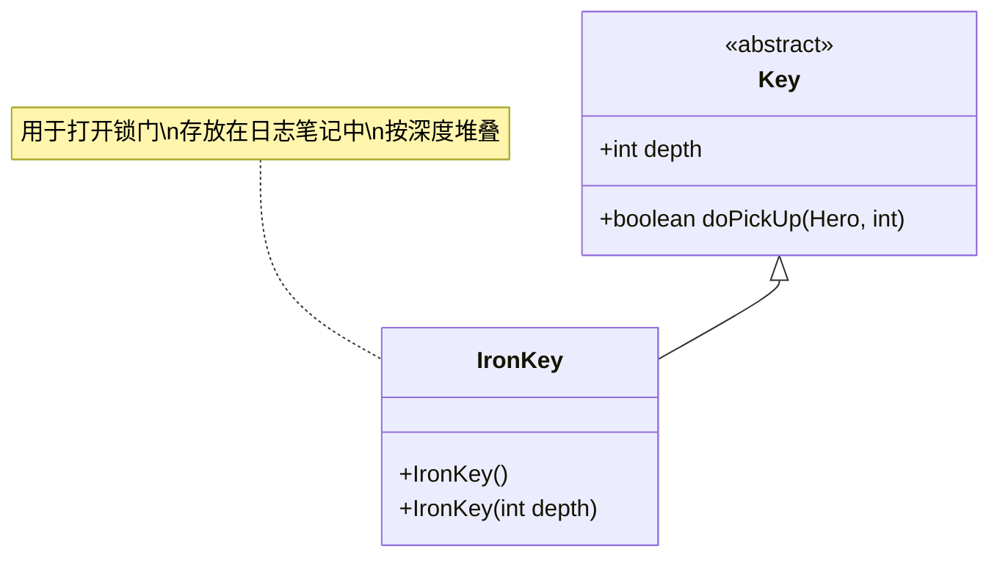

# IronKey 类文档

## 1. 基本信息
| 属性 | 值 |
|------|-----|
| 文件路径 | core/src/main/java/com/shatteredpixel/shatteredpixeldungeon/items/keys/IronKey.java |
| 包名 | com.shatteredpixel.shatteredpixeldungeon.items.keys |
| 类类型 | public class |
| 继承关系 | extends Key |
| 代码行数 | 41行 |

## 2. 类职责说明
铁钥匙是最常见的钥匙类型，用于打开对应深度的锁门。每层通常有一定数量的锁门，铁钥匙数量与锁门数量匹配。铁钥匙可以在探索中找到，也可以从某些敌人身上掉落。

## 4. 继承与协作关系


## 实例字段表
| 字段名 | 类型 | 修饰符 | 说明 |
|--------|------|--------|------|
| image | int | - | 物品图标（IRON_KEY） |

## 7. 方法详解

### IronKey()
**签名**: `public IronKey()`
**功能**: 默认构造函数，深度为0
**实现逻辑**:
- 调用IronKey(0)（第33行）

### IronKey(int depth)
**签名**: `public IronKey(int depth)`
**功能**: 创建指定深度的铁钥匙
**参数**:
- depth: int - 深度值
**实现逻辑**:
1. 调用父类构造函数（第37行）
2. 设置深度值（第38行）

## 11. 使用示例
```java
// 创建铁钥匙
IronKey key = new IronKey(5); // 第5层的铁钥匙

// 拾取铁钥匙
key.doPickUp(hero, pos);
// 自动添加到日志笔记
// 显示钥匙收集界面

// 使用铁钥匙
// 当靠近锁门时自动使用对应深度的铁钥匙
// 锁门 -> 普通门

// 检查钥匙数量
int count = Notes.keyCount(new IronKey(Dungeon.depth));
```

## 钥匙用途表

| 锁类型 | 钥匙类型 | 说明 |
|--------|---------|------|
| 锁门 (LOCKED_DOOR) | 铁钥匙 | 打开后变成普通门 |
| 锁定出口 (LOCKED_EXIT) | 无法用钥匙 | 需要击败Boss |

## 注意事项
1. 铁钥匙用于打开对应深度的锁门
2. 钥匙存放在日志笔记中，不占用背包
3. 每层的铁钥匙数量通常与锁门数量匹配
4. 多余的钥匙可以在下一层丢弃
5. 骷髅钥匙可以替代铁钥匙

## 最佳实践
1. 探索时注意收集铁钥匙
2. 确保钥匙数量与锁门匹配
3. 多余钥匙可以用骷髅钥匙自动处理
4. 查看日志了解当前钥匙数量
5. 不要故意丢弃钥匙