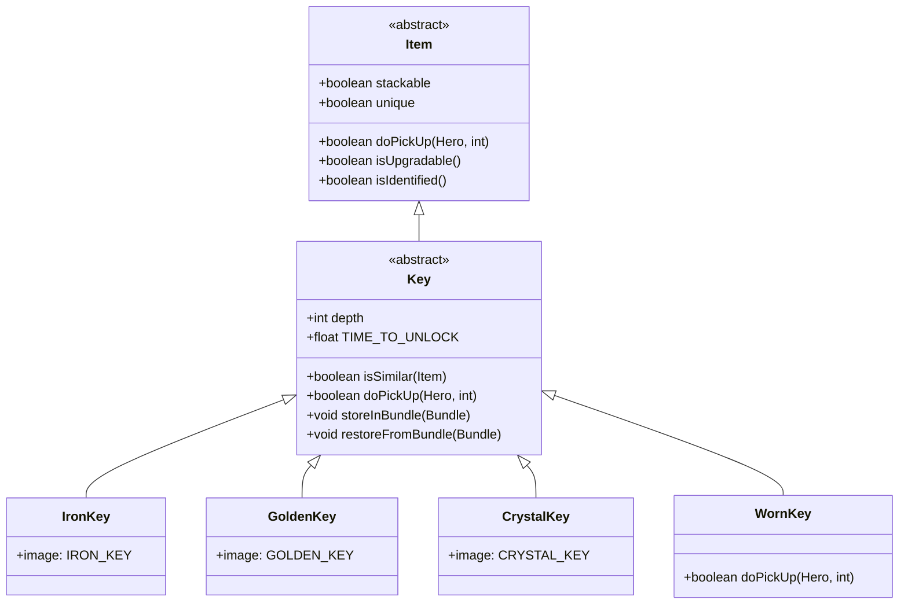

# Key 类文档

## 1. 基本信息
| 属性 | 值 |
|------|-----|
| 文件路径 | core/src/main/java/com/shatteredpixel/shatteredpixeldungeon/items/keys/Key.java |
| 包名 | com.shatteredpixel.shatteredpixeldungeon.items.keys |
| 类类型 | public abstract class |
| 继承关系 | extends Item |
| 代码行数 | 95行 |

## 2. 类职责说明
钥匙是所有钥匙类型的抽象基类，定义了钥匙的基本行为。钥匙不存放在背包中，而是存放在日志笔记中。每种钥匙都与特定的深度关联，只能打开对应深度的锁。

## 4. 继承与协作关系


## 静态常量表
| 常量名 | 类型 | 值 | 说明 |
|--------|------|-----|------|
| TIME_TO_UNLOCK | float | 1.0 | 解锁所需时间（回合） |

## 实例字段表
| 字段名 | 类型 | 修饰符 | 说明 |
|--------|------|--------|------|
| stackable | boolean | - | 是否可堆叠（true） |
| unique | boolean | - | 是否唯一物品（true） |
| depth | int | public | 钥匙对应的深度 |

## 7. 方法详解

### isSimilar(Item item)
**签名**: `boolean isSimilar(Item item)`
**功能**: 检查物品是否相似（用于堆叠）
**参数**:
- item: Item - 要比较的物品
**返回值**: boolean - 是否相似
**实现逻辑**:
1. 调用父类isSimilar方法（第50行）
2. 检查深度是否相同（第50行）

### doPickUp(Hero hero, int pos)
**签名**: `boolean doPickUp(Hero hero, int pos)`
**功能**: 拾取钥匙
**参数**:
- hero: Hero - 拾取的英雄
- pos: int - 拾取位置
**返回值**: boolean - 是否成功
**实现逻辑**:
1. 记录物品类型发现（第55-56行）
2. 添加到日志笔记而非背包（第57-59行）
3. 播放拾取音效（第60行）
4. 花费拾取延迟时间（第61行）
5. 更新钥匙显示（第62行）
6. 如果有骷髅钥匙追踪器，处理多余钥匙（第64-66行）

### storeInBundle(Bundle bundle)
**签名**: `void storeInBundle(Bundle bundle)`
**功能**: 将钥匙状态保存到Bundle
**参数**:
- bundle: Bundle - 存储容器
**返回值**: void
**实现逻辑**:
1. 调用父类方法（第75行）
2. 保存深度值（第76行）

### restoreFromBundle(Bundle bundle)
**签名**: `void restoreFromBundle(Bundle bundle)`
**功能**: 从Bundle恢复钥匙状态
**参数**:
- bundle: Bundle - 存储容器
**返回值**: void
**实现逻辑**:
1. 调用父类方法（第81行）
2. 恢复深度值（第82行）

### isUpgradable()
**签名**: `boolean isUpgradable()`
**功能**: 是否可升级
**参数**: 无
**返回值**: boolean - false（钥匙不可升级）

### isIdentified()
**签名**: `boolean isIdentified()`
**功能**: 是否已鉴定
**参数**: 无
**返回值**: boolean - true（钥匙默认已鉴定）

## 11. 使用示例
```java
// 钥匙不能直接实例化（抽象类）
// 使用具体子类：
IronKey ironKey = new IronKey(5); // 第5层的铁钥匙
GoldenKey goldenKey = new GoldenKey(10); // 第10层的金钥匙
CrystalKey crystalKey = new CrystalKey(15); // 第15层的水晶钥匙

// 钥匙自动存放到日志笔记中
// 不占用背包空间

// 检查钥匙深度
if (key.depth == Dungeon.depth) {
    // 可以使用这把钥匙
}

// 钥匙通过拾取获得
key.doPickUp(hero, pos);
// 自动添加到日志笔记
```

## 注意事项
1. 钥匙是抽象类，不能直接实例化
2. 钥匙存放在日志笔记中，不占用背包
3. 钥匙按深度堆叠，不同深度的钥匙分开存储
4. 钥匙拾取后会自动打开钥匙日志页
5. 骷髅钥匙会自动处理多余的钥匙

## 最佳实践
1. 检查钥匙深度确保正确使用
2. 不要丢弃钥匙，会自动进入日志
3. 注意钥匙数量，避免多余
4. 使用骷髅钥匙可以替代各种钥匙
5. 查看日志笔记了解当前钥匙情况