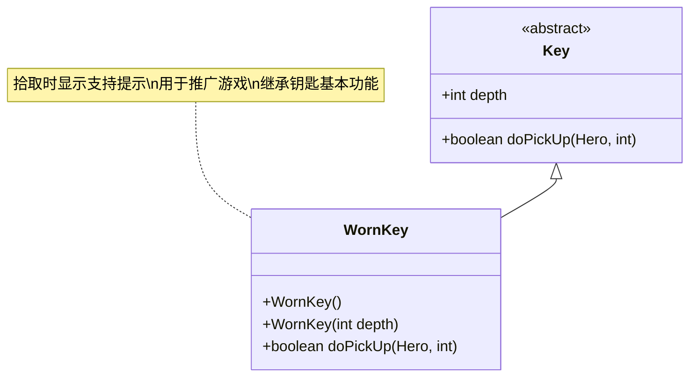

# WornKey 类文档

## 1. 基本信息
| 属性 | 值 |
|------|-----|
| 文件路径 | core/src/main/java/com/shatteredpixel/shatteredpixeldungeon/items/keys/WornKey.java |
| 包名 | com.shatteredpixel.shatteredpixeldungeon.items.keys |
| 类类型 | public class |
| 继承关系 | extends Key |
| 代码行数 | 70行 |

## 2. 类职责说明
磨损钥匙是一种特殊的钥匙，拾取时会显示支持提示窗口（用于推广游戏）。这种钥匙通常在特定情况下出现，提醒玩家支持游戏开发。

## 4. 继承与协作关系


## 实例字段表
| 字段名 | 类型 | 修饰符 | 说明 |
|--------|------|--------|------|
| image | int | - | 物品图标（WORN_KEY） |

## 7. 方法详解

### WornKey()
**签名**: `public WornKey()`
**功能**: 默认构造函数，深度为0
**实现逻辑**:
- 调用WornKey(0)（第42行）

### WornKey(int depth)
**签名**: `public WornKey(int depth)`
**功能**: 创建指定深度的磨损钥匙
**参数**:
- depth: int - 深度值
**实现逻辑**:
1. 调用父类构造函数（第46行）
2. 设置深度值（第47行）

### doPickUp(Hero hero, int pos)
**签名**: `boolean doPickUp(Hero hero, int pos)`
**功能**: 拾取磨损钥匙并显示支持提示
**参数**:
- hero: Hero - 拾取的英雄
- pos: int - 拾取位置
**返回值**: boolean - 是否成功
**实现逻辑**:
1. 检查是否已显示过支持提示（第52行）
2. 如果未显示过：
   - 保存游戏状态（第54行）
   - 在渲染线程显示支持提示窗口（第55-60行）
3. 调用父类doPickUp方法（第67行）

## 11. 使用示例
```java
// 创建磨损钥匙
WornKey key = new WornKey(1); // 第1层的磨损钥匙

// 拾取磨损钥匙
key.doPickUp(hero, pos);
// 如果未显示过支持提示：
//   1. 保存游戏
//   2. 显示支持提示窗口
// 然后添加到日志笔记

// 支持提示只会显示一次
// SPDSettings.supportNagged() 记录是否已显示
```

## 注意事项
1. 拾取时会显示支持提示窗口
2. 支持提示只会显示一次
3. 继承钥匙的基本功能
4. 用于推广和支持游戏开发
5. 功能上与其他钥匙相同

## 最佳实践
1. 正常拾取使用
2. 支持游戏开发者
3. 功能上与其他钥匙无异
4. 如果不想看到提示，可以提前支持游戏
5. 查看日志了解当前钥匙数量