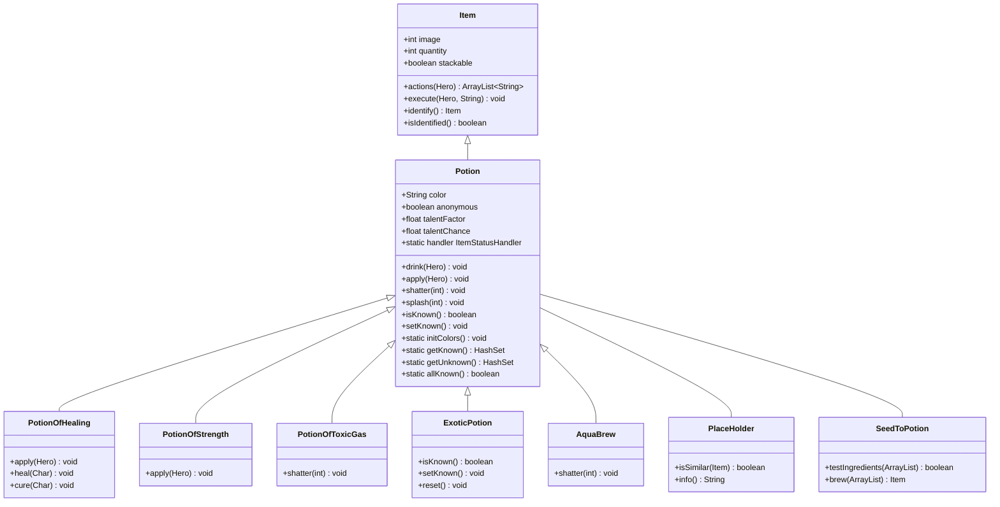

# Potion 源码详解

## 1. 基本信息

| 属性 | 值 |
|------|-----|
| **文件路径** | core/src/main/java/com/shatteredpixel/shatteredpixeldungeon/items/potions/Potion.java |
| **包名** | com.shatteredpixel.shatteredpixeldungeon.items.potions |
| **类类型** | class（非抽象） |
| **继承关系** | extends Item |
| **代码行数** | 566 |

---

## 类职责

Potion 是游戏中所有"药水"的基类。它处理：

1. **颜色系统**：药水外观与类型的随机关联
2. **鉴定系统**：药水类型的发现与记忆
3. **使用方式**：饮用与投掷两种模式
4. **效果触发**：药水效果的应用
5. **种子酿造**：种子转换为药水的配方

**设计模式**：
- **模板方法模式**：`apply()` 和 `shatter()` 定义效果框架，子类重写具体行为
- **状态模式**：通过 `ItemStatusHandler` 管理药水的颜色与鉴定状态

---

## 4. 继承与协作关系



---

## 静态常量

### 动作常量

| 字段名 | 类型 | 值 | 说明 |
|--------|------|-----|------|
| `AC_DRINK` | String | "DRINK" | 饮用动作 |
| `AC_CHOOSE` | String | "CHOOSE" | 选择动作（可饮用或投掷） |

### 时间常量

| 字段名 | 类型 | 值 | 说明 |
|--------|------|-----|------|
| `TIME_TO_DRINK` | float | 1f | 饮用药水所需时间 |

### 颜色映射表

| 颜色名 | 图像常量 | 说明 |
|--------|----------|------|
| "crimson" | POTION_CRIMSON | 绯红色 |
| "amber" | POTION_AMBER | 琥珀色 |
| "golden" | POTION_GOLDEN | 金色 |
| "jade" | POTION_JADE | 翡翠色 |
| "turquoise" | POTION_TURQUOISE | 绿松石色 |
| "azure" | POTION_AZURE | 天蓝色 |
| "indigo" | POTION_INDIGO | 靛蓝色 |
| "magenta" | POTION_MAGENTA | 品红色 |
| "bistre" | POTION_BISTRE | 褐色 |
| "charcoal" | POTION_CHARCOAL | 炭灰色 |
| "silver" | POTION_SILVER | 银色 |
| "ivory" | POTION_IVORY | 象牙色 |

### 必须投掷的药水集合

| 类名 | 说明 |
|------|------|
| `PotionOfToxicGas` | 毒气药水 |
| `PotionOfLiquidFlame` | 液态火焰药水 |
| `PotionOfParalyticGas` | 麻痹气体药水 |
| `PotionOfFrost` | 冰霜药水 |
| `PotionOfCorrosiveGas` | 腐蚀气体药水（异域） |
| `PotionOfSnapFreeze` | 急冻药水（异域） |
| `PotionOfShroudingFog` | 迷雾药水（异域） |
| `PotionOfStormClouds` | 风暴云药水（异域） |

### 可选择投掷的药水集合

| 类名 | 说明 |
|------|------|
| `PotionOfPurity` | 净化药水 |
| `PotionOfLevitation` | 漂浮药水 |
| `PotionOfCleansing` | 清洁药水（异域） |
| `ElixirOfHoneyedHealing` | 蜜糖治疗药剂 |

---

## 实例字段

### 核心属性

| 字段名 | 类型 | 默认值 | 说明 |
|--------|------|--------|------|
| `color` | String | "crimson" | 药水颜色标识 |
| `anonymous` | boolean | false | 是否为匿名药水 |
| `talentFactor` | float | 1 | 天赋触发强度因子 |
| `talentChance` | float | 1 | 天赋触发概率（0-1） |

### 继承自 Item 的属性

| 字段名 | 类型 | 设置值 | 说明 |
|--------|------|--------|------|
| `stackable` | boolean | true | 药水可堆叠 |
| `defaultAction` | String | AC_DRINK | 默认动作为饮用 |

---

## 静态字段

| 字段名 | 类型 | 说明 |
|--------|------|------|
| `handler` | ItemStatusHandler&lt;Potion&gt; | 管理药水颜色与鉴定状态 |
| `colors` | LinkedHashMap&lt;String, Integer&gt; | 颜色名到图像索引的映射 |
| `mustThrowPots` | HashSet&lt;Class&lt;? extends Potion&gt;&gt; | 必须投掷的药水类型 |
| `canThrowPots` | HashSet&lt;Class&lt;? extends Potion&gt;&gt; | 可选择投掷的药水类型 |

---

## 7. 方法详解

### initColors()

```java
@SuppressWarnings("unchecked")
public static void initColors() {
    handler = new ItemStatusHandler<>( 
        (Class<? extends Potion>[])Generator.Category.POTION.classes, 
        colors 
    );
}
```

**方法作用**：初始化药水颜色系统。

**执行时机**：游戏启动时调用。

**工作原理**：
1. 从 `Generator.Category.POTION.classes` 获取所有药水类
2. 创建 `ItemStatusHandler`，随机分配颜色到每种药水

---

### clearColors()

```java
public static void clearColors() {
    handler = null;
}
```

**方法作用**：清除药水颜色处理器。

**执行时机**：游戏重置时调用。

---

### save(Bundle bundle)

```java
public static void save( Bundle bundle ) {
    handler.save( bundle );
}
```

**方法作用**：保存药水颜色与鉴定状态到存档。

**参数**：
- `bundle` (Bundle)：存档数据容器

---

### saveSelectively(Bundle bundle, ArrayList&lt;Item&gt; items)

```java
public static void saveSelectively( Bundle bundle, ArrayList<Item> items ) {
    ArrayList<Class<?extends Item>> classes = new ArrayList<>();
    for (Item i : items){
        // 处理异域药水：保存对应的普通药水类型
        if (i instanceof ExoticPotion){
            if (!classes.contains(ExoticPotion.exoToReg.get(i.getClass()))){
                classes.add(ExoticPotion.exoToReg.get(i.getClass()));
            }
        } else if (i instanceof Potion){
            if (!classes.contains(i.getClass())){
                classes.add(i.getClass());
            }
        }
    }
    handler.saveClassesSelectively( bundle, classes );
}
```

**方法作用**：选择性保存特定药水的状态。

**参数**：
- `bundle` (Bundle)：存档数据容器
- `items` (ArrayList&lt;Item&gt;)：要保存的物品列表

**特殊处理**：异域药水保存时映射到对应的普通药水类型。

---

### restore(Bundle bundle)

```java
@SuppressWarnings("unchecked")
public static void restore( Bundle bundle ) {
    handler = new ItemStatusHandler<>( 
        (Class<? extends Potion>[])Generator.Category.POTION.classes, 
        colors, 
        bundle 
    );
}
```

**方法作用**：从存档恢复药水颜色与鉴定状态。

**参数**：
- `bundle` (Bundle)：存档数据容器

---

### Potion()

```java
public Potion() {
    super();
    reset();
}
```

**方法作用**：构造函数，初始化药水并重置状态。

---

### anonymize()

```java
public void anonymize(){
    if (!isKnown()) image = ItemSpriteSheet.POTION_HOLDER;
    anonymous = true;
}
```

**方法作用**：将药水标记为匿名。

**用途**：
- UI 中显示的药水
- 仅用于产生效果的临时药水实例

**效果**：
- 未鉴定的匿名药水显示为占位符图标
- 不影响鉴定状态
- 不计入使用统计

---

### reset()

```java
@Override
public void reset(){
    super.reset();
    if (handler != null && handler.contains(this)) {
        image = handler.image(this);   // 获取随机分配的图像
        color = handler.label(this);    // 获取随机分配的颜色名
    } else {
        image = ItemSpriteSheet.POTION_CRIMSON;
        color = "crimson";
    }
}
```

**方法作用**：重置药水的外观。

**逻辑**：
1. 调用父类 `reset()`
2. 如果 handler 存在且包含此药水，使用随机分配的外观
3. 否则使用默认的绯红色外观

---

### defaultAction()

```java
@Override
public String defaultAction() {
    if (isKnown() && mustThrowPots.contains(this.getClass())) {
        return AC_THROW;      // 必须投掷的药水：默认投掷
    } else if (isKnown() && canThrowPots.contains(this.getClass())){
        return AC_CHOOSE;     // 可选择的药水：显示选择界面
    } else {
        return AC_DRINK;      // 默认：饮用
    }
}
```

**方法作用**：根据药水类型返回默认动作。

**决策逻辑**：
| 条件 | 默认动作 |
|------|----------|
| 已鉴定且必须投掷 | 投掷 |
| 已鉴定且可选择 | 选择界面 |
| 其他 | 饮用 |

---

### actions(Hero hero)

```java
@Override
public ArrayList<String> actions( Hero hero ) {
    ArrayList<String> actions = super.actions( hero );  // 继承 DROP, THROW
    actions.add( AC_DRINK );  // 添加饮用动作
    return actions;
}
```

**方法作用**：返回药水可用的动作列表。

**参数**：
- `hero` (Hero)：英雄

**返回值**：动作列表，包含 DROP、THROW、DRINK

---

### execute(Hero hero, String action)

```java
@Override
public void execute( final Hero hero, String action ) {
    super.execute( hero, action );
    
    if (action.equals( AC_CHOOSE )){
        // 显示使用方式选择界面
        GameScene.show(new WndUseItem(null, this) );
        
    } else if (action.equals( AC_DRINK )) {
        if (isKnown() && mustThrowPots.contains(getClass())) {
            // 已知有害药水：显示确认对话框
            GameScene.show(
                new WndOptions(new ItemSprite(this),
                        Messages.get(Potion.class, "harmful"),
                        Messages.get(Potion.class, "sure_drink"),
                        Messages.get(Potion.class, "yes"), 
                        Messages.get(Potion.class, "no") ) {
                    @Override
                    protected void onSelect(int index) {
                        if (index == 0) {
                            drink( hero );
                        }
                    }
                }
            );
        } else {
            drink( hero );
        }
    }
}
```

**方法作用**：执行药水的指定动作。

**参数**：
- `hero` (Hero)：执行者
- `action` (String)：动作标识符

**安全机制**：
- 已知有害药水饮用时显示确认对话框

---

### doThrow(Hero hero)

```java
@Override
public void doThrow( final Hero hero ) {
    // 有益药水投掷时显示确认
    if (isKnown()
            && !mustThrowPots.contains(this.getClass())
            && !canThrowPots.contains(this.getClass())) {
        GameScene.show(
            new WndOptions(new ItemSprite(this),
                    Messages.get(Potion.class, "beneficial"),
                    Messages.get(Potion.class, "sure_throw"),
                    Messages.get(Potion.class, "yes"), 
                    Messages.get(Potion.class, "no") ) {
                @Override
                protected void onSelect(int index) {
                    if (index == 0) {
                        Potion.super.doThrow( hero );
                    }
                }
            }
        );
    } else {
        super.doThrow( hero );
    }
}
```

**方法作用**：执行投掷动作。

**安全机制**：
- 已知有益且不可投掷的药水投掷时显示确认对话框

---

### drink(Hero hero)

```java
protected void drink( Hero hero ) {
    detach( hero.belongings.backpack );  // 从背包移除
    
    hero.spend( TIME_TO_DRINK );  // 消耗时间
    hero.busy();                   // 标记英雄忙碌
    
    apply( hero );                 // 应用效果
    
    Sample.INSTANCE.play( Assets.Sounds.DRINK );  // 播放音效
    
    hero.sprite.operate( hero.pos );  // 播放操作动画

    if (!anonymous) {
        Catalog.countUse(getClass());  // 计入使用统计
        if (Random.Float() < talentChance) {
            Talent.onPotionUsed(curUser, curUser.pos, talentFactor);  // 触发天赋
        }
    }
}
```

**方法作用**：执行饮用药水。

**参数**：
- `hero` (Hero)：饮用者

**执行流程**：
1. 从背包移除药水
2. 消耗时间（1回合）
3. 标记英雄忙碌
4. 应用药水效果
5. 播放音效和动画
6. 更新统计和触发天赋

---

### onThrow(int cell)

```java
@Override
protected void onThrow( int cell ) {
    // 落入井或深坑：正常掉落
    if (Dungeon.level.map[cell] == Terrain.WELL || Dungeon.level.pit[cell]) {
        super.onThrow( cell );
    } else {
        // AquaBrew 和 StormClouds 不触发格子压力（可解除陷阱）
        if (!(this instanceof AquaBrew) && !(this instanceof PotionOfStormClouds)){
            Dungeon.level.pressCell( cell );
        }
        shatter( cell );  // 破碎并产生效果

        if (!anonymous) {
            Catalog.countUse(getClass());
            if (Random.Float() < talentChance) {
                Talent.onPotionUsed(curUser, cell, talentFactor);
            }
        }
    }
}
```

**方法作用**：药水落地时的处理。

**参数**：
- `cell` (int)：目标格子

**逻辑分支**：
| 条件 | 处理 |
|------|------|
| 落入井或深坑 | 正常掉落 |
| 其他 | 破碎并产生效果 |

---

### apply(Hero hero)

```java
public void apply( Hero hero ) {
    shatter( hero.pos );  // 默认：在英雄位置破碎
}
```

**方法作用**：对英雄应用药水效果。

**参数**：
- `hero` (Hero)：目标英雄

**重写说明**：子类通常重写此方法实现具体效果，如治疗、增益等。

---

### shatter(int cell)

```java
public void shatter( int cell ) {
    splash( cell );  // 产生飞溅效果
    if (Dungeon.level.heroFOV[cell]) {
        GLog.i( Messages.get(Potion.class, "shatter") );  // 显示消息
        Sample.INSTANCE.play( Assets.Sounds.SHATTER );     // 播放破碎音效
    }
}
```

**方法作用**：药水破碎时的处理。

**参数**：
- `cell` (int)：破碎位置

**默认行为**：产生飞溅效果，显示消息和播放音效。

**重写说明**：子类重写此方法添加具体效果，如产生气体、火焰等。

---

### cast(Hero user, int dst)

```java
@Override
public void cast( final Hero user, int dst ) {
    super.cast(user, dst);  // 直接调用父类实现
}
```

**方法作用**：投掷药水到目标位置。

**参数**：
- `user` (Hero)：投掷者
- `dst` (int)：目标位置

---

### isKnown()

```java
public boolean isKnown() {
    return anonymous || (handler != null && handler.isKnown( this ));
}
```

**方法作用**：判断药水是否已被鉴定。

**返回值**：匿名药水始终返回 true，否则检查 handler 状态

---

### setKnown()

```java
public void setKnown() {
    if (!anonymous) {
        if (!isKnown()) {
            handler.know(this);      // 标记为已知
            updateQuickslot();        // 更新快捷栏
        }
        
        if (Dungeon.hero.isAlive()) {
            Catalog.setSeen(getClass());                    // 记录到图鉴
            Statistics.itemTypesDiscovered.add(getClass()); // 统计发现
        }
    }
}
```

**方法作用**：标记药水为已鉴定。

**效果**：
- 更新 handler 状态
- 更新快捷栏显示
- 记录到图鉴和统计

---

### identify(boolean byHero)

```java
@Override
public Item identify( boolean byHero ) {
    super.identify(byHero);

    if (!isKnown()) {
        setKnown();
    }
    return this;
}
```

**方法作用**：鉴定药水。

**参数**：
- `byHero` (boolean)：是否由英雄鉴定

---

### name()

```java
@Override
public String name() {
    return isKnown() ? super.name() : Messages.get(this, color);
}
```

**方法作用**：返回药水名称。

**返回值**：
- 已鉴定：返回真实名称
- 未鉴定：返回颜色名称（如"绯红色药水"）

---

### info()

```java
@Override
public String info() {
    // 匿名且未鉴定的药水跳过自定义笔记
    return (anonymous && (handler == null || !handler.isKnown( this ))) 
           ? desc() 
           : super.info();
}
```

**方法作用**：返回药水完整信息。

**特殊处理**：匿名未鉴定药水只返回基础描述。

---

### desc()

```java
@Override
public String desc() {
    return isKnown() ? super.desc() : Messages.get(this, "unknown_desc");
}
```

**方法作用**：返回药水描述。

**返回值**：
- 已鉴定：返回真实描述
- 未鉴定：返回"未知药水"描述

---

### isIdentified()

```java
@Override
public boolean isIdentified() {
    return isKnown();
}
```

**方法作用**：判断药水是否完全鉴定。

---

### isUpgradable()

```java
@Override
public boolean isUpgradable() {
    return false;  // 药水不可升级
}
```

**方法作用**：药水不可升级。

---

### getKnown()

```java
public static HashSet<Class<? extends Potion>> getKnown() {
    return handler.known();
}
```

**方法作用**：获取所有已鉴定的药水类型。

**返回值**：已鉴定药水类型的集合

---

### getUnknown()

```java
public static HashSet<Class<? extends Potion>> getUnknown() {
    return handler.unknown();
}
```

**方法作用**：获取所有未鉴定的药水类型。

**返回值**：未鉴定药水类型的集合

---

### allKnown()

```java
public static boolean allKnown() {
    return handler != null && handler.known().size() == Generator.Category.POTION.classes.length;
}
```

**方法作用**：判断是否已鉴定所有药水类型。

---

### splashColor()

```java
protected int splashColor(){
    return anonymous ? 0x00AAFF : ItemSprite.pick( image, 5, 9 );
}
```

**方法作用**：获取飞溅效果的粒子颜色。

**返回值**：
- 匿名药水：固定浅蓝色 (0x00AAFF)
- 普通药水：从药水图像中提取颜色

---

### splash(int cell)

```java
protected void splash( int cell ) {
    // 熄灭火焰
    Fire fire = (Fire)Dungeon.level.blobs.get( Fire.class );
    if (fire != null) {
        fire.clear(cell);
    }

    // 对友方角色移除燃烧和粘液
    Char ch = Actor.findChar(cell);
    if (ch != null && ch.alignment == Char.Alignment.ALLY) {
        Buff.detach(ch, Burning.class);
        Buff.detach(ch, Ooze.class);
    }

    // 显示飞溅效果
    if (Dungeon.level.heroFOV[cell]) {
        if (ch != null) {
            Splash.at(ch.sprite.center(), splashColor(), 5);
        } else {
            Splash.at(cell, splashColor(), 5);
        }
    }
}
```

**方法作用**：产生药水飞溅效果。

**参数**：
- `cell` (int)：飞溅位置

**效果**：
1. 熄灭目标位置的火焰
2. 对友方角色移除燃烧和粘液效果
3. 显示粒子飞溅动画

---

### value()

```java
@Override
public int value() {
    return 30 * quantity;
}
```

**方法作用**：返回药水的金币价值。

**公式**：30金币 × 数量

---

### energyVal()

```java
@Override
public int energyVal() {
    return 6 * quantity;
}
```

**方法作用**：返回药水的能量晶体价值。

**公式**：6能量 × 数量

---

## 内部类

### PlaceHolder

```java
public static class PlaceHolder extends Potion {
    {
        image = ItemSpriteSheet.POTION_HOLDER;
    }
    
    @Override
    public boolean isSimilar(Item item) {
        // 匹配所有普通药水和异域药水
        return ExoticPotion.regToExo.containsKey(item.getClass())
                || ExoticPotion.regToExo.containsValue(item.getClass());
    }
    
    @Override
    public String info() {
        return "";  // 占位符无信息
    }
}
```

**用途**：在UI中作为药水的占位符显示。

---

### SeedToPotion

```java
public static class SeedToPotion extends Recipe {
    // 种子到药水的映射
    public static HashMap<Class<?extends Plant.Seed>, Class<?extends Potion>> types = new HashMap<>();
    static {
        types.put(Blindweed.Seed.class,     PotionOfInvisibility.class);
        types.put(Mageroyal.Seed.class,     PotionOfPurity.class);
        types.put(Earthroot.Seed.class,     PotionOfParalyticGas.class);
        types.put(Fadeleaf.Seed.class,      PotionOfMindVision.class);
        types.put(Firebloom.Seed.class,     PotionOfLiquidFlame.class);
        types.put(Icecap.Seed.class,        PotionOfFrost.class);
        types.put(Rotberry.Seed.class,      PotionOfStrength.class);
        types.put(Sorrowmoss.Seed.class,    PotionOfToxicGas.class);
        types.put(Starflower.Seed.class,    PotionOfExperience.class);
        types.put(Stormvine.Seed.class,     PotionOfLevitation.class);
        types.put(Sungrass.Seed.class,      PotionOfHealing.class);
        types.put(Swiftthistle.Seed.class,  PotionOfHaste.class);
    }
    
    @Override
    public boolean testIngredients(ArrayList<Item> ingredients) {
        if (ingredients.size() != 3) return false;
        
        for (Item ingredient : ingredients){
            if (!(ingredient instanceof Plant.Seed
                    && ingredient.quantity() >= 1
                    && types.containsKey(ingredient.getClass()))){
                return false;
            }
        }
        return true;
    }
    
    @Override
    public int cost(ArrayList<Item> ingredients) {
        return 0;  // 无能量消耗
    }
    
    @Override
    public Item brew(ArrayList<Item> ingredients) {
        if (!testIngredients(ingredients)) return null;
        
        // 消耗种子
        for (Item ingredient : ingredients){
            ingredient.quantity(ingredient.quantity() - 1);
        }
        
        // 统计不同种类的种子
        ArrayList<Class<?extends Plant.Seed>> seeds = new ArrayList<>();
        for (Item i : ingredients) {
            if (!seeds.contains(i.getClass())) {
                seeds.add((Class<? extends Plant.Seed>) i.getClass());
            }
        }
        
        Potion result;
        
        // 根据种子种类数量决定结果
        if ( (seeds.size() == 2 && Random.Int(4) == 0)
                || (seeds.size() == 3 && Random.Int(2) == 0)) {
            // 随机药水
            result = (Potion) Generator.randomUsingDefaults(Generator.Category.POTION);
        } else {
            // 对应类型的药水
            result = Reflection.newInstance(types.get(Random.element(ingredients).getClass()));
        }
        
        // 同类种子：结果已鉴定
        if (seeds.size() == 1){
            result.identify();
        }

        // 限制治疗药水产出
        while (result instanceof PotionOfHealing
                && Random.Int(10) < Dungeon.LimitedDrops.COOKING_HP.count) {
            result = (Potion) Generator.randomUsingDefaults(Generator.Category.POTION);
        }
        
        if (result instanceof PotionOfHealing) {
            Dungeon.LimitedDrops.COOKING_HP.count++;
        }
        
        return result;
    }
}
```

**用途**：定义种子酿造药水的配方。

**酿造规则**：
| 种子组合 | 结果 |
|----------|------|
| 3个同类种子 | 对应药水（已鉴定） |
| 3个同类（小概率） | 随机药水 |
| 2类种子（小概率） | 随机药水 |
| 3类种子（50%概率） | 随机药水 |

---

## 11. 使用示例

### 创建自定义药水

```java
public class PotionOfCustomEffect extends Potion {
    {
        // 设置图标（用于鉴定后显示）
        icon = ItemSpriteSheet.Icons.POTION_CUSTOM;
        // 可出现在英雄遗骸中
        bones = true;
    }
    
    @Override
    public void apply(Hero hero) {
        identify();
        // 应用效果
        Buff.affect(hero, CustomBuff.class, 10f);
        GLog.p("你获得了自定义效果！");
    }
    
    @Override
    public void shatter(int cell) {
        // 投掷时的效果
        splash(cell);
        Char ch = Actor.findChar(cell);
        if (ch != null) {
            Buff.affect(ch, CustomBuff.class, 5f);
        }
    }
    
    @Override
    public int value() {
        return isKnown() ? 50 * quantity : super.value();
    }
}
```

### 饮用药水

```java
// 获取药水
PotionOfHealing potion = new PotionOfHealing();

// 直接饮用
potion.execute(hero, Potion.AC_DRINK);

// 或通过 drink 方法
potion.drink(hero);
```

### 投掷药水

```java
// 获取药水
PotionOfToxicGas potion = new PotionOfToxicGas();

// 投掷到目标位置
potion.cast(hero, targetCell);
```

### 检查药水状态

```java
// 检查是否已鉴定
if (potion.isKnown()) {
    GLog.i("这是" + potion.name());
} else {
    GLog.i("这是一瓶" + potion.name() + "，效果未知");
}

// 获取所有已鉴定的药水类型
HashSet<Class<? extends Potion>> known = Potion.getKnown();

// 检查是否已鉴定所有药水
if (Potion.allKnown()) {
    GLog.i("你已鉴定所有药水！");
}
```

### 种子酿造

```java
// 准备种子
ArrayList<Item> seeds = new ArrayList<>();
seeds.add(new Sungrass.Seed());
seeds.add(new Sungrass.Seed());
seeds.add(new Sungrass.Seed());

// 酿造
SeedToPotion recipe = new SeedToPotion();
if (recipe.testIngredients(seeds)) {
    Potion result = (Potion) recipe.brew(seeds);
    // 结果是已鉴定的治疗药水
}
```

---

## 注意事项

### 颜色系统

1. **随机分配**：每次新游戏，药水颜色随机分配
2. **持久保存**：颜色关联保存在存档中
3. **异域药水**：与普通药水共享颜色状态

### 鉴定机制

1. **使用鉴定**：饮用或投掷后自动鉴定
2. **类型鉴定**：鉴定一种药水类型即鉴定所有同类
3. **匿名药水**：不影响全局鉴定状态

### 投掷安全

1. **确认机制**：有益药水投掷前确认
2. **有害警告**：有害药水饮用前警告
3. **特殊情况**：AquaBrew 和 StormClouds 不触发陷阱

### 常见的坑

1. **忘记调用 identify()**：药水效果不触发鉴定
2. **未处理投掷效果**：重写 `apply()` 但忘记 `shatter()`
3. **匿名药水误用**：匿名药水不计入统计

---

## 最佳实践

### 创建新药水

1. 继承 `Potion` 类
2. 重写 `apply()` 处理饮用效果
3. 重写 `shatter()` 处理投掷效果（如果需要）
4. 调用 `identify()` 标记鉴定
5. 设置 `icon` 用于鉴定后显示
6. 设置 `bones` 决定是否出现在遗骸中

### 投掷型药水

```java
// 注册到 mustThrowPots 或 canThrowPots
static {
    mustThrowPots.add(PotionOfCustomGas.class);
}
```

### 天赋系统

```java
{
    talentFactor = 1.5f;  // 增强天赋效果
    talentChance = 0.5f;  // 50% 概率触发
}
```

### 价值设置

```java
@Override
public int value() {
    return isKnown() ? 50 * quantity : super.value();
}
```