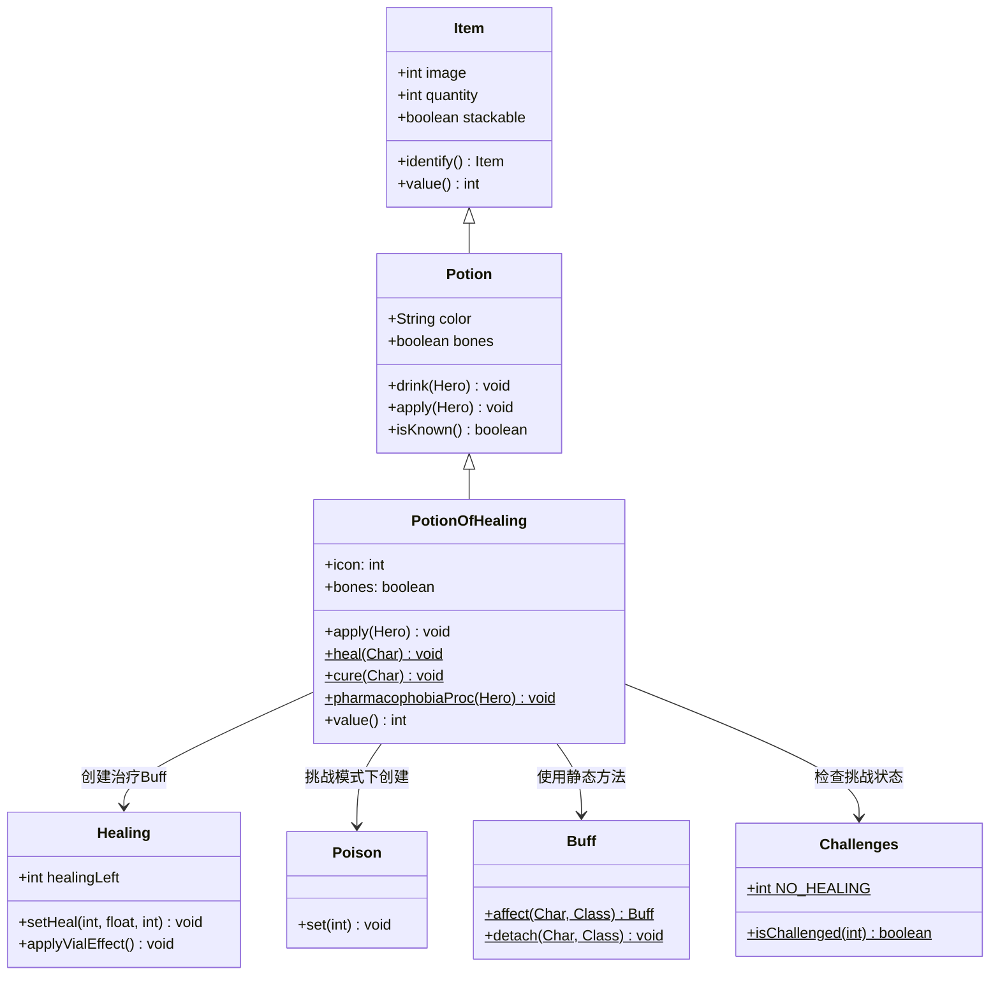

# PotionOfHealing 源码详解

## 1. 基本信息

| 属性 | 值 |
|------|-----|
| **文件路径** | core/src/main/java/com/shatteredpixel/shatteredpixeldungeon/items/potions/PotionOfHealing.java |
| **包名** | com.shatteredpixel.shatteredpixeldungeon.items.potions |
| **类类型** | class（非抽象） |
| **继承关系** | extends Potion |
| **代码行数** | 93 |
| **中文名称** | 治疗药水 |

---

## 类职责

PotionOfHealing（治疗药水）是游戏中最重要的恢复类物品之一。它负责：

1. **生命恢复**：为角色提供持续的治疗效果
2. **状态清除**：移除多种有害的状态效果
3. **挑战兼容**：在"禁疗"挑战下转换为中毒效果
4. **价值计算**：已鉴定的治疗药水有更高的出售价值

**设计模式**：
- **模板方法模式**：重写父类 `apply()` 方法定义饮用行为
- **策略模式**：通过静态方法 `heal()` 和 `cure()` 提供可复用的效果逻辑

---

## 4. 继承与协作关系



---

## 静态常量表

本类未定义静态常量，但依赖以下外部常量：

| 常量 | 来源 | 值 | 说明 |
|------|------|-----|------|
| `NO_HEALING` | Challenges | 4 | "禁疗"挑战标识位 |

---

## 实例字段表

| 字段名 | 类型 | 默认值 | 说明 |
|--------|------|--------|------|
| `icon` | int | `ItemSpriteSheet.Icons.POTION_HEALING` | 药水图标索引（鉴定后显示） |
| `bones` | boolean | true | 可出现在英雄遗骸中 |

### 继承自 Potion 的字段

| 字段名 | 类型 | 设置值 | 说明 |
|--------|------|--------|------|
| `stackable` | boolean | true | 可堆叠 |
| `defaultAction` | String | AC_DRINK | 默认动作为饮用 |

---

## 7. 方法详解

### apply(Hero hero)

```java
@Override
public void apply( Hero hero ) {
    identify();  // 鉴定药水
    cure( hero ); // 清除负面状态
    heal( hero ); // 应用治疗效果
}
```

**方法作用**：对英雄应用治疗药水效果（饮用时调用）。

**参数**：
- `hero` (Hero)：饮用药水的英雄

**执行流程**：
1. **鉴定药水**：调用 `identify()` 标记此类型药水为已鉴定
2. **清除负面状态**：调用 `cure()` 移除所有可治疗的负面效果
3. **应用治疗**：调用 `heal()` 提供生命恢复

**重写说明**：重写父类 `Potion.apply()` 方法，替代默认的 `shatter()` 行为。

---

### heal(Char ch) [静态方法]

```java
public static void heal( Char ch ){
    // 检查是否为英雄且启用"禁疗"挑战
    if (ch == Dungeon.hero && Dungeon.isChallenged(Challenges.NO_HEALING)){
        pharmacophobiaProc(Dungeon.hero);  // 触发禁疗惩罚
    } else {
        // 计算治疗量：基础为最大生命值的80% + 14
        // 与英雄总生命值在11级时持平
        Healing healing = Buff.affect(ch, Healing.class);
        healing.setHeal((int) (0.8f * ch.HT + 14), 0.25f, 0);
        healing.applyVialEffect();  // 应用血瓶饰品效果
        
        // 英雄饮用时显示消息
        if (ch == Dungeon.hero){
            GLog.p( Messages.get(PotionOfHealing.class, "heal") );
        }
    }
}
```

**方法作用**：为目标角色提供治疗效果。

**参数**：
- `ch` (Char)：接受治疗的角色

**治疗计算公式**：
```
治疗量 = 0.8 × 最大生命值(HT) + 14
每回合恢复 = 剩余治疗量 × 25%
```

**示例计算**：
| 角色最大生命值 | 治疗量 | 说明 |
|---------------|--------|------|
| 20 (1级) | 30 | 基础治疗量 |
| 100 (10级) | 94 | 接近满血 |
| 120 (11级) | 110 | 与最大生命值持平 |

**特殊处理**：
- **禁疗挑战**：触发 `pharmacophobiaProc()` 施加中毒而非治疗
- **血瓶饰品**：`applyVialEffect()` 可能增加总治疗量但限制每回合恢复

---

### pharmacophobiaProc(Hero hero) [静态方法]

```java
public static void pharmacophobiaProc( Hero hero ){
    // 对英雄施加中毒，伤害约为最大生命值的40%
    Buff.affect( hero, Poison.class).set(4 + hero.lvl/2);
}
```

**方法作用**：在"禁疗"挑战下，替代治疗效果施加中毒惩罚。

**参数**：
- `hero` (Hero)：受到惩罚的英雄

**中毒持续时间计算**：
```
持续时间 = 4 + 英雄等级 / 2
```

**伤害估算**：
- 中毒每回合造成 `等级 + 1` 点伤害
- 总伤害 ≈ `(4 + hero.lvl/2) × (hero.lvl + 1)` ≈ 40% 最大生命值

---

### cure(Char ch) [静态方法]

```java
public static void cure( Char ch ) {
    Buff.detach( ch, Poison.class );      // 中毒
    Buff.detach( ch, Cripple.class );     // 残废
    Buff.detach( ch, Weakness.class );    // 虚弱
    Buff.detach( ch, Vulnerable.class );  // 易伤
    Buff.detach( ch, Bleeding.class );    // 流血
    Buff.detach( ch, Blindness.class );   // 失明
    Buff.detach( ch, Drowsy.class );      // 困倦
    Buff.detach( ch, Slow.class );        // 减速
    Buff.detach( ch, Vertigo.class);      // 眩晕
}
```

**方法作用**：清除角色身上的多种负面状态。

**参数**：
- `ch` (Char)：被清除状态的角色

**可清除的负面状态**：

| 状态类 | 中文名 | 效果 |
|--------|--------|------|
| `Poison` | 中毒 | 持续受到伤害 |
| `Cripple` | 残废 | 移动速度减半 |
| `Weakness` | 虚弱 | 攻击伤害降低 |
| `Vulnerable` | 易伤 | 受到伤害增加 |
| `Bleeding` | 流血 | 移动时受到伤害 |
| `Blindness` | 失明 | 视野受限 |
| `Drowsy` | 困倦 | 可能陷入睡眠 |
| `Slow` | 减速 | 行动速度减半 |
| `Vertigo` | 眩晕 | 移动方向随机 |

**注意**：此方法不会清除所有负面状态，例如：
- 燃烧（Burning）
- 冻结（Frozen）
- 麻痹（Paralysis）
- 腐蚀（Corrosion）

---

### value()

```java
@Override
public int value() {
    return isKnown() ? 30 * quantity : super.value();
}
```

**方法作用**：返回药水的出售价值。

**返回值**：
- **已鉴定**：`30 × 数量` 金币
- **未鉴定**：调用父类 `Potion.value()`（同样为 `30 × 数量`）

**价值表**：

| 状态 | 单瓶价值 | 10瓶价值 |
|------|---------|---------|
| 已鉴定 | 30 金币 | 300 金币 |
| 未鉴定 | 30 金币 | 300 金币 |

---

## 11. 使用示例

### 基本使用

```java
// 创建治疗药水
PotionOfHealing potion = new PotionOfHealing();

// 英雄饮用
potion.execute(hero, Potion.AC_DRINK);
// 效果：鉴定、清除负面状态、恢复生命
```

### 直接调用静态方法

```java
// 对任意角色应用治疗
PotionOfHealing.heal(enemy);  // 治疗敌人

// 仅清除负面状态（不恢复生命）
PotionOfHealing.cure(hero);

// 触发禁疗惩罚
PotionOfHealing.pharmacophobiaProc(hero);
```

### 在其他物品中复用

```java
// 蜜糖治疗药剂复用治疗逻辑
public class ElixirOfHoneyedHealing extends Elixir {
    @Override
    public void apply(Hero hero) {
        PotionOfHealing.cure(hero);
        PotionOfHealing.heal(hero);
    }
}
```

### 检查禁疗挑战

```java
// 在自定义治疗物品中检查挑战
if (Dungeon.isChallenged(Challenges.NO_HEALING)) {
    PotionOfHealing.pharmacophobiaProc(hero);
} else {
    // 正常治疗逻辑
    Buff.affect(hero, Healing.class).setHeal(amount, 0.25f, 0);
}
```

---

## 注意事项

### 禁疗挑战（Pharmacophobia）

当启用 `NO_HEALING` 挑战时：
1. 治疗药水不会恢复生命
2. 反而会对英雄施加中毒效果
3. 中毒伤害约为最大生命值的 40%

### 治疗机制

1. **持续治疗**：治疗不是瞬间完成，而是分多个回合逐渐恢复
2. **治疗叠加**：多次饮用会叠加治疗量，不会浪费
3. **血瓶饰品**：装备血瓶饰品会改变治疗效果（总治疗量增加，但每回合恢复上限）

### 可清除状态限制

`cure()` 方法只能清除特定的 9 种负面状态，以下常见状态无法清除：
- 燃烧（Burning）
- 冻结（Frozen）
- 麻痹（Paralysis）
- 腐蚀（Corrosion）
- 酸液（Ooze）

### 价值计算

治疗药水的价值始终为 30 金币/瓶，无论是否鉴定。这是因为：
- 价值计算逻辑中，父类 `Potion.value()` 同样返回 `30 × quantity`
- 重写此方法是为了与其他有鉴定价值的药水保持一致性

---

## 最佳实践

### 创建自定义治疗物品

```java
public class CustomHealingItem extends Item {
    @Override
    public void apply(Hero hero) {
        // 复用治疗药水的清除逻辑
        PotionOfHealing.cure(hero);
        
        // 自定义治疗效果
        Healing healing = Buff.affect(hero, Healing.class);
        healing.setHeal(50, 0.5f, 0);  // 50点治疗，每回合恢复50%
        healing.applyVialEffect();
    }
}
```

### 检查治疗需求

```java
// 判断是否需要治疗药水
public boolean needsHealing(Hero hero) {
    return hero.HP < hero.HT || hasCurableDebuff(hero);
}

// 检查是否有可清除的负面状态
public boolean hasCurableDebuff(Char ch) {
    return ch.buff(Poison.class) != null
        || ch.buff(Bleeding.class) != null
        || ch.buff(Weakness.class) != null
        // ... 其他状态
    ;
}
```

### 处理禁疗挑战

```java
// 通用的治疗处理模式
public void applyHealing(Char target) {
    if (target == Dungeon.hero && Dungeon.isChallenged(Challenges.NO_HEALING)) {
        // 禁疗挑战下的替代效果
        GLog.w("在禁疗挑战下，治疗效果被替换！");
        PotionOfHealing.pharmacophobiaProc(Dungeon.hero);
    } else {
        // 正常治疗
        PotionOfHealing.heal(target);
    }
}
```

### AI 使用决策

```java
// 敌人使用治疗药水的决策
public boolean shouldUseHealing(Char enemy) {
    // 生命值低于 50% 时使用
    if (enemy.HP < enemy.HT * 0.5f) {
        return true;
    }
    
    // 有可清除的负面状态时使用
    if (enemy.buff(Poison.class) != null 
        || enemy.buff(Bleeding.class) != null) {
        return true;
    }
    
    return false;
}
```

---

## 相关类

| 类名 | 关系 | 说明 |
|------|------|------|
| `Potion` | 父类 | 药水基类 |
| `Healing` | 创建的Buff | 持续治疗效果 |
| `Poison` | 创建的Buff | 禁疗挑战下的替代效果 |
| `PotionOfShielding` | 相关类 | 异域护盾药水，也受禁疗挑战影响 |
| `ElixirOfHoneyedHealing` | 复用者 | 蜜糖治疗药剂，复用 heal/cure 方法 |
| `ElixirOfAquaticRejuvenation` | 相关类 | 水生恢复药剂，也受禁疗挑战影响 |
| `VialOfBlood` | 影响者 | 血瓶饰品，改变治疗效果 |

---

## 消息键

| 键名 | 值 | 用途 |
|------|-----|------|
| `items.potions.potionofhealing.name` | potion of healing | 物品名称 |
| `items.potions.potionofhealing.heal` | Your wounds begin to close. | 治疗消息 |
| `items.potions.potionofhealing.desc` | This elixir will rapidly restore your health and instantly cure many ailments. | 物品描述 |