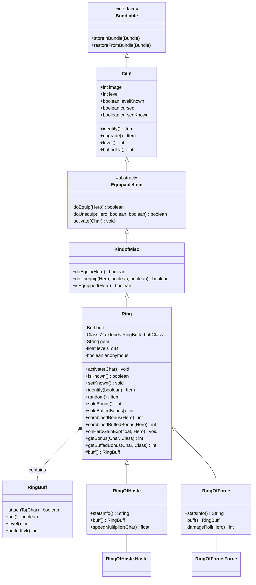

# Ring 源码详解

## 1. 基本信息

| 属性 | 值 |
|------|-----|
| **文件路径** | core/src/main/java/com/shatteredpixel/shatteredpixeldungeon/items/rings/Ring.java |
| **包名** | com.shatteredpixel.shatteredpixeldungeon.items.rings |
| **类类型** | class（非抽象） |
| **继承关系** | extends KindofMisc |
| **代码行数** | 459 |

---

## 类职责

Ring 是游戏中所有"戒指"物品的基类。它是戒指系统的核心，处理：

1. **随机外观系统**：戒指有12种宝石外观，随机分配给不同类型
2. **鉴定机制**：通过积累经验值逐渐鉴定
3. **Buff管理**：装备时附加对应的RingBuff到角色
4. **诅咒系统**：戒指可能带有诅咒
5. **等级加成**：通过升级增强效果

**设计模式**：
- **模板方法模式**：`buff()` 方法由子类实现，返回特定的RingBuff
- **策略模式**：不同戒指通过不同的RingBuff提供不同效果
- **状态模式**：通过anonymous状态控制显示行为

---

## 4. 继承与协作关系



---

## 静态常量表

### 宝石类型映射

| 键名 | 图像常量 | 说明 |
|------|---------|------|
| "garnet" | RING_GARNET | 石榴石（默认） |
| "ruby" | RING_RUBY | 红宝石 |
| "topaz" | RING_TOPAZ | 托帕石/黄玉 |
| "emerald" | RING_EMERALD | 祖母绿 |
| "onyx" | RING_ONYX | 缟玛瑙 |
| "opal" | RING_OPAL | 蛋白石 |
| "tourmaline" | RING_TOURMALINE | 碧玺 |
| "sapphire" | RING_SAPPHIRE | 蓝宝石 |
| "amethyst" | RING_AMETHYST | 紫水晶 |
| "quartz" | RING_QUARTZ | 石英 |
| "agate" | RING_AGATE | 玛瑙 |
| "diamond" | RING_DIAMOND | 钻石 |

### 序列化键

| 常量名 | 值 | 说明 |
|--------|-----|------|
| `LEVELS_TO_ID` | "levels_to_ID" | 鉴定进度存储键 |

---

## 实例字段表

### 核心字段

| 字段名 | 类型 | 默认值 | 说明 |
|--------|------|--------|------|
| `buff` | Buff | null | 当前附加的Buff实例 |
| `buffClass` | Class&lt;? extends RingBuff&gt; | null | Buff类型（由子类设置） |
| `gem` | String | "garnet" | 宝石类型标识 |
| `levelsToID` | float | 1 | 鉴定所需的经验值（以等级百分比计） |
| `anonymous` | boolean | false | 是否为匿名戒指 |

### 继承字段

| 字段名 | 来源 | 说明 |
|--------|------|------|
| `image` | Item | 图像索引（由宝石类型决定） |
| `level` | Item | 戒指等级 |
| `cursed` | Item | 是否被诅咒 |

---

## 静态字段表

| 字段名 | 类型 | 说明 |
|--------|------|------|
| `gems` | LinkedHashMap&lt;String, Integer&gt; | 宝石名称到图像索引的映射 |
| `handler` | ItemStatusHandler&lt;Ring&gt; | 物品状态处理器（管理鉴定状态和外观分配） |

---

## 7. 方法详解

### initGems()

```java
@SuppressWarnings("unchecked")
public static void initGems() {
    handler = new ItemStatusHandler<>( 
        (Class<? extends Ring>[])Generator.Category.RING.classes, 
        gems 
    );
}
```

**方法作用**：初始化戒指系统。

**执行流程**：
1. 从Generator获取所有戒指类型的Class数组
2. 创建ItemStatusHandler实例
3. ItemStatusHandler会随机将12种宝石外观分配给12种戒指类型

**调用时机**：游戏启动时调用

---

### clearGems()

```java
public static void clearGems(){
    handler = null;
}
```

**方法作用**：清空戒指处理器。

**调用时机**：游戏重置或场景切换时

---

### save(Bundle bundle) / restore(Bundle bundle)

```java
public static void save( Bundle bundle ) {
    handler.save( bundle );
}

@SuppressWarnings("unchecked")
public static void restore( Bundle bundle ) {
    handler = new ItemStatusHandler<>( 
        (Class<? extends Ring>[])Generator.Category.RING.classes, 
        gems, 
        bundle 
    );
}
```

**方法作用**：保存/恢复戒指系统的鉴定状态和外观分配。

**参数**：
- `bundle` (Bundle)：序列化容器

---

### saveSelectively(Bundle bundle, ArrayList&lt;Item&gt; items)

```java
public static void saveSelectively( Bundle bundle, ArrayList<Item> items ) {
    handler.saveSelectively( bundle, items );
}
```

**方法作用**：选择性保存（仅保存指定物品的状态）。

**使用场景**：英雄遗骸系统

---

### Ring()

```java
public Ring() {
    super();
    reset();
}
```

**方法作用**：构造函数，调用reset()初始化状态。

---

### reset()

```java
public void reset() {
    super.reset();
    levelsToID = 1;
    if (handler != null && handler.contains(this)){
        image = handler.image(this);    // 获取分配的外观图像
        gem = handler.label(this);       // 获取分配的宝石名称
    } else {
        image = ItemSpriteSheet.RING_GARNET;  // 默认使用石榴石
        gem = "garnet";
    }
}
```

**方法作用**：重置戒指状态，分配外观。

**执行流程**：
1. 调用父类reset()
2. 重置鉴定进度为1个等级
3. 如果handler存在，获取分配的外观
4. 否则使用默认外观

---

### anonymize()

```java
protected boolean anonymous = false;

public void anonymize(){
    if (!isKnown()) image = ItemSpriteSheet.RING_HOLDER;  // 使用占位图
    anonymous = true;
}
```

**方法作用**：将戒指设为匿名状态。

**匿名戒指特性**：
- 自动视为已鉴定
- 不影响全局鉴定状态
- 未鉴定时使用占位图
- 用于UI显示或临时生成的戒指

**使用场景**：
- 精神形态（SpiritForm）技能
- UI预览
- 临时效果生成

---

### activate(Char ch)

```java
public void activate( Char ch ) {
    if (buff != null){
        buff.detach();  // 移除旧的buff
        buff = null;
    }
    buff = buff();      // 创建新的buff（由子类实现）
    buff.attachTo( ch ); // 附加到角色
}
```

**方法作用**：装备戒指时激活，创建并附加Buff。

**参数**：
- `ch` (Char)：装备者

**执行流程**：
1. 移除已存在的Buff
2. 调用buff()创建新的Buff（模板方法）
3. 将Buff附加到角色

---

### doUnequip(Hero hero, boolean collect, boolean single)

```java
@Override
public boolean doUnequip( Hero hero, boolean collect, boolean single ) {
    if (super.doUnequip( hero, collect, single )) {
        if (buff != null) {
            buff.detach();  // 卸下时移除Buff
            buff = null;
        }
        return true;
    } else {
        return false;
    }
}
```

**方法作用**：卸下戒指，移除附加的Buff。

**参数**：
- `hero` (Hero)：卸下者
- `collect` (boolean)：是否放回背包
- `single` (boolean)：是否单独操作

**返回值**：是否成功卸下

---

### isKnown()

```java
public boolean isKnown() {
    return anonymous || (handler != null && handler.isKnown( this ));
}
```

**方法作用**：判断该类型戒指是否已被鉴定。

**返回值**：
- 匿名戒指始终返回true
- 否则检查handler中的鉴定状态

**注意**：这是"类型鉴定"，不是"实例鉴定"

---

### setKnown()

```java
public void setKnown() {
    if (!anonymous) {
        if (!isKnown()) {
            handler.know(this);  // 标记该类型为已知
        }
        if (Dungeon.hero.isAlive()) {
            Catalog.setSeen(getClass());              // 记录到图鉴
            Statistics.itemTypesDiscovered.add(getClass()); // 统计发现
        }
    }
}
```

**方法作用**：将该戒指类型标记为已鉴定。

**执行流程**：
1. 检查是否为匿名戒指
2. 如果未鉴定，标记为已知
3. 更新图鉴和统计

---

### name()

```java
@Override
public String name() {
    return isKnown() ? super.name() : Messages.get(Ring.class, gem);
}
```

**方法作用**：返回戒指名称。

**返回值**：
- 已鉴定：返回真实名称（如"速度戒指"）
- 未鉴定：返回宝石名称（如"红宝石戒指"）

---

### desc()

```java
@Override
public String desc() {
    return isKnown() ? super.desc() : Messages.get(this, "unknown_desc");
}
```

**方法作用**：返回戒指描述。

**返回值**：
- 已鉴定：返回真实描述
- 未鉴定：返回通用的未知描述

---

### info()

```java
@Override
public String info(){
    // 处理匿名戒指的特殊情况
    String desc;
    if (anonymous && (handler == null || !handler.isKnown( this ))){
        desc = desc();
    } else {
        desc = super.info();
    }

    // 添加诅咒状态信息
    if (cursed && isEquipped( Dungeon.hero )) {
        desc += "\n\n" + Messages.get(Ring.class, "cursed_worn");
    } else if (cursed && cursedKnown) {
        desc += "\n\n" + Messages.get(Ring.class, "curse_known");
    } else if (!isIdentified() && cursedKnown){
        desc += "\n\n" + Messages.get(Ring.class, "not_cursed");
    }
    
    // 添加属性信息
    if (isKnown()) {
        desc += "\n\n" + statsInfo();
    }
    
    return desc;
}
```

**方法作用**：返回完整的物品信息文本。

**包含内容**：
1. 基础描述（可能包含自定义笔记）
2. 诅咒状态提示
3. 属性数值（已鉴定时）

---

### statsInfo()

```java
protected String statsInfo(){
    return "";
}
```

**方法作用**：返回属性信息字符串。

**重写说明**：子类应重写此方法，返回具体的属性数值。例如：
- RingOfHaste：显示速度加成百分比
- RingOfForce：显示伤害范围

---

### upgradeStat1/2/3(int level)

```java
public String upgradeStat1(int level){
    return null;
}

public String upgradeStat2(int level){
    return null;
}

public String upgradeStat3(int level){
    return null;
}
```

**方法作用**：返回升级后的属性预览（用于UI显示）。

**参数**：
- `level` (int)：目标等级

**重写说明**：子类可重写以显示升级预览

---

### upgrade()

```java
@Override
public Item upgrade() {
    super.upgrade();
    
    // 33%几率移除诅咒
    if (Random.Int(3) == 0) {
        cursed = false;
    }
    
    return this;
}
```

**方法作用**：升级戒指，有概率移除诅咒。

**特性**：
- 每次升级有1/3几率移除诅咒
- 支持链式调用

---

### isIdentified()

```java
@Override
public boolean isIdentified() {
    return super.isIdentified() && isKnown();
}
```

**方法作用**：判断戒指是否完全鉴定。

**完全鉴定条件**：
1. 等级已知（levelKnown）
2. 诅咒状态已知（cursedKnown）
3. 戒指类型已知（isKnown）

---

### identify(boolean byHero)

```java
@Override
public Item identify( boolean byHero ) {
    setKnown();          // 标记类型为已知
    levelsToID = 0;      // 清零鉴定进度
    return super.identify(byHero);  // 调用父类完成鉴定
}
```

**方法作用**：完全鉴定戒指。

---

### setIDReady() / readyToIdentify()

```java
public void setIDReady(){
    levelsToID = -1;
}

public boolean readyToIdentify(){
    return !isIdentified() && levelsToID <= 0;
}
```

**方法作用**：
- `setIDReady()`：标记为准备鉴定（用于遗忘碎片）
- `readyToIdentify()`：判断是否准备好鉴定

---

### random()

```java
@Override
public Item random() {
    // 等级分布：+0: 66.67%, +1: 26.67%, +2: 6.67%
    int n = 0;
    if (Random.Int(3) == 0) {
        n++;
        if (Random.Int(5) == 0){
            n++;
        }
    }
    level(n);
    
    // 30%几率被诅咒
    if (Random.Float() < 0.3f) {
        cursed = true;
    }
    
    return this;
}
```

**方法作用**：生成随机属性的戒指。

**等级分布**：
- +0: 66.67% (2/3)
- +1: 26.67% (4/15)
- +2: 6.67% (1/15)

**诅咒概率**：30%

---

### getKnown() / getUnknown() / allKnown()

```java
public static HashSet<Class<? extends Ring>> getKnown() {
    return handler.known();
}

public static HashSet<Class<? extends Ring>> getUnknown() {
    return handler.unknown();
}

public static boolean allKnown() {
    return handler != null && handler.known().size() == Generator.Category.RING.classes.length;
}
```

**方法作用**：
- `getKnown()`：获取所有已知类型的戒指
- `getUnknown()`：获取所有未知类型的戒指
- `allKnown()`：判断是否所有戒指类型都已鉴定

---

### value()

```java
@Override
public int value() {
    int price = 75;  // 基础价格
    if (cursed && cursedKnown) {
        price /= 2;   // 已知诅咒减半
    }
    if (levelKnown) {
        if (level() > 0) {
            price *= (level() + 1);  // 升级加价
        } else if (level() < 0) {
            price /= (1 - level());   // 降级减价
        }
    }
    if (price < 1) {
        price = 1;
    }
    return price;
}
```

**方法作用**：计算戒指的出售价格。

**价格计算**：
1. 基础价格75金币
2. 已知诅咒：价格减半
3. 升级：价格 × (等级+1)
4. 降级：价格 ÷ (1-等级)

---

### buff()

```java
protected RingBuff buff() {
    return null;
}
```

**方法作用**：创建戒指对应的Buff实例（模板方法）。

**重写说明**：子类必须重写此方法，返回具体的RingBuff实例。

**示例**：
```java
// RingOfHaste中
@Override
protected RingBuff buff() {
    return new Haste();
}
```

---

### storeInBundle() / restoreFromBundle()

```java
@Override
public void storeInBundle( Bundle bundle ) {
    super.storeInBundle( bundle );
    bundle.put( LEVELS_TO_ID, levelsToID );
}

@Override
public void restoreFromBundle( Bundle bundle ) {
    super.restoreFromBundle( bundle );
    levelsToID = bundle.getFloat( LEVELS_TO_ID );
}
```

**方法作用**：序列化/反序列化鉴定进度。

---

### onHeroGainExp(float levelPercent, Hero hero)

```java
public void onHeroGainExp( float levelPercent, Hero hero ){
    if (isIdentified() || !isEquipped(hero)) return;
    
    // 应用鉴定速度加成（天赋等）
    levelPercent *= Talent.itemIDSpeedFactor(hero, this);
    
    // 减少鉴定进度
    levelsToID -= levelPercent;
    
    if (levelsToID <= 0){
        // 检查遗忘碎片是否禁用被动鉴定
        if (ShardOfOblivion.passiveIDDisabled()){
            if (levelsToID > -1){
                GLog.p(Messages.get(ShardOfOblivion.class, "identify_ready"), name());
            }
            setIDReady();  // 仅标记准备就绪
        } else {
            identify();    // 直接鉴定
            GLog.p(Messages.get(Ring.class, "identify"));
            Badges.validateItemLevelAquired(this);
        }
    }
}
```

**方法作用**：处理英雄获得经验时的鉴定进度。

**参数**：
- `levelPercent` (float)：获得的经验（以等级百分比计）
- `hero` (Hero)：获得经验的英雄

**鉴定机制**：
1. 只在装备状态下累积
2. 默认需要1个等级的经验
3. 天赋可加速鉴定
4. 遗忘碎片可禁用被动鉴定

---

### buffedLvl()

```java
@Override
public int buffedLvl() {
    int lvl = super.buffedLvl();
    // 强化戒指Buff可增加1级
    if (Dungeon.hero.buff(EnhancedRings.class) != null){
        lvl++;
    }
    return lvl;
}
```

**方法作用**：获取考虑Buff修正后的等级。

**特殊效果**：EnhancedRings Buff可使戒指等级+1

---

### getBonus(Char target, Class&lt;? extends RingBuff&gt; type)

```java
public static int getBonus(Char target, Class<?extends RingBuff> type){
    // 魔法免疫时无效果
    if (target.buff(MagicImmune.class) != null) return 0;
    
    int bonus = 0;
    // 累加所有匹配类型的RingBuff等级
    for (RingBuff buff : target.buffs(type)) {
        bonus += buff.level();
    }
    
    // 精神形态处理
    SpiritForm.SpiritFormBuff spiritForm = target.buff(SpiritForm.SpiritFormBuff.class);
    if (bonus == 0
            && spiritForm != null
            && spiritForm.ring() != null
            && spiritForm.ring().buffClass == type){
        bonus += spiritForm.ring().soloBonus();
    }
    return bonus;
}
```

**方法作用**：获取目标身上指定类型戒指的总加成。

**参数**：
- `target` (Char)：目标角色
- `type` (Class)：RingBuff类型

**返回值**：总加成值

**使用示例**：
```java
// 获取速度加成
int hasteBonus = Ring.getBonus(hero, RingOfHaste.Haste.class);
```

---

### getBuffedBonus(Char target, Class&lt;? extends RingBuff&gt; type)

```java
public static int getBuffedBonus(Char target, Class<?extends RingBuff> type){
    if (target.buff(MagicImmune.class) != null) return 0;
    
    int bonus = 0;
    // 使用buffedLvl()获取修正后的等级
    for (RingBuff buff : target.buffs(type)) {
        bonus += buff.buffedLvl();
    }
    
    // 精神形态处理
    if (bonus == 0
            && target.buff(SpiritForm.SpiritFormBuff.class) != null
            && target.buff(SpiritForm.SpiritFormBuff.class).ring() != null
            && target.buff(SpiritForm.SpiritFormBuff.class).ring().buffClass == type){
        bonus += target.buff(SpiritForm.SpiritFormBuff.class).ring().soloBuffedBonus();
    }
    return bonus;
}
```

**方法作用**：获取修正后的总加成（考虑EnhancedRings等Buff）。

---

### soloBonus() / soloBuffedBonus()

```java
// 单枚戒指的基础加成
public int soloBonus(){
    if (cursed){
        return Math.min( 0, Ring.this.level()-2 );  // 诅咒：负加成
    } else {
        return Ring.this.level()+1;  // 正常：等级+1
    }
}

// 单枚戒指的修正加成
public int soloBuffedBonus(){
    if (cursed){
        return Math.min( 0, Ring.this.buffedLvl()-2 );
    } else {
        return Ring.this.buffedLvl()+1;
    }
}
```

**方法作用**：计算单枚戒指的加成值。

**加成公式**：
- 正常：等级 + 1
- 诅咒：min(0, 等级 - 2)

**示例**：
| 等级 | 正常加成 | 诅咒加成 |
|------|---------|---------|
| -1 | 0 | min(0, -3) = -3 |
| 0 | 1 | min(0, -2) = -2 |
| +1 | 2 | min(0, -1) = -1 |
| +2 | 3 | min(0, 0) = 0 |

---

### combinedBonus(Hero hero) / combinedBuffedBonus(Hero hero)

```java
// 组合加成（用于描述显示）
public int combinedBonus(Hero hero){
    int bonus = 0;
    if (hero.belongings.ring() != null && hero.belongings.ring().getClass() == getClass()){
        bonus += hero.belongings.ring().soloBonus();
    }
    if (hero.belongings.misc() != null && hero.belongings.misc().getClass() == this.getClass()){
        bonus += ((Ring)hero.belongings.misc()).soloBonus();
    }
    return bonus;
}
```

**方法作用**：计算同类型戒指的组合加成。

**使用场景**：
- 戒指描述中显示组合效果
- 英雄可装备两枚同类型戒指，效果叠加

---

## RingBuff 内部类详解

```java
public class RingBuff extends Buff {

    @Override
    public boolean attachTo( Char target ) {
        if (super.attachTo( target )) {
            // 处理游戏加载时的回合延迟
            if (target instanceof Hero && Dungeon.hero == null && cooldown() == 0 && target.cooldown() > 0) {
                spend(TICK);
            }
            return true;
        }
        return false;
    }

    @Override
    public boolean act() {
        spend( TICK );  // 每回合执行一次
        return true;
    }

    public int level(){
        return Ring.this.soloBonus();
    }

    public int buffedLvl(){
        return Ring.this.soloBuffedBonus();
    }
}
```

**类作用**：戒指效果的具体实现载体。

**关键特性**：
1. **内部类**：可以访问外部Ring实例
2. **持续性**：只要装备就持续存在
3. **等级同步**：`level()` 方法实时返回戒指当前等级

**子类实现示例**：
```java
// RingOfHaste中的Haste Buff
public class Haste extends RingBuff {
    // 空实现，仅作为类型标识
    // 具体效果通过Ring.getBonus()获取
}
```

---

## 与其他类的交互

### 被哪些类继承

| 类名 | 说明 |
|------|------|
| `RingOfAccuracy` | 命中加成戒指 |
| `RingOfArcana` | 奥术加成戒指 |
| `RingOfElements` | 元素抗性戒指 |
| `RingOfEnergy` | 能量恢复戒指 |
| `RingOfEvasion` | 闪避加成戒指 |
| `RingOfForce` | 力量伤害戒指 |
| `RingOfFuror` | 攻速加成戒指 |
| `RingOfHaste` | 移速加成戒指 |
| `RingOfMight` | 力量/生命戒指 |
| `RingOfSharpshooting` | 远程加成戒指 |
| `RingOfTenacity` | 韧性戒指 |
| `RingOfWealth` | 财富戒指 |

### 使用了哪些类

| 类名 | 用于什么目的 |
|------|-------------|
| `ItemStatusHandler` | 管理鉴定状态和外观分配 |
| `RingBuff` | 实现戒指效果 |
| `Generator.Category` | 获取戒指类型列表 |
| `Messages` | 国际化文本 |
| `Catalog` | 图鉴记录 |
| `Badges` | 徽章验证 |
| `Talent` | 天赋系统交互 |
| `EnhancedRings` | 强化戒指效果 |
| `MagicImmune` | 魔法免疫检测 |
| `SpiritForm` | 精神形态技能 |
| `ShardOfOblivion` | 遗忘碎片交互 |

---

## 11. 使用示例

### 创建自定义戒指

```java
public class RingOfLuck extends Ring {

    {
        icon = ItemSpriteSheet.Icons.RING_LUCK;
        buffClass = Luck.class;
    }

    @Override
    protected RingBuff buff() {
        return new Luck();
    }

    @Override
    public String statsInfo() {
        if (isIdentified()) {
            return Messages.get(this, "stats", soloBuffedBonus() * 5);
        } else {
            return Messages.get(this, "typical_stats", 5);
        }
    }

    // 获取幸运加成
    public static int luckBonus(Char target) {
        return getBonus(target, Luck.class) * 5;
    }

    public class Luck extends RingBuff {
        // 空实现，作为类型标识
    }
}
```

### 使用戒指加成

```java
// 计算命中率时使用
float hitChance = baseChance + Ring.getBonus(attacker, RingOfAccuracy.Accuracy.class) * 0.05f;

// 计算速度时使用
float speed = baseSpeed * RingOfHaste.speedMultiplier(hero);

// 检查是否装备特定戒指
if (hero.buff(RingOfForce.Force.class) != null) {
    // 使用力量戒指的徒手伤害
}
```

### 匿名戒指使用

```java
// 创建预览用的匿名戒指
Ring preview = new RingOfHaste();
preview.anonymize();
// 用于UI显示，不影响游戏状态
```

---

## 注意事项

### 鉴定机制

1. **类型鉴定 vs 实例鉴定**：
   - `isKnown()` 检查的是类型是否已知
   - `isIdentified()` 检查的是实例是否完全鉴定
   - 鉴定一枚戒指会揭示所有同类型戒指

2. **经验累积**：
   - 只在装备状态下累积
   - 默认需要1个等级的经验
   - 可通过天赋加速

### 外观系统

1. **随机分配**：每局游戏开始时，12种宝石外观随机分配给12种戒指类型
2. **持久化**：外观分配会保存到存档
3. **玩家记忆**：玩家需要记住"红宝石戒指=速度戒指"这样的对应关系

### 双戒指系统

1. 英雄可以装备两枚戒指（ring槽位 + misc槽位）
2. 两枚同类型戒指效果叠加
3. `combinedBonus()` 用于显示组合效果

### 常见的坑

1. **忘记设置buffClass**：子类必须设置buffClass字段
2. **忘记重写buff()**：子类必须重写buff()方法
3. **魔法免疫**：MagicImmune会完全禁用戒指效果

---

## 最佳实践

### 子类实现清单

```java
public class RingOfXxx extends Ring {

    // 1. 设置图标和buff类型
    {
        icon = ItemSpriteSheet.Icons.RING_XXX;
        buffClass = XxxBuff.class;
    }

    // 2. 实现buff()方法
    @Override
    protected RingBuff buff() {
        return new XxxBuff();
    }

    // 3. 提供静态访问方法
    public static int getBonus(Char target) {
        return Ring.getBonus(target, XxxBuff.class);
    }

    // 4. 重写statsInfo()显示属性
    @Override
    public String statsInfo() {
        // ...
    }

    // 5. 定义内部Buff类
    public class XxxBuff extends RingBuff {
        // 可以添加额外字段和方法
    }
}
```

### 效果获取方式

```java
// 推荐：使用静态方法
int bonus = RingOfHaste.speedMultiplier(hero);

// 不推荐：直接访问Buff
RingOfHaste.Haste buff = hero.buff(RingOfHaste.Haste.class);
if (buff != null) {
    int level = buff.level();
}
```

### 性能考虑

1. 使用 `getBonus()` 而不是遍历Buff
2. 缓存常用计算结果
3. 避免在频繁调用的方法中创建对象