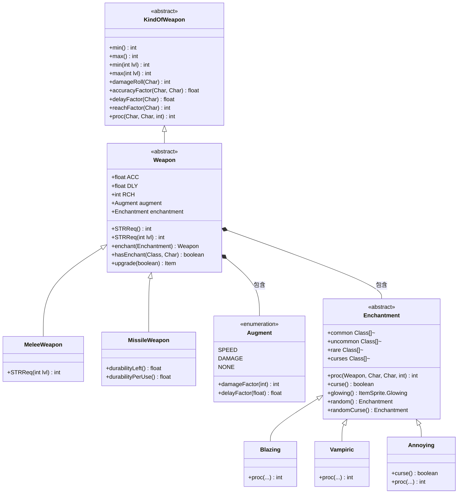

# Weapon 源码详解

## 1. 基本信息

| 属性 | 值 |
|------|-----|
| **文件路径** | core/src/main/java/com/shatteredpixel/shatteredpixeldungeon/items/weapon/Weapon.java |
| **包名** | com.shatteredpixel.shatteredpixeldungeon.items.weapon |
| **类类型** | abstract class（抽象类） |
| **继承关系** | extends KindOfWeapon |
| **代码行数** | 662 |

---

## 类职责

Weapon 是游戏中所有**武器**的抽象基类，继承自 KindOfWeapon。它是武器系统的核心，处理：

1. **武器属性**：精准度(ACC)、攻击速度(DLY)、攻击范围(RCH)
2. **强化系统**：速度强化(SPEED)和伤害强化(DAMAGE)两种增益
3. **附魔系统**：包含附魔(Enchantment)和诅咒(Curse)的管理
4. **鉴定系统**：通过使用次数逐渐鉴定武器
5. **力量需求**：计算武器所需的力量值(STRReq)
6. **序列化**：存档/读档支持

**设计模式**：
- **模板方法模式**：`STRReq(int lvl)`、`proc()` 等方法由子类实现
- **策略模式**：`Enchantment` 附魔系统，不同附魔提供不同效果

---

## 4. 继承与协作关系



---

## 静态常量表

### 序列化键名

| 字段名 | 类型 | 值 | 说明 |
|--------|------|-----|------|
| `USES_LEFT_TO_ID` | String | "uses_left_to_id" | 鉴定剩余使用次数的存储键 |
| `AVAILABLE_USES` | String | "available_uses" | 可用鉴定次数的存储键 |
| `ENCHANTMENT` | String | "enchantment" | 附魔的存储键 |
| `ENCHANT_HARDENED` | String | "enchant_hardened" | 附魔硬化状态的存储键 |
| `CURSE_INFUSION_BONUS` | String | "curse_infusion_bonus" | 诅咒注入加成的存储键 |
| `MASTERY_POTION_BONUS` | String | "mastery_potion_bonus" | 熟练药水加成的存储键 |
| `AUGMENT` | String | "augment" | 增益类型的存储键 |

### 附魔稀有度概率

| 字段名 | 类型 | 值 | 说明 |
|--------|------|-----|------|
| `typeChances` | float[] | {50, 40, 10} | 普通/罕见/稀有附魔的权重 |

### 附魔光效

| 字段名 | 类型 | 值 | 说明 |
|--------|------|-----|------|
| `HOLY` | ItemSprite.Glowing | 0xFFFF00 (黄色) | 神圣武器的光效 |

---

## 内部枚举：Augment（增益类型）

### 枚举定义

```java
public enum Augment {
    SPEED   (0.7f, 2/3f),   // 速度型：伤害×0.7，延迟×0.67
    DAMAGE  (1.5f, 5/3f),   // 伤害型：伤害×1.5，延迟×1.67
    NONE    (1.0f, 1f);     // 无增益

    private float damageFactor;  // 伤害因子
    private float delayFactor;   // 延迟因子
}
```

### 枚举值详解

| 枚举值 | damageFactor | delayFactor | 效果说明 |
|--------|--------------|-------------|----------|
| `SPEED` | 0.7f | 2/3f ≈ 0.67f | 攻速提升约50%，伤害降低30% |
| `DAMAGE` | 1.5f | 5/3f ≈ 1.67f | 伤害提升50%，攻速降低约40% |
| `NONE` | 1.0f | 1.0f | 无任何修改 |

### 枚举方法

| 方法签名 | 返回类型 | 说明 |
|----------|----------|------|
| `damageFactor(int dmg)` | int | 计算增益后的伤害（四舍五入） |
| `damageFactor(float dmg)` | float | 计算增益后的伤害（浮点） |
| `delayFactor(float dly)` | float | 计算增益后的攻击延迟 |

---

## 内部类：Enchantment（附魔基类）

### 1. 基本信息

| 属性 | 值 |
|------|-----|
| **类类型** | abstract class（抽象类） |
| **实现接口** | Bundlable |
| **职责** | 定义所有附魔/诅咒的通用接口 |

### 附魔分类常量

| 字段名 | 类型 | 包含的附魔 | 说明 |
|--------|------|-----------|------|
| `common` | Class[] | Blazing, Chilling, Kinetic, Shocking | 普通附魔（各12.5%） |
| `uncommon` | Class[] | Blocking, Blooming, Elastic, Lucky, Projecting, Unstable | 罕见附魔（各约6.67%） |
| `rare` | Class[] | Corrupting, Grim, Vampiric | 稀有附魔（各约3.33%） |
| `curses` | Class[] | Annoying, Displacing, Dazzling, Explosive, Sacrificial, Wayward, Polarized, Friendly | 诅咒附魔 |

### 抽象方法

| 方法签名 | 说明 |
|----------|------|
| `proc(Weapon, Char, Char, int)` | 处理附魔效果，返回修改后的伤害 |
| `glowing()` | 返回附魔的光效颜色 |

### 实例方法

| 方法签名 | 返回类型 | 说明 |
|----------|----------|------|
| `curse()` | boolean | 是否为诅咒（默认false） |
| `name()` | String | 获取附魔名称 |
| `name(String weaponName)` | String | 获取带武器名的附魔名称 |
| `desc()` | String | 获取附魔描述 |
| `procChanceMultiplier(Char)` | float | 附魔触发概率倍率 |

### 静态方法

| 方法签名 | 说明 |
|----------|------|
| `random(Class... toIgnore)` | 随机获取一个附魔 |
| `randomCommon(Class... toIgnore)` | 随机获取普通附魔 |
| `randomUncommon(Class... toIgnore)` | 随机获取罕见附魔 |
| `randomRare(Class... toIgnore)` | 随机获取稀有附魔 |
| `randomCurse(Class... toIgnore)` | 随机获取诅咒附魔 |
| `genericProcChanceMultiplier(Char)` | 计算通用的附魔触发倍率 |

---

## 实例字段表

### 武器基础属性

| 字段名 | 类型 | 默认值 | 说明 |
|--------|------|--------|------|
| `ACC` | float | 1f | 精准度修正系数 |
| `DLY` | float | 1f | 攻击延迟修正系数 |
| `RCH` | int | 1 | 攻击范围（仅近战有效） |

### 增益系统

| 字段名 | 类型 | 默认值 | 说明 |
|--------|------|--------|------|
| `augment` | Augment | Augment.NONE | 当前增益类型 |

### 鉴定系统

| 字段名 | 类型 | 默认值 | 说明 |
|--------|------|--------|------|
| `usesLeftToID` | float | 20 | 鉴定所需剩余使用次数 |
| `availableUsesToID` | float | 10 | 可累计的鉴定使用次数 |

### 附魔系统

| 字段名 | 类型 | 默认值 | 说明 |
|--------|------|--------|------|
| `enchantment` | Enchantment | null | 当前附魔 |
| `enchantHardened` | boolean | false | 附魔是否已硬化（升级不易丢失） |
| `curseInfusionBonus` | boolean | false | 是否有诅咒注入加成 |
| `masteryPotionBonus` | boolean | false | 是否有熟练药水加成 |

---

## 7. 方法详解

### 武器属性相关方法

#### ACC, DLY, RCH 字段

```java
// 第87-89行
public float    ACC = 1f;    // Accuracy modifier - 精准度修正
public float    DLY = 1f;    // Speed modifier - 速度修正
public int      RCH = 1;     // Reach modifier (only applies to melee hits) - 攻击范围修正
```

**说明**：
- `ACC`：影响命中率的乘数。1.0表示标准精准度，>1提升命中，<1降低命中
- `DLY`：影响攻击速度的乘数。1.0表示标准速度，<1更快，>1更慢
- `RCH`：攻击范围（格子数）。1=相邻，2=可隔一格攻击等

---

#### usesToID()

```java
// 第119-121行
protected int usesToID(){
    return 20;
}
```

**作用**：返回鉴定武器所需的使用次数。

**返回值**：默认20次

**子类重写**：可覆盖以调整鉴定速度

---

### 鉴定系统方法

#### proc() - 核心攻击处理

```java
// 第131-209行
@Override
public int proc( Char attacker, Char defender, int damage ) {

    boolean becameAlly = false;
    boolean wasAlly = defender.alignment == Char.Alignment.ALLY;
    
    // 第135-180行：附魔处理逻辑
    if (attacker.buff(MagicImmune.class) == null) {
        // Trinity附魔处理（BodyForm技能）
        Enchantment trinityEnchant = null;
        if (Dungeon.hero.buff(BodyForm.BodyFormBuff.class) != null && this instanceof MeleeWeapon
                && (attacker == Dungeon.hero || attacker instanceof MirrorImage || attacker instanceof ShadowClone.ShadowAlly)){
            trinityEnchant = Dungeon.hero.buff(BodyForm.BodyFormBuff.class).enchant();
            // 避免与武器自带附魔重复
            if (enchantment != null && trinityEnchant != null && trinityEnchant.getClass() == enchantment.getClass()){
                trinityEnchant = null;
            }
        }

        // HolyWeapon处理
        if (attacker instanceof Hero && isEquipped((Hero) attacker)
                && attacker.buff(HolyWeapon.HolyWepBuff.class) != null){
            // 圣武士子职业或有诅咒时的特殊处理
            if (enchantment != null &&
                    (((Hero) attacker).subClass == HeroSubClass.PALADIN || hasCurseEnchant())){
                damage = enchantment.proc(this, attacker, defender, damage);
                if (defender.alignment == Char.Alignment.ALLY && !wasAlly){
                    becameAlly = true;  // Corrupting等附魔可能将敌人变成盟友
                }
            }
            // Trinity附魔效果
            if (defender.isAlive() && !becameAlly && trinityEnchant != null){
                damage = trinityEnchant.proc(this, attacker, defender, damage);
            }
            // 额外神圣伤害
            if (defender.isAlive() && !becameAlly) {
                int dmg = ((Hero) attacker).subClass == HeroSubClass.PALADIN ? 6 : 2;
                defender.damage(Math.round(dmg * Enchantment.genericProcChanceMultiplier(attacker)), HolyWeapon.INSTANCE);
            }

        } else {
            // 标准附魔处理
            if (enchantment != null) {
                damage = enchantment.proc(this, attacker, defender, damage);
                if (defender.alignment == Char.Alignment.ALLY && !wasAlly) {
                    becameAlly = true;
                }
            }

            if (defender.isAlive() && !becameAlly && trinityEnchant != null){
                damage = trinityEnchant.proc(this, attacker, defender, damage);
            }
        }

        // Smite技能额外伤害
        if (attacker instanceof Hero && isEquipped((Hero) attacker) &&
                attacker.buff(Smite.SmiteTracker.class) != null && !becameAlly){
            defender.damage(Smite.bonusDmg((Hero) attacker, defender), Smite.INSTANCE);
        }
    }

    // 第184-188行：远程武器耐久度检测
    // 如果是最后一次使用的远程武器且无父物品，跳过鉴定进度
    if (this instanceof MissileWeapon
            && ((MissileWeapon) this).durabilityLeft() <= ((MissileWeapon) this).durabilityPerUse()
            && ((MissileWeapon) this).parent == null){
        return damage;
    }
    
    // 第190-206行：鉴定进度处理
    if (!levelKnown && attacker == Dungeon.hero) {
        float uses = Math.min( availableUsesToID, Talent.itemIDSpeedFactor(Dungeon.hero, this) );
        availableUsesToID -= uses;
        usesLeftToID -= uses;
        
        if (usesLeftToID <= 0) {
            // ShardOfOblivion会延迟鉴定
            if (ShardOfOblivion.passiveIDDisabled()){
                if (usesLeftToID > -1){
                    GLog.p(Messages.get(ShardOfOblivion.class, "identify_ready"), name());
                }
                setIDReady();  // 设置为可鉴定状态
            } else {
                identify();
                GLog.p(Messages.get(Weapon.class, "identify"));
                Badges.validateItemLevelAquired(this);
            }
        }
    }

    return damage;
}
```

**作用**：处理武器攻击时的所有效果，包括附魔触发和鉴定进度。

**参数**：
- `attacker` (Char)：攻击者
- `defender` (Char)：防御者
- `damage` (int)：基础伤害

**返回值**：处理后的伤害值

**关键逻辑**：
1. 检查魔法免疫状态
2. 处理Trinity附魔（BodyForm技能）
3. 处理HolyWeapon状态
4. 触发附魔效果
5. 处理Smite额外伤害
6. 推进鉴定进度

---

#### onHeroGainExp()

```java
// 第211-218行
public void onHeroGainExp( float levelPercent, Hero hero ){
    levelPercent *= Talent.itemIDSpeedFactor(hero, this);
    if (!levelKnown && (isEquipped(hero) || this instanceof MissileWeapon)
            && availableUsesToID <= usesToID()/2f) {
        // 每0.5级恢复足够的鉴定使用次数
        availableUsesToID = Math.min(usesToID()/2f, availableUsesToID + levelPercent * usesToID());
    }
}
```

**作用**：英雄获得经验时恢复鉴定使用次数。

**参数**：
- `levelPercent` (float)：经验进度百分比
- `hero` (Hero)：英雄实例

**机制**：装备中的武器或远程武器可通过经验恢复鉴定进度

---

#### setIDReady() / readyToIdentify()

```java
// 第282-288行
public void setIDReady(){
    usesLeftToID = -1;  // 设为-1表示已准备好鉴定
}

public boolean readyToIdentify(){
    return !isIdentified() && usesLeftToID <= 0;
}
```

**作用**：
- `setIDReady()`：标记武器已准备好鉴定
- `readyToIdentify()`：检查是否可以鉴定

---

### 序列化方法

#### storeInBundle() / restoreFromBundle()

```java
// 第228-251行
private static final String USES_LEFT_TO_ID = "uses_left_to_id";
// ... 其他常量定义

@Override
public void storeInBundle( Bundle bundle ) {
    super.storeInBundle( bundle );
    bundle.put( USES_LEFT_TO_ID, usesLeftToID );
    bundle.put( AVAILABLE_USES, availableUsesToID );
    bundle.put( ENCHANTMENT, enchantment );
    bundle.put( ENCHANT_HARDENED, enchantHardened );
    bundle.put( CURSE_INFUSION_BONUS, curseInfusionBonus );
    bundle.put( MASTERY_POTION_BONUS, masteryPotionBonus );
    bundle.put( AUGMENT, augment );
}

@Override
public void restoreFromBundle( Bundle bundle ) {
    super.restoreFromBundle( bundle );
    usesLeftToID = bundle.getFloat( USES_LEFT_TO_ID );
    availableUsesToID = bundle.getFloat( AVAILABLE_USES );
    enchantment = (Enchantment)bundle.get( ENCHANTMENT );
    enchantHardened = bundle.getBoolean( ENCHANT_HARDENED );
    curseInfusionBonus = bundle.getBoolean( CURSE_INFUSION_BONUS );
    masteryPotionBonus = bundle.getBoolean( MASTERY_POTION_BONUS );
    augment = bundle.getEnum(AUGMENT, Augment.class);
}
```

**作用**：将武器状态保存/恢复到存档中。

**保存的字段**：
- 鉴定进度
- 附魔及状态
- 增益类型

---

### 属性计算方法

#### accuracyFactor()

```java
// 第291-306行
@Override
public float accuracyFactor(Char owner, Char target) {
    
    int encumbrance = 0;
    
    // 计算力量不足的惩罚
    if( owner instanceof Hero ){
        encumbrance = STRReq() - ((Hero)owner).STR();
    }

    float ACC = this.ACC;

    // Wayward诅咒惩罚
    if (owner.buff(Wayward.WaywardBuff.class) != null && enchantment instanceof Wayward){
        ACC /= 5;  // 精准度降低80%
    }

    // 力量不足时精准度按1.5的幂次降低
    return encumbrance > 0 ? (float)(ACC / Math.pow( 1.5, encumbrance )) : ACC;
}
```

**作用**：计算武器的精准度因子。

**参数**：
- `owner` (Char)：武器持有者
- `target` (Char)：攻击目标

**返回值**：精准度乘数

**计算公式**：
- 基础精准度 = `ACC`
- 力量不足惩罚 = `ACC / (1.5 ^ 力量差值)`
- Wayward诅咒 = `ACC / 5`

---

#### delayFactor() / baseDelay() / speedMultiplier()

```java
// 第309-333行
@Override
public float delayFactor( Char owner ) {
    return baseDelay(owner) * (1f/speedMultiplier(owner));
}

protected float baseDelay( Char owner ){
    float delay = augment.delayFactor(this.DLY);
    if (owner instanceof Hero) {
        int encumbrance = STRReq() - ((Hero)owner).STR();
        if (encumbrance > 0){
            // 力量不足时延迟按1.2的幂次增加
            delay *= Math.pow( 1.2, encumbrance );
        }
    }
    return delay;
}

protected float speedMultiplier(Char owner ){
    float multi = RingOfFuror.attackSpeedMultiplier(owner);

    // Scimitar的剑舞技能加成
    if (owner.buff(Scimitar.SwordDance.class) != null){
        multi += 0.6f;
    }

    return multi;
}
```

**作用**：计算攻击延迟和速度修正。

**返回值**：最终攻击延迟 = `基础延迟 / 速度乘数`

**影响因素**：
1. 增益类型（SPEED/DAMAGE）
2. 力量不足惩罚
3. RingOfFuror效果
4. SwordDance技能

---

#### reachFactor()

```java
// 第336-352行
@Override
public int reachFactor(Char owner) {
    int reach = RCH;
    
    // 徒手格斗时重置范围为1
    if (owner instanceof Hero && RingOfForce.fightingUnarmed((Hero) owner)){
        reach = 1;
        if (!RingOfForce.unarmedGetsWeaponEnchantment((Hero) owner)){
            return reach;
        }
    }
    
    // AscendedForm技能增加范围
    if (owner instanceof Hero && owner.buff(AscendedForm.AscendBuff.class) != null){
        reach += 2;
    }
    
    // Projecting附魔增加范围
    if (hasEnchant(Projecting.class, owner)){
        return reach + Math.round(Enchantment.genericProcChanceMultiplier(owner));
    } else {
        return reach;
    }
}
```

**作用**：计算攻击范围。

**返回值**：攻击范围（格子数）

**影响因素**：
- 基础RCH值
- 徒手格斗状态
- AscendedForm技能（+2）
- Projecting附魔（+倍率）

---

### 力量需求方法

#### STRReq() / STRReq(int lvl)

```java
// 第354-365行
public int STRReq(){
    return STRReq(level());
}

public abstract int STRReq(int lvl);  // 子类必须实现

protected static int STRReq(int tier, int lvl){
    lvl = Math.max(0, lvl);

    // 力量需求在+1,+3,+6,+10等时降低
    // 公式：(8 + tier * 2) - (sqrt(8 * lvl + 1) - 1) / 2
    return (8 + tier * 2) - (int)(Math.sqrt(8 * lvl + 1) - 1)/2;
}
```

**作用**：计算武器所需的力量值。

**参数**：
- `tier` (int)：武器层级
- `lvl` (int)：武器等级

**返回值**：所需力量值

**计算示例**：
- 1阶武器+0：8 + 2 = 10
- 2阶武器+0：8 + 4 = 12
- 3阶武器+0：8 + 6 = 14
- +1时：sqrt(9) = 3, (3-1)/2 = 1，降低1点

---

### 升级方法

#### level()

```java
// 第368-372行
@Override
public int level() {
    int level = super.level();
    if (curseInfusionBonus) level += 1 + level/6;  // 诅咒注入加成
    return level;
}
```

**作用**：返回武器的有效等级（含诅咒注入加成）。

---

#### upgrade(boolean enchant)

```java
// 第375-405行
@Override
public Item upgrade() {
    return upgrade(false);
}

public Item upgrade(boolean enchant ) {

    if (enchant){
        // 强制添加附魔
        if (enchantment == null){
            enchant(Enchantment.random());
        }
    } else if (enchantment != null) {
        // 硬化状态：从+6开始有概率失去硬化
        // +6:10%, +7:20%, +8:40%, +9:80%, +10:100%
        if (enchantHardened){
            if (level() >= 6 && Random.Float(10) < Math.pow(2, level()-6)){
                enchantHardened = false;
            }

        // 诅咒：33%概率移除
        } else if (hasCurseEnchant()) {
            if (Random.Int(3) == 0) enchant(null);

        // 普通附魔：从+4开始有概率失去
        // +4:10%, +5:20%, +6:40%, +7:80%, +8:100%
        } else if (level() >= 4 && Random.Float(10) < Math.pow(2, level()-4)){
            enchant(null);
        }
    }
    
    cursed = false;  // 升级移除诅咒状态

    return super.upgrade();
}
```

**作用**：升级武器，处理附魔相关逻辑。

**参数**：
- `enchant` (boolean)：是否强制添加附魔

**返回值**：this（支持链式调用）

**附魔丢失概率表**：

| 等级 | 硬化丢失 | 普通附魔丢失 |
|------|----------|--------------|
| +4 | - | 10% |
| +5 | - | 20% |
| +6 | 10% | 40% |
| +7 | 20% | 80% |
| +8 | 40% | 100% |
| +9 | 80% | - |
| +10 | 100% | - |

---

### 名称与显示方法

#### name()

```java
// 第408-416行
@Override
public String name() {
    // HolyWeapon状态的特殊名称
    if (isEquipped(Dungeon.hero) && !hasCurseEnchant() && Dungeon.hero.buff(HolyWeapon.HolyWepBuff.class) != null
        && (Dungeon.hero.subClass != HeroSubClass.PALADIN || enchantment == null)){
            return Messages.get(HolyWeapon.class, "ench_name", super.name());
        } else {
            // 附魔武器名称
            return enchantment != null && (cursedKnown || !enchantment.curse()) ? enchantment.name(super.name()) : super.name();
        }
}
```

**作用**：返回武器的显示名称。

**格式示例**：
- 普通武器："长剑"
- 附魔武器："炽焰长剑"
- 神圣武器："神圣长剑"

---

#### glowing()

```java
// 第504-511行
@Override
public ItemSprite.Glowing glowing() {
    // HolyWeapon的特殊光效
    if (isEquipped(Dungeon.hero) && !hasCurseEnchant() && Dungeon.hero.buff(HolyWeapon.HolyWepBuff.class) != null
            && (Dungeon.hero.subClass != HeroSubClass.PALADIN || enchantment == null)){
        return HOLY;  // 黄色光效
    } else {
        return enchantment != null && (cursedKnown || !enchantment.curse()) ? enchantment.glowing() : null;
    }
}
```

**作用**：返回武器的光效颜色。

---

### 随机生成方法

#### random()

```java
// 第419-449行
@Override
public Item random() {
    // 等级随机：+0(75%), +1(20%), +2(5%)
    int n = 0;
    if (Random.Int(4) == 0) {
        n++;
        if (Random.Int(5) == 0) {
            n++;
        }
    }
    level(n);

    // 使用独立RNG以保证等级生成不受影响
    Random.pushGenerator(Random.Long());

        // 30%诅咒，10%附魔
        float effectRoll = Random.Float();
        if (effectRoll < 0.3f * ParchmentScrap.curseChanceMultiplier()) {
            enchant(Enchantment.randomCurse());
            cursed = true;
        } else if (effectRoll >= 1f - (0.1f * ParchmentScrap.enchantChanceMultiplier())){
            enchant();
        }

    Random.popGenerator();

    return this;
}
```

**作用**：随机生成武器的初始属性。

**生成概率**：
- 等级：+0(75%), +1(20%), +2(5%)
- 效果：诅咒(30%), 附魔(10%), 无(60%)

---

### 附魔管理方法

#### enchant()

```java
// 第451-469行
public Weapon enchant( Enchantment ench ) {
    // 移除非诅咒附魔时清除诅咒注入加成
    if (ench == null || !ench.curse()) curseInfusionBonus = false;
    enchantment = ench;
    updateQuickslot();
    
    // 记录到图鉴
    if (ench != null && isIdentified() && Dungeon.hero != null
            && Dungeon.hero.isAlive() && Dungeon.hero.belongings.contains(this)){
        Catalog.setSeen(ench.getClass());
        Statistics.itemTypesDiscovered.add(ench.getClass());
    }
    return this;
}

public Weapon enchant() {
    Class<? extends Enchantment> oldEnchantment = enchantment != null ? enchantment.getClass() : null;
    Enchantment ench = Enchantment.random( oldEnchantment );  // 避免相同附魔
    return enchant( ench );
}
```

**作用**：为武器添加附魔。

**返回值**：this（支持链式调用）

---

#### hasEnchant()

```java
// 第471-490行
public boolean hasEnchant(Class<?extends Enchantment> type, Char owner) {
    // 魔法免疫检查
    if (owner.buff(MagicImmune.class) != null) {
        return false;
    } 
    // HolyWeapon替换普通附魔（圣武士除外）
    else if (enchantment != null
            && !enchantment.curse()
            && owner instanceof Hero
            && isEquipped((Hero) owner)
            && owner.buff(HolyWeapon.HolyWepBuff.class) != null
            && ((Hero) owner).subClass != HeroSubClass.PALADIN) {
        return false;
    } 
    // BodyForm的Trinity附魔
    else if (owner.buff(BodyForm.BodyFormBuff.class) != null
            && owner.buff(BodyForm.BodyFormBuff.class).enchant() != null
            && owner.buff(BodyForm.BodyFormBuff.class).enchant().getClass().equals(type)){
        return true;
    } 
    // 标准检查
    else if (enchantment != null) {
        return enchantment.getClass() == type;
    } else {
        return false;
    }
}
```

**作用**：检查武器是否具有指定类型的附魔。

**参数**：
- `type` (Class)：附魔类型
- `owner` (Char)：持有者

**返回值**：是否具有该附魔

---

#### hasGoodEnchant() / hasCurseEnchant()

```java
// 第493-499行
public boolean hasGoodEnchant(){
    return enchantment != null && !enchantment.curse();
}

public boolean hasCurseEnchant(){
    return enchantment != null && enchantment.curse();
}
```

**作用**：快速判断附魔类型。

---

### Enchantment 静态方法详解

#### genericProcChanceMultiplier()

```java
// 第543-574行
public static float genericProcChanceMultiplier( Char attacker ){
    float multi = RingOfArcana.enchantPowerMultiplier(attacker);
    
    // 狂暴状态加成
    Berserk rage = attacker.buff(Berserk.class);
    if (rage != null) {
        multi = rage.enchantFactor(multi);
    }

    // RunicBlade技能
    if (attacker.buff(RunicBlade.RunicSlashTracker.class) != null){
        multi += attacker.buff(RunicBlade.RunicSlashTracker.class).boost;
        attacker.buff(RunicBlade.RunicSlashTracker.class).detach();
    }

    // Smite技能
    if (attacker.buff(Smite.SmiteTracker.class) != null){
        multi += 3f;
    }

    // ElementalStrike技能
    if (attacker.buff(ElementalStrike.DirectedPowerTracker.class) != null){
        multi += attacker.buff(ElementalStrike.DirectedPowerTracker.class).enchBoost;
        attacker.buff(ElementalStrike.DirectedPowerTracker.class).detach();
    }

    // 天赋加成
    if (attacker.buff(Talent.SpiritBladesTracker.class) != null
            && ((Hero)attacker).pointsInTalent(Talent.SPIRIT_BLADES) == 4){
        multi += 0.1f;
    }
    if (attacker.buff(Talent.StrikingWaveTracker.class) != null
            && ((Hero)attacker).pointsInTalent(Talent.STRIKING_WAVE) == 4){
        multi += 0.2f;
    }

    return multi;
}
```

**作用**：计算附魔触发概率的总倍率。

**影响因素**：
1. RingOfArcana效果
2. Berserk状态
3. 各种技能追踪器
4. 天赋效果

---

## 11. 使用示例

### 创建自定义近战武器

```java
public class CustomSword extends MeleeWeapon {
    {
        image = ItemSpriteSheet.CUSTOM_SWORD;
        tier = 3;
        ACC = 1.2f;    // 20%命中加成
        DLY = 1.1f;    // 10%更慢
        RCH = 1;       // 标准范围
    }

    @Override
    public int min(int lvl) {
        return 5 + lvl;    // 最小伤害
    }

    @Override
    public int max(int lvl) {
        return 25 + 5 * lvl;  // 最大伤害
    }

    @Override
    public int STRReq(int lvl) {
        return STRReq(tier, lvl);  // 使用标准公式
    }
}
```

### 为武器添加附魔

```java
// 添加随机附魔
weapon.enchant();

// 添加指定附魔
weapon.enchant(new Blazing());

// 检查附魔类型
if (weapon.hasEnchant(Vampiric.class, hero)) {
    GLog.i("这把武器有吸血附魔！");
}

// 检查是否是诅咒
if (weapon.hasCurseEnchant()) {
    GLog.w("这把武器被诅咒了！");
}
```

### 使用增益系统

```java
// 检查当前增益
if (weapon.augment == Augment.SPEED) {
    GLog.i("这是一把速度型武器");
}

// 修改增益（通常由游戏逻辑控制）
weapon.augment = Augment.DAMAGE;
```

### 计算武器属性

```java
// 获取力量需求
int strReq = weapon.STRReq();

// 计算实际延迟
float delay = weapon.delayFactor(hero);

// 计算攻击范围
int reach = weapon.reachFactor(hero);

// 计算精准度
float accuracy = weapon.accuracyFactor(hero, target);
```

---

## 注意事项

### 鉴定系统

1. **使用次数消耗**：每次攻击消耗鉴定进度，但有上限
2. **经验恢复**：装备中的武器可通过获得经验恢复鉴定次数
3. **ShardOfOblivion**：会延迟鉴定完成

### 附魔系统

1. **附魔丢失**：升级时高等级武器有概率失去附魔
2. **附魔硬化**：可以保护附魔不易丢失（从+6开始有风险）
3. **诅咒注入**：诅咒被移除时会失去加成

### 力量需求

1. **力量不足**：会降低精准度和攻击速度
2. **升级降低**：每升一定等级降低1点力量需求
3. **公式**：降低点数 = (sqrt(8*lvl+1) - 1) / 2

### 常见问题

1. **忘记检查魔法免疫**：MagicImmune会禁用附魔效果
2. **忽略增益类型**：计算伤害/延迟时必须考虑augment
3. **远程武器特殊处理**：MissileWeapon有耐久度系统

---

## 最佳实践

### 创建新武器类型

```java
public class NewWeapon extends MeleeWeapon {
    // 1. 设置基础属性块
    {
        image = ItemSpriteSheet.NEW_WEAPON;
        tier = 4;
        // 根据设计调整ACC/DLY/RCH
    }

    // 2. 实现伤害公式
    @Override
    public int min(int lvl) { return base_min + lvl * scaling; }
    
    @Override
    public int max(int lvl) { return base_max + lvl * scaling; }

    // 3. 如需要，重写STRReq()
    @Override
    public int STRReq(int lvl) {
        return STRReq(tier, lvl);  // 或自定义公式
    }

    // 4. 如需要，重写特殊方法
    @Override
    public int proc(Char attacker, Char defender, int damage) {
        // 特殊效果
        return super.proc(attacker, defender, damage);
    }
}
```

### 创建自定义附魔

```java
public class CustomEnchantment extends Weapon.Enchantment {
    @Override
    public int proc(Weapon weapon, Char attacker, Char defender, int damage) {
        // 触发概率检查
        if (Random.Float() < procChanceMultiplier(attacker) * 0.2f) {
            // 特殊效果
            Buff.affect(defender, SomeBuff.class, 5f);
        }
        return damage;
    }

    @Override
    public ItemSprite.Glowing glowing() {
        return new ItemSprite.Glowing(0xFF00FF);  // 紫色光效
    }
    
    // 如是诅咒，重写curse()
    // @Override
    // public boolean curse() { return true; }
}
```

### 正确处理武器状态

```java
// 升级前检查附魔状态
if (weapon.hasGoodEnchant() && weapon.level() >= 4) {
    // 高等级附魔武器升级有风险
    // 考虑使用升级卷轴配合保护
}

// 处理诅咒注入
if (weapon.hasCurseEnchant()) {
    // 可以利用诅咒注入获得加成
    // 33%概率在升级时移除诅咒
}

// 鉴定状态管理
if (weapon.readyToIdentify()) {
    weapon.identify();
}
```

---

## 相关类

| 类名 | 关系 | 说明 |
|------|------|------|
| `KindOfWeapon` | 父类 | 武器基类，定义基础接口 |
| `MeleeWeapon` | 子类 | 近战武器 |
| `MissileWeapon` | 子类 | 远程武器 |
| `Enchantment` | 内部类 | 附魔基类 |
| `Augment` | 内部枚举 | 增益类型 |
| `RingOfFuror` | 交互 | 影响攻击速度 |
| `RingOfArcana` | 交互 | 影响附魔效果 |