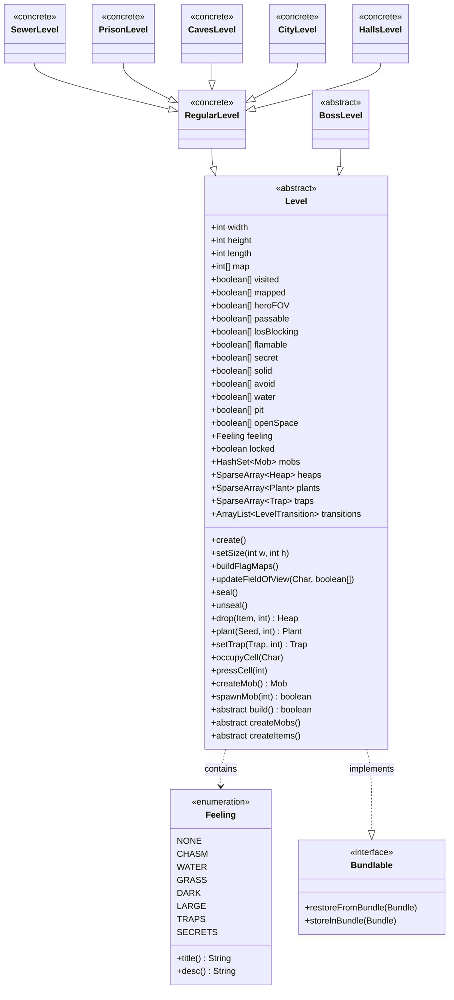

# Level 类文档

## 1. 基本信息
| 属性 | 值 |
|------|-----|
| 文件路径 | D:\Develop\Workspace\DustedPixelDungeon\core\src\main\java\com\shatteredpixel\shatteredpixeldungeon\levels\Level.java |
| 包名 | com.shatteredpixel.shatteredpixeldungeon.levels |
| 类类型 | abstract class |
| 继承关系 | implements Bundlable |
| 代码行数 | 1657 |

## 2. 类职责说明
Level 是所有地下城关卡的抽象基类，负责管理关卡的核心数据结构，包括地图数据、实体集合（怪物、物品堆、植物、陷阱）、视野计算和游戏机制。它提供了关卡生成、物品投放、陷阱/植物触发、怪物刷新等关键功能，是地下城系统的核心基础设施。

## 4. 继承与协作关系


## 内部枚举 Feeling

Feeling 枚举定义了关卡的特殊氛围类型，影响关卡的生成和玩家体验。

| 枚举值 | 中文名称 | 说明 |
|--------|----------|------|
| NONE | 无特殊 | 默认的普通关卡，无特殊氛围 |
| CHASM | 深渊 | 关卡中大量深渊地形，默认地形为 CHASM |
| WATER | 水域 | 关卡中水域面积增加 |
| GRASS | 草地 | 关卡中草地面积增加 |
| DARK | 黑暗 | 视野距离降低到正常值的 5/8 |
| LARGE | 大型 | 关卡面积增大，额外生成一件食物 |
| TRAPS | 陷阱 | 关卡中陷阱数量增加 |
| SECRETS | 秘密 | 关卡中隐藏房间增加 |

### Feeling 方法

#### title()
**签名**: `public String title()`
**功能**: 获取氛围类型的本地化标题
**返回值**: String - 氛围类型的显示名称

#### desc()
**签名**: `public String desc()`
**功能**: 获取氛围类型的本地化描述
**返回值**: String - 氛围类型的详细描述文本

## 静态常量表

| 常量名 | 类型 | 值 | 说明 |
|--------|------|-----|------|
| TIME_TO_RESPAWN | float | 50 | 怪物重生基础冷却时间（回合数） |
| VERSION | String | "version" | Bundle 存档版本键 |
| WIDTH | String | "width" | Bundle 宽度键 |
| HEIGHT | String | "height" | Bundle 高度键 |
| MAP | String | "map" | Bundle 地图数据键 |
| VISITED | String | "visited" | Bundle 访问记录键 |
| MAPPED | String | "mapped" | Bundle 地图绘制键 |
| TRANSITIONS | String | "transitions" | Bundle 过渡点键 |
| LOCKED | String | "locked" | Bundle 锁定状态键 |
| HEAPS | String | "heaps" | Bundle 物品堆键 |
| PLANTS | String | "plants" | Bundle 植物键 |
| TRAPS | String | "traps" | Bundle 陷阱键 |
| CUSTOM_TILES | String | "customTiles" | Bundle 自定义地图块键 |
| CUSTOM_WALLS | String | "customWalls" | Bundle 自定义墙壁键 |
| MOBS | String | "mobs" | Bundle 怪物键 |
| BLOBS | String | "blobs" | Bundle 效果区域键 |
| FEELING | String | "feeling" | Bundle 氛围类型键 |

## 实例字段表

### 尺寸字段

| 字段名 | 类型 | 修饰符 | 说明 |
|--------|------|--------|------|
| width | int | protected | 关卡宽度（格子数） |
| height | int | protected | 关卡高度（格子数） |
| length | int | protected | 关卡总大小（width × height） |

### 地图数据字段

| 字段名 | 类型 | 修饰符 | 说明 |
|--------|------|--------|------|
| map | int[] | public | 地图地形数据，每个元素存储对应格子的地形类型（Terrain 常量） |
| visited | boolean[] | public | 访问记录数组，标记玩家是否曾进入过该格子的视野范围 |
| mapped | boolean[] | public | 地图绘制数组，标记该格子是否已在地图上显示 |
| discoverable | boolean[] | public | 可发现数组，标记该格子是否可被探索发现（靠近非墙壁格子） |

### 视野字段

| 字段名 | 类型 | 修饰符 | 说明 |
|--------|------|--------|------|
| viewDistance | int | public | 基础视野距离，默认为8，黑暗挑战下为2 |
| heroFOV | boolean[] | public | 英雄视野数组，标记每个格子是否在英雄当前视野内 |

### 地形标志字段

| 字段名 | 类型 | 修饰符 | 说明 |
|--------|------|--------|------|
| passable | boolean[] | public | 可通行数组，标记角色是否可通过该格子 |
| losBlocking | boolean[] | public | 视线阻挡数组，标记该格子是否阻挡视线 |
| flamable | boolean[] | public | 可燃数组，标记该格子是否可被点燃 |
| secret | boolean[] | public | 秘密数组，标记该格子是否为隐藏地形 |
| solid | boolean[] | public | 实体数组，标记该格子是否为不可穿越的实体地形 |
| avoid | boolean[] | public | 避开数组，标记AI是否应避免进入该格子 |
| water | boolean[] | public | 水域数组，标记该格子是否为水域 |
| pit | boolean[] | public | 深渊数组，标记该格子是否为深渊（会导致坠落） |
| openSpace | boolean[] | public | 开阔空间数组，标记该格子是否足够大以容纳大型怪物 |

### 关卡状态字段

| 字段名 | 类型 | 修饰符 | 说明 |
|--------|------|--------|------|
| feeling | Feeling | public | 关卡氛围类型 |
| entrance | int | public | 入口格子坐标（已弃用，使用 transitions） |
| exit | int | public | 出口格子坐标（已弃用，使用 transitions） |
| locked | boolean | public | 锁定状态，Boss 关卡锁定时为 true |

### 过渡点字段

| 字段名 | 类型 | 修饰符 | 说明 |
|--------|------|--------|------|
| transitions | ArrayList\<LevelTransition\> | public | 关卡过渡点列表，包含入口、出口等 |

### 实体集合字段

| 字段名 | 类型 | 修饰符 | 说明 |
|--------|------|--------|------|
| mobs | HashSet\<Mob\> | public | 怪物集合 |
| heaps | SparseArray\<Heap\> | public | 物品堆映射（格子坐标 → 物品堆） |
| blobs | HashMap\<Class\<? extends Blob\>,Blob\> | public | 效果区域映射（类型 → 效果实例） |
| plants | SparseArray\<Plant\> | public | 植物映射（格子坐标 → 植物） |
| traps | SparseArray\<Trap\> | public | 陷阱映射（格子坐标 → 陷阱） |
| customTiles | ArrayList\<CustomTilemap\> | public | 自定义地图块列表（地面层） |
| customWalls | ArrayList\<CustomTilemap\> | public | 自定义墙壁列表 |

### 内部字段

| 字段名 | 类型 | 修饰符 | 说明 |
|--------|------|--------|------|
| itemsToSpawn | ArrayList\<Item\> | protected | 待生成物品列表 |
| visuals | Group | protected | 视觉效果组 |
| wallVisuals | Group | protected | 墙壁视觉效果组 |
| color1 | int | public | 关卡主色调1 |
| color2 | int | public | 关卡主色调2 |
| mobsToSpawn | ArrayList\<Class\<? extends Mob\>\> | private | 待生成怪物类型列表 |
| respawner | MobSpawner | private | 怪物重生器 |
| heroMindFov | boolean[] | private static | 英雄心灵视野数组 |
| modifiableBlocking | boolean[] | private static | 可修改的视线阻挡数组 |

## 抽象方法

| 方法名 | 返回类型 | 说明 |
|--------|----------|------|
| build() | boolean | 构建关卡地形，返回是否成功生成有效关卡 |
| createMobs() | void | 创建关卡中的初始怪物 |
| createItems() | void | 创建关卡中的初始物品 |

## 7. 方法详解

### create()
**签名**: `public void create()`
**功能**: 关卡创建的主入口方法，协调整个关卡生成流程
**实现逻辑**:
1. 推入随机数生成器，使用当前深度的种子确保可重现性
2. 如果非 Boss 关卡且在主分支：
   - 添加随机食物
   - 根据需求添加力量药水（posNeeded）
   - 根据需求添加升级卷轴（souNeeded）
   - 根据需求添加神秘刻笔（asNeeded）
   - 根据需求添加附魔石（enchStoneNeeded）
   - 根据需求添加直觉石（intStoneNeeded）
   - 根据需求添加饰品催化剂（trinketCataNeeded）
   - 随机决定关卡氛围类型（14种可能，每种氛围约7.15%概率）
3. 循环调用 build() 直到成功生成有效关卡
4. 调用 buildFlagMaps() 构建地形标志数组
5. 调用 cleanWalls() 清理墙壁
6. 调用 createMobs() 创建怪物
7. 调用 createItems() 创建物品
8. 弹出随机数生成器

### setSize()
**签名**: `public void setSize(int w, int h)`
**功能**: 设置关卡尺寸并初始化所有数组
**参数**:
- w: int - 关卡宽度
- h: int - 关卡高度
**实现逻辑**:
1. 设置 width、height、length 字段
2. 初始化 map 数组，默认填充墙壁或深渊（根据 feeling）
3. 初始化 visited、mapped、heroFOV 数组
4. 初始化所有地形标志数组（passable、losBlocking 等）
5. 设置 PathFinder 的地图尺寸

### buildFlagMaps()
**签名**: `public void buildFlagMaps()`
**功能**: 构建所有地形标志数组，基于 Terrain.flags 计算
**实现逻辑**:
1. 遍历所有格子：
   - 从 Terrain.flags 获取地形标志位
   - 通过位运算设置各标志数组：
     - passable = (flags & PASSABLE) != 0
     - losBlocking = (flags & LOS_BLOCKING) != 0
     - flamable = (flags & FLAMABLE) != 0
     - secret = (flags & SECRET) != 0
     - solid = (flags & SOLID) != 0
     - avoid = (flags & AVOID) != 0
     - water = (flags & LIQUID) != 0
     - pit = (flags & PIT) != 0
2. 让所有 Blob 更新标志地图
3. 设置边界格子（第一行、最后一行、第一列、最后一列）为不可通行
4. 计算 openSpace 数组：
   - 大型怪物需要开阔空间
   - 一个格子是开阔的当且仅当：
     - 不是 solid
     - 存在一个开放角落，且两个相邻格子都是开放的

### updateFieldOfView()
**签名**: `public void updateFieldOfView(Char c, boolean[] fieldOfView)`
**功能**: 更新角色的视野范围，整合多种视野来源
**参数**:
- c: Char - 要计算视野的角色
- fieldOfView: boolean[] - 输出的视野数组
**实现逻辑**:
1. 计算角色的格子坐标 (cx, cy)
2. 判断角色是否有视力（非失明、非隐身、存活）
3. 处理特殊视野情况：
   - Warden 子类可以透过高草看到
   - SoiledFist 和 GnollGeomancer 也能透过高草
   - 非盟友且非 GnollGeomancer 会受到烟幕影响
4. 调用 ShadowCaster.castShadow() 计算基础视野
5. 处理心灵视野（MindVision）和魔法视野（MagicalSight）
6. 如果角色是英雄：
   - 处理 MindVision Buff
   - 处理 Heightened Senses 天赋
   - 处理 Divine Sense 法术
   - 处理 Awareness Buff（看到所有物品堆）
   - 处理 Talisman of Foresight 的感知效果
   - 处理 Ward、Lotus、HawkAlly 等召唤物的视野
   - 更新物品堆的 seen 标记

### seal()
**签名**: `public void seal()`
**功能**: 锁定关卡，用于 Boss 战开始
**实现逻辑**:
1. 检查是否已锁定
2. 设置 locked = true
3. 给英雄添加 LockedFloor Buff

### unseal()
**签名**: `public void unseal()`
**功能**: 解锁关卡，用于 Boss 战结束
**实现逻辑**:
1. 检查是否已锁定
2. 设置 locked = false
3. 移除英雄的 LockedFloor Buff

### drop()
**签名**: `public Heap drop(Item item, int cell)`
**功能**: 在指定格子投放物品
**参数**:
- item: Item - 要投放的物品
- cell: int - 目标格子坐标
**返回值**: Heap - 物品所在的物品堆
**实现逻辑**:
1. 如果物品为 null 或被挑战阻止，创建虚拟 Heap 返回
2. 获取目标格子的物品堆
3. 如果没有物品堆：
   - 创建新 Heap
   - 设置位置和可见性
   - 如果是深渊格子，物品会掉落到下一层
   - 否则添加到 heaps 映射
4. 如果物品堆是上锁/水晶箱子，投放到相邻格子
5. 否则添加到现有物品堆
6. 调用 pressCell() 触发格子效果

### plant()
**签名**: `public Plant plant(Plant.Seed seed, int pos)`
**功能**: 在指定格子种植植物
**参数**:
- seed: Plant.Seed - 种子
- pos: int - 目标格子坐标
**返回值**: Plant - 种植的植物，失败返回 null
**实现逻辑**:
1. 如果格子已有植物，先移除旧植物
2. 如果地形是高草、草、空地等，设置为基础草地
3. 如果开启了 NO_HERBALISM 挑战，返回 null
4. 调用 seed.couch() 创建植物实例
5. 添加到 plants 映射
6. 如果有 Lotus 在范围内且格子上有角色，立即触发植物

### setTrap()
**签名**: `public Trap setTrap(Trap trap, int pos)`
**功能**: 在指定格子设置陷阱
**参数**:
- trap: Trap - 陷阱实例
- pos: int - 目标格子坐标
**返回值**: Trap - 设置的陷阱
**实现逻辑**:
1. 移除格子上的现有陷阱
2. 调用 trap.set() 设置陷阱位置
3. 添加到 traps 映射
4. 更新地图显示

### occupyCell()
**签名**: `public void occupyCell(Char ch)`
**功能**: 处理角色占据格子的效果
**参数**:
- ch: Char - 占据格子的角色
**实现逻辑**:
1. 处理蜘蛛网效果
2. 处理祭祀火焰标记
3. 如果角色不是飞行状态：
   - 水域格子：熄灭燃烧、清除粘液
   - 草地/灰烬格子：处理 Rejuvenating Steps 天赋
   - 深渊格子：触发坠落（Chasm.heroFall/mobFall）
   - 调用 pressCell() 触发格子（Hero/Sheep 为硬触发，其他为软触发）
4. 如果角色是飞行状态且地形是门，调用 Door.enter()
5. 处理食人鱼在陆地上的死亡

### pressCell()
**签名**: `public void pressCell(int cell)` / `private void pressCell(int cell, boolean hard)`
**功能**: 触发格子上的陷阱、植物等效果
**参数**:
- cell: int - 格子坐标
- hard: boolean - 是否为硬触发（隐藏陷阱也会触发）
**实现逻辑**:
1. 根据地形类型处理：
   - SECRET_TRAP（硬触发时）：发现并获取陷阱
   - TRAP：获取陷阱
   - HIGH_GRASS/FURROWED_GRASS：践踏草地
   - WELL：触发井水效果
   - DOOR：进入门
2. 处理时间冻结效果（TimekeepersHourglass/Swiftthistle）：
   - 如果有时间冻结，延迟触发陷阱/植物
   - 否则直接触发
3. 触发格子上的植物
4. 硬触发时清除蜘蛛网

### createMob()
**签名**: `public Mob createMob()`
**功能**: 从怪物轮换列表创建一个怪物
**返回值**: Mob - 创建的怪物实例
**实现逻辑**:
1. 如果 mobsToSpawn 为空，从 MobSpawner 获取当前深度的怪物轮换
2. 移除并实例化列表中的第一个怪物类型
3. 为怪物随机分配冠军属性
4. 返回怪物实例

### addRespawner()
**签名**: `public Actor addRespawner()`
**功能**: 添加或重置怪物重生器
**返回值**: Actor - 重生器 Actor
**实现逻辑**:
1. 如果 respawner 为 null，创建新的 MobSpawner 并延迟添加
2. 否则直接添加现有的 respawner
3. 如果冷却时间过长，重置冷却时间

### respawnCooldown()
**签名**: `public float respawnCooldown()`
**功能**: 计算怪物重生的冷却时间
**返回值**: float - 冷却时间（回合数）
**实现逻辑**:
1. 如果已获得护符：
   - 第1层：快速重生（基于怪物数量）
   - 其他层：5/5/10/15/20/25/25 递增模式
2. 如果是黑暗氛围：冷却时间为正常的 2/3
3. 默认：TIME_TO_RESPAWN（50回合）
4. 应用 DimensionalSundial 的时间倍率

### spawnMob()
**签名**: `public boolean spawnMob(int disLimit)`
**功能**: 在距离英雄指定距离外生成一个怪物
**参数**:
- disLimit: int - 与英雄的最小距离
**返回值**: boolean - 是否成功生成
**实现逻辑**:
1. 构建从英雄位置出发的距离地图
2. 创建怪物并设置为 WANDERING 状态
3. 尝试最多30次找到合适的生成位置
4. 如果找到有效位置，添加怪物到游戏
5. 如果怪物有冠军属性，显示警告信息

### getTransition()
**签名**: 
- `public LevelTransition getTransition(LevelTransition.Type type)`
- `public LevelTransition getTransition(int cell)`
**功能**: 获取关卡过渡点
**参数**:
- type: LevelTransition.Type - 过渡类型（可为 null）
- cell: int - 格子坐标
**返回值**: LevelTransition - 找到的过渡点，未找到返回 null
**实现逻辑**:
- 按类型查找：遍历 transitions 列表，返回匹配类型的过渡点
- 按位置查找：返回包含指定格子的过渡点
- 如果 type 为 null，优先返回任何入口类型

### activateTransition()
**签名**: `public boolean activateTransition(Hero hero, LevelTransition transition)`
**功能**: 激活关卡过渡，切换到下一层
**参数**:
- hero: Hero - 英雄实例
- transition: LevelTransition - 过渡点
**返回值**: boolean - 是否立即过渡
**实现逻辑**:
1. 如果关卡已锁定，返回 false
2. 调用 beforeTransition() 处理过渡前的效果
3. 设置 InterlevelScene 的过渡信息
4. 根据过渡类型设置模式（DESCEND/ASCEND）
5. 切换场景到 InterlevelScene

### beforeTransition()
**签名**: `public static void beforeTransition()`
**功能**: 处理关卡过渡前的各种效果
**实现逻辑**:
1. 处理时间冻结效果（TimekeepersHourglass/Swiftthistle）的延迟触发
2. 移除不跨层持续的 Buff：
   - WarriorFoodImmunity
   - ChallengeArena
   - Awareness
3. 处理 Stasis 中的盟友（IMMOVABLE 属性的会被留下）
4. 将英雄和其他 Actor 的时间调整到整回合

### randomRespawnCell()
**签名**: `public int randomRespawnCell(Char ch)`
**功能**: 获取一个随机重生格子
**参数**:
- ch: Char - 要重生的角色（可为 null）
**返回值**: int - 格子坐标，未找到返回 -1
**实现逻辑**:
1. 最多尝试30次
2. 随机选择格子
3. 检查条件：
   - 不在英雄视野内
   - 可通行
   - 大型角色需要开阔空间
   - 格子上没有其他角色

### distance()
**签名**: `public int distance(int a, int b)`
**功能**: 计算两个格子之间的切比雪夫距离
**参数**:
- a: int - 第一个格子
- b: int - 第二个格子
**返回值**: int - 距离值
**实现逻辑**: 使用切比雪夫距离公式：max(|ax - bx|, |ay - by|)

### trueDistance()
**签名**: `public float trueDistance(int a, int b)`
**功能**: 计算两个格子之间的欧几里得距离
**参数**:
- a: int - 第一个格子
- b: int - 第二个格子
**返回值**: float - 真实距离值
**实现逻辑**: 使用勾股定理：sqrt((ax - bx)² + (ay - by)²)

### restoreFromBundle()
**签名**: `public void restoreFromBundle(Bundle bundle)`
**功能**: 从存档数据恢复关卡状态
**参数**:
- bundle: Bundle - 存档数据
**实现逻辑**:
1. 检查版本号，低于 v2.5.4 的存档不支持
2. 从 bundle 恢复所有字段
3. 重建标志地图和清理墙壁

### storeInBundle()
**签名**: `public void storeInBundle(Bundle bundle)`
**功能**: 将关卡状态保存到存档数据
**参数**:
- bundle: Bundle - 存档数据
**实现逻辑**: 将所有关键字段写入 bundle

## 11. 使用示例

### 创建关卡实例
```java
// Level 是抽象类，需要使用具体子类
Level level = new SewerLevel();
level.create();  // 创建关卡
```

### 物品投放
```java
// 在指定位置投放物品
Item item = new Gold(100);
Heap heap = Dungeon.level.drop(item, targetCell);

// 投放特殊物品
Dungeon.level.drop(new PotionOfHealing(), cell);
```

### 种植和陷阱
```java
// 种植植物
Plant.Seed seed = new Sungrass.Seed();
Plant plant = Dungeon.level.plant(seed, cell);

// 设置陷阱
Trap trap = new FireTrap();
Dungeon.level.setTrap(trap, cell);
```

### 视野更新
```java
// 更新英雄视野
Dungeon.level.updateFieldOfView(Dungeon.hero, Dungeon.hero.fieldOfView);

// 检查格子是否在视野内
if (Dungeon.level.heroFOV[targetCell]) {
    // 格子在视野内
}
```

### Boss 战锁定
```java
// Boss 战开始时
Dungeon.level.seal();  // 锁定关卡

// Boss 战结束时
Dungeon.level.unseal();  // 解锁关卡
```

### 怪物生成
```java
// 创建怪物
Mob mob = Dungeon.level.createMob();

// 生成怪物到合适位置
Dungeon.level.spawnMob(5);  // 至少距离英雄5格
```

## 注意事项

1. **数组索引**: 所有格子相关数组使用线性索引，坐标转换公式：`index = x + y * width`

2. **线程安全**: Level 的多个静态数组（heroMindFov、modifiableBlocking）需要注意并发访问

3. **存档兼容性**: 只支持 v2.5.4 及以上版本的存档，旧版本会抛出 RuntimeException

4. **边界处理**: 地图边界格子（第一行、最后一行、第一列、最后一列）强制设置为不可通行

5. **视野计算**: updateFieldOfView 是计算密集型操作，应避免频繁调用

6. **怪物重生**: 重生冷却时间受多种因素影响（护符、黑暗氛围、饰品效果等）

7. **过渡系统**: entrance 和 exit 字段已弃用，应使用 transitions 列表管理所有过渡点

## 最佳实践

1. **关卡生成**: 子类应重写 build() 方法，确保生成有效的关卡布局

2. **性能优化**: 大批量地形修改后应调用 buildFlagMaps() 一次性更新所有标志

3. **物品投放**: 使用 drop() 而非直接操作 heaps 映射，确保触发格子效果

4. **视野检查**: 使用 heroFOV 数组进行视野判断，而非自行计算

5. **Boss 关卡**: 实现子类时应正确处理 seal/unseal 逻辑，确保 Boss 战流程正确

6. **自定义地形**: 使用 CustomTilemap 添加特殊装饰，避免修改基础地形系统

7. **错误处理**: build() 方法应返回 false 表示生成失败，让 create() 重试